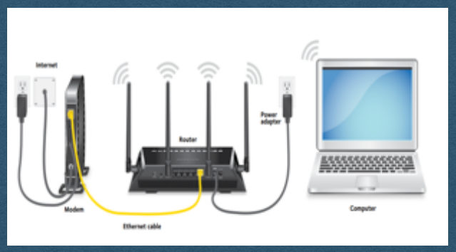
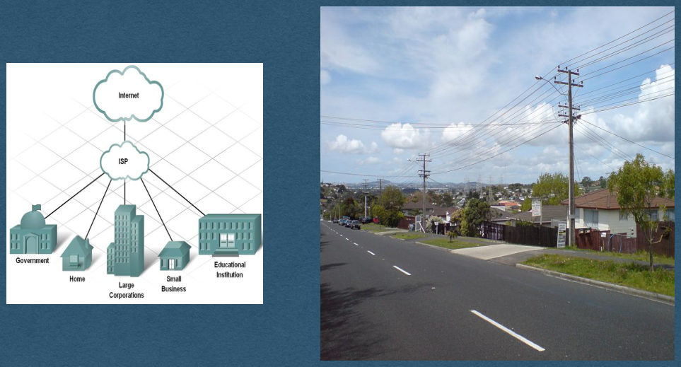
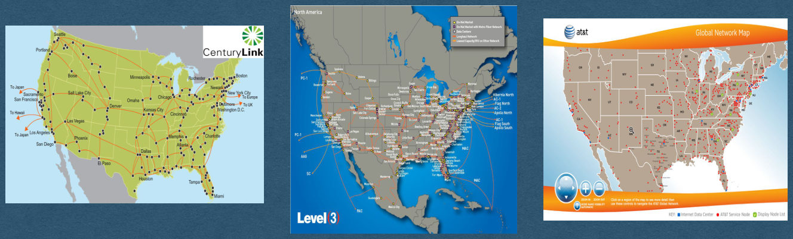
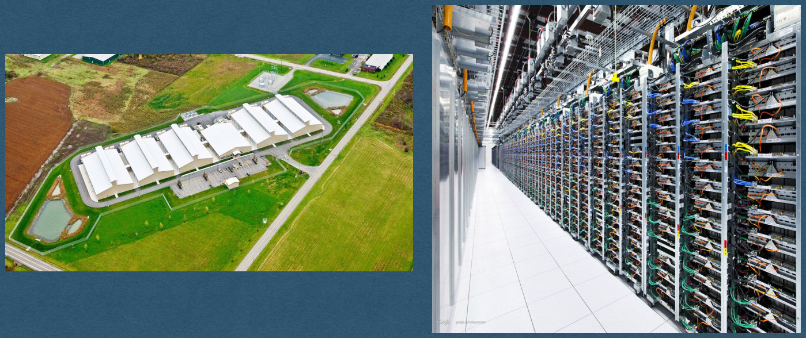
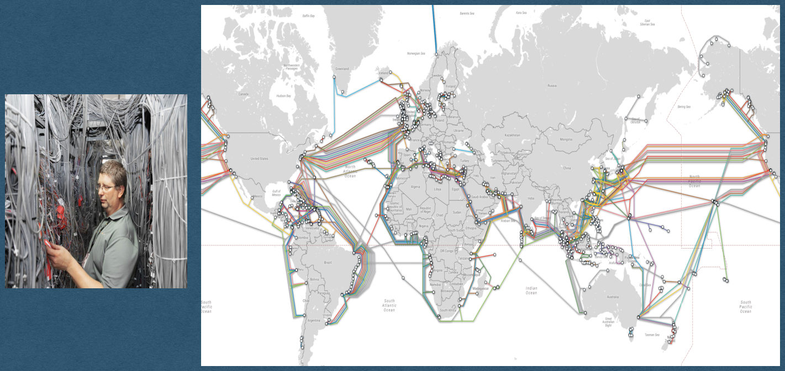

<!-- PDF page 1 -->
## The Internet

Networks, TCP/IP

<!-- PDF page 2 -->
## Local Area Network (LAN)

<!-- REVIEW: diagram rendered whole; describe it in fig-alt -->

Connect a small group of devices

{fig-alt="TODO: describe this image"}

<!-- PDF page 3 -->
## Internet Service Provider (ISP)

<!-- REVIEW: diagram rendered whole; describe it in fig-alt -->

Connect customers to The Internet

{fig-alt="TODO: describe this image"}

<!-- PDF page 4 -->
## Tier 1 Networks

<!-- REVIEW: diagram rendered whole; describe it in fig-alt -->

The Internet

{fig-alt="TODO: describe this image"}

<!-- PDF page 5 -->
## Data Centers Power Apps

<!-- REVIEW: diagram rendered whole; describe it in fig-alt -->

{fig-alt="TODO: describe this image"}

<!-- PDF page 6 -->
## It’s all Cables!

<!-- REVIEW: diagram rendered whole; describe it in fig-alt -->

{fig-alt="TODO: describe this image"}

<!-- PDF page 7 -->
## How do we use these cables?

<!-- PDF page 8 -->
## Internet Protocol

<!-- PDF page 9 -->
## Internet Protocol (IP) Address

<!-- REVIEW: diagram rendered whole; describe it in fig-alt -->

- Every device has an IP Address
  - Use this address to send messages to that device
  - Ex: 172.217.12.211
- Use DNS (Domain Name Server) to lookup IP address by domain name

IP address for cse312.com?

159.89.179.140

{fig-alt="TODO: describe this image"}

<!-- PDF page 10 -->
## Data is sent over the Internet in packets/datagrams

<!-- REVIEW: mostly an image; write a text description -->

Large messages are sent in multiple packets

{fig-alt="TODO: describe this image"}

<!-- PDF page 11 -->
## Routing Packets

<!-- REVIEW: diagram rendered whole; describe it in fig-alt -->

1. Check the destination IP address of the packet
2. Send the packet to the next router on its path
3. Fuhgettaboutit

{fig-alt="TODO: describe this image"}

<!-- PDF page 12 -->
## The Internet is Unreliable

<!-- REVIEW: diagram rendered whole; describe it in fig-alt -->

Many factors cause packets to be dropped

{fig-alt="TODO: describe this image"}

<!-- PDF page 13 -->
## Transmission Control Protocol

<!-- PDF page 14 -->
## Transmission Control Protocol (TCP)

Makes the Internet reliable

- Detect and resend dropped packets
- Adds port numbers to identify specific programs
- Connect to a port number/IP address combination (TCP/IP)
  - 127.0.0.1:8080

TCP 3-way Handshake

{fig-alt="TODO: describe this image"}

<!-- PDF page 15 -->
## TCP/IP in CSE312

- Use libraries to do all this for us
- Assume TCP/IP works and that we have reliable communication over the Internet
- Freely send and receive messages (As bytes)
- Your code (HW) will start with HTTP
- Much deeper TCP/IP coverage, and more, in CSE489: Modern Networking Concepts!
