## Local Area Network (LAN)

Connect a small group of devices

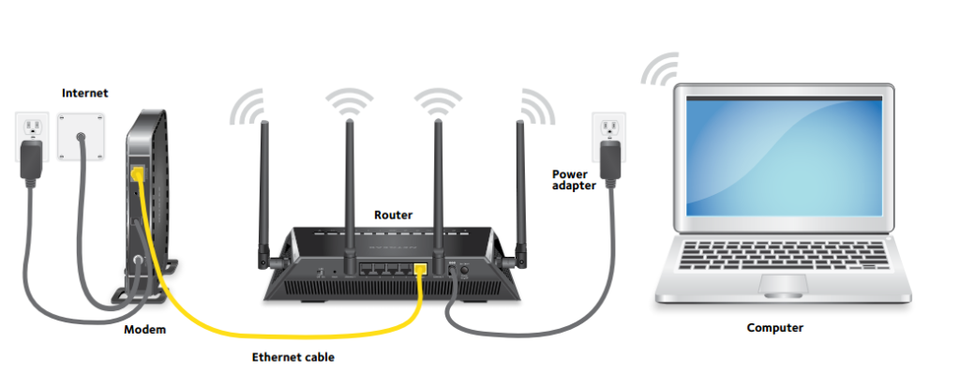{fig-alt="A modem connected to a router showing wifi communication to a laptop"}

## Internet Service Provider (ISP)

Connect customers to The Internet

:::: {.columns}
::: {.column width="50%"}
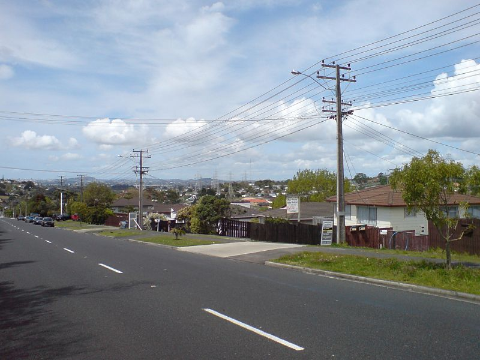{fig-alt="Diagram showing an ISP connecting 5 different customers to the Internet. The customers are government, home, large corporation, small business, and an educational institution"}
:::
::: {.column width="50%"}
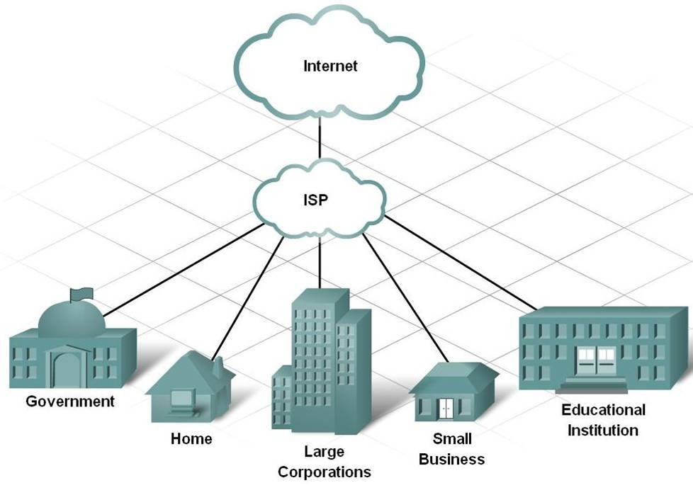{fig-alt="Image of utility poles in a suburban neighborhood"}
:::
::::

## Tier 1 Networks

Tier 1 networks form the backbone of the Internet

:::: {.columns}
::: {.column width="33%"}
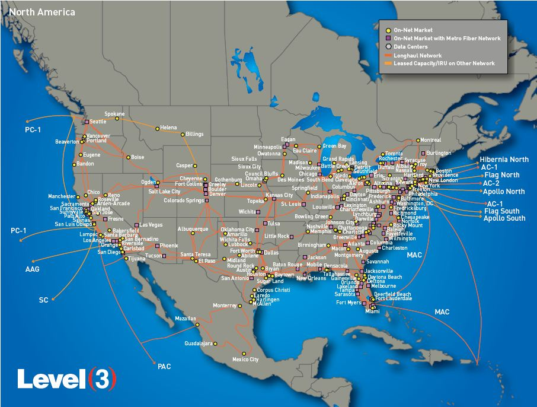{fig-alt="Map of the CenturyLink tier 1 network covering the United States"}
:::
::: {.column width="34%"}
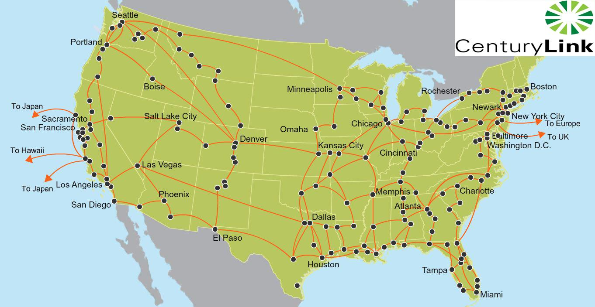{fig-alt="Map of the Level 3 tier 1 network covering the United States"}
:::
::: {.column width="33%"}
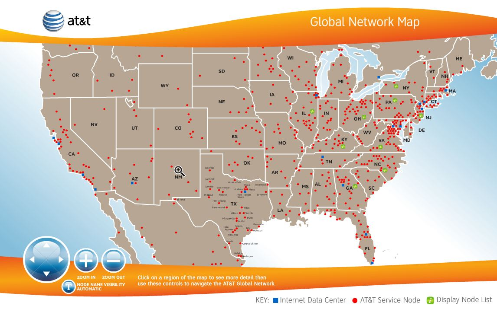{fig-alt="Map of the AT&T tier 1 network covering the United States"}
:::
::::

<!-- PDF page 5 -->
## Data Centers Power Apps

:::: {.columns}
::: {.column width="50%"}
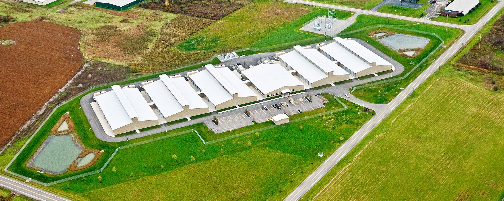{fig-alt="Ariel image of the Lockport data center"}
:::
::: {.column width="50%"}
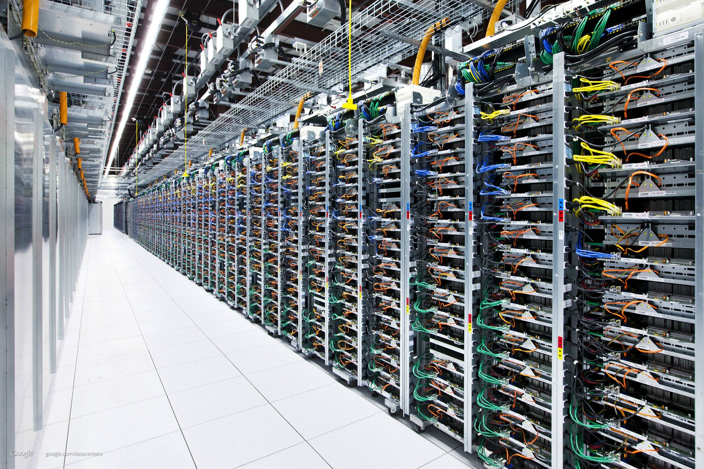{fig-alt="Inside of a data center showing dozens of racks of servers"}
:::
::::

<!-- PDF page 6 -->
## It’s all Cables!

:::: {.columns}
::: {.column width="30%"}
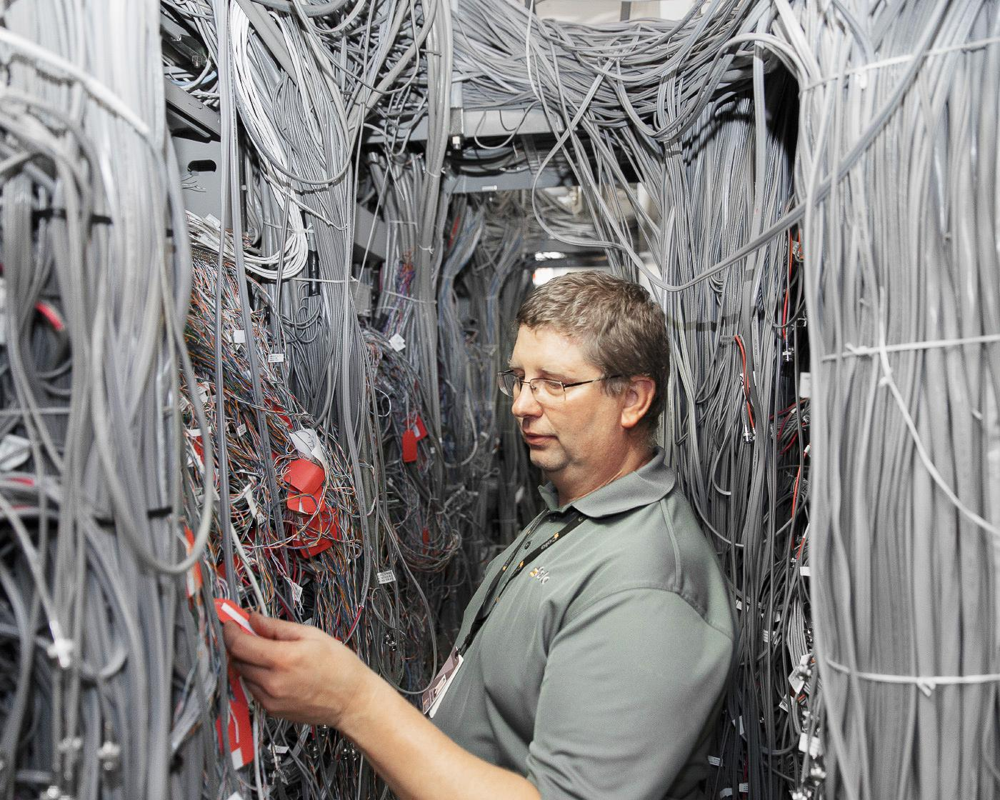{fig-alt="A technician working in a room with 100's of ethernet cables"}
:::
::: {.column width="70%"}
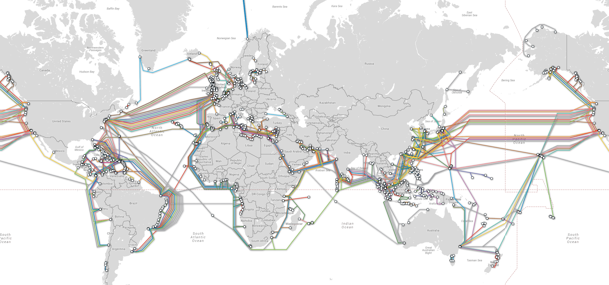{fig-alt="Map of the earth showing cables the cross the oceans and connect continents"}
:::
::::

## How do we use these cables?..

# Internet Protocol

## Internet Protocol (IP) Address

- Every device has an IP Address
  - Use this address to send messages to that device
  - Ex: 172.217.12.211
- Use DNS (Domain Name Server) to lookup IP address by domain name

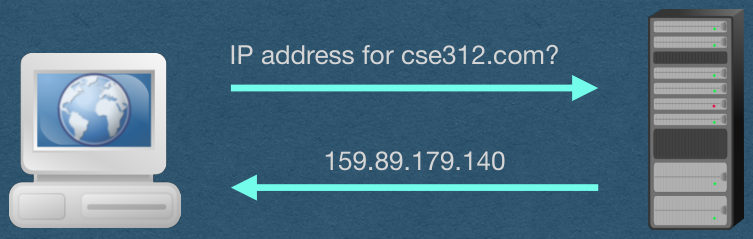{fig-alt="Diagram showing a computer sending a request to a server for the IP address of CSE312.com. The server replies with 159.89.179.140"}

## Data is sent over the Internet in packets/datagrams

- Each packet contains headers containing information about the packet

- Large messages are sent in multiple packets

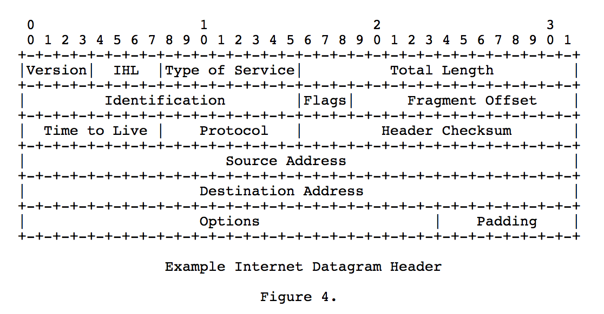{fig-alt="IPv4 header diagram"}

## Routing Packets

- To route a packet through the Internet, a router will
  1. Check the destination IP address of the packet
  2. Send the packet to the next router on its path
  3. Fuhgettaboutit

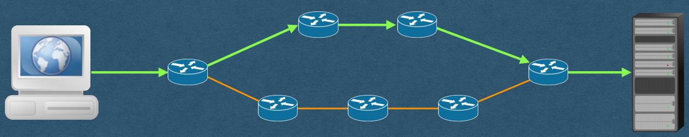{fig-alt="Routers sending a packet through the Internet between 2 devices. There are 2 different paths and only 1 was used"}

## The Internet is Unreliable

Many factors cause packets to be dropped

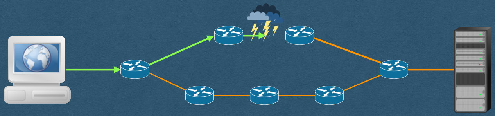{fig-alt="Same diagram as the previous slide, but with a storm severing one of the connections that was used. This packet will be lost"}

# Transmission Control Protocol

## Transmission Control Protocol (TCP)

- Makes the Internet reliable
- Detect and resend dropped packets
- Adds port numbers to identify specific programs
- Connect to a port number/IP address combination (TCP/IP)
  - 127.0.0.1:8080

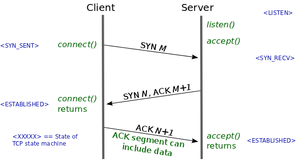{fig-alt="TCP 3-way handshake"}

<!-- PDF page 15 -->
## TCP/IP in CSE312

- Use libraries to do all this for us
- Assume TCP/IP works and that we have reliable communication over the Internet
- Freely send and receive messages (As bytes)
- Your code (HW) will start with HTTP
- Much deeper TCP/IP coverage, and more, in CSE489: Modern Networking Concepts
