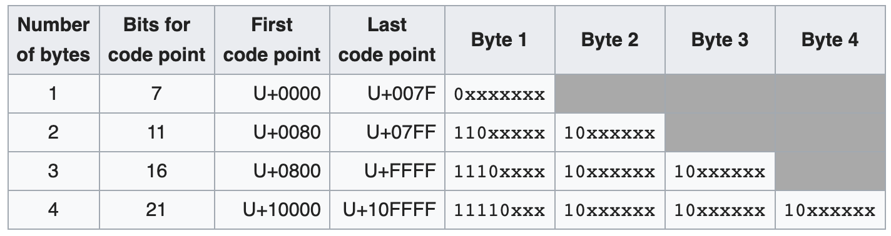

# Encodings

MIME types and bytes

## 1's and 0's

- The Internet can only transfer bits
  - Copper: High/Low voltage
  - Fiber: Light/Dark
- All data sent over the Internet must be binary
- How do we know what these 1's and 0's represent in HTTP?
  - Encodings and MIME Types

# Encoding Text

## Text

- Only 1's and 0's can travel through the Internet
  - How do we send text?

## ASCII

- Character encoding
  - Maps characters to numbers
  - Numbers are represented in bits
  - Bits are sent through the Internet
  - Numbers are mapped back to characters by the receiver
- ASCII uses 7 bit encodings

## ASCII Chart

{fig-alt="Chart of all ASCII values including each character's decimal, hex, octal, and HTML value"}

## ASCII

- As a String:
  - "hello"
  - Programming language specific representation
- In Hex:
  - 68 65 6c 6c 6f
  - Need to encode the String into a byte representation
- In Binary:
  - 01101000 01100101 01101100 01101100 01101111
  - Send this over the Internet

## HTTP Headers

HTTP Headers can only contain

ASCII characters

## HTTP Headers

- When reading HTTP headers [And request/status lines]
  - Assume it is text encoded using ASCII
- The body of the request/response may be encoded differently
  - Read the headers to find the encoding for the body

## Character Encodings

- ASCII can only encode 128 different characters
  - Decent enough for english text
  - Unusable for languages with different alphabets
- With the Internet, the world became much more connected
  - Too restrictive for each alphabet to have its own encoding
- How do we encode more characters with a single standard?
  - We need more bits!
  - Enter UTF-8

## UTF-8

- The modern standard for encoding text
- Uses up to 4 bytes to represent a character
- If the first bit is a 0
  - One byte used. Remaining 7 bits are ASCII
  - All ASCII encoded Strings are valid UTF-8

{fig-alt="TODO: describe this image"}

## UTF-8

- If more bytes are needed:
  - Lead with 1's to indicate the number of bytes
  - Each continuation byte begins with 10
  - Prevents decoding errors
  - No character is a subsequence of another character

{fig-alt="TODO: describe this image"}

## Sending Data

- When sending Strings over the Internet
  - The Internet does not understand language-specific Strings
  - Always convert to bytes/bits before sending
  - Encode the String using UTF-8
- When receiving text over the Internet
  - It must have been sent as bytes/bits
  - Must convert to a language-specific String
  - Decode the bytes using the proper encoding

## Sending Data

- Use the Python methods
  - .encode()
  - .decode()
- You can specify the encoding as an argument of these methods
  - Default is UTF-8 so providing no arguments will do what you want for this course

## Content Length

- Content-Length header must be set when there is a body to a response/request
- Value is the number of bytes contained in the body
  - Bytes referred to as octets in some documentation
- If all your characters are ASCII
  - This is equal to the length of the String
- Any non-ASCII UTF-8 character uses >1 byte
  - Cannot use the length of the String as your Content-Length!

## Content Length

- To compute the content length of a UTF-8 String
  - Convert to bytes first
  - Get the length of the byte array

## MIME Types

## MIME Types

- When an HTTP response [or request] contains a body, the body is an array of bytes
  - There's no restriction on the encoding used for these bytes (Cannot always assume ASCII/UTF-8)
- Set a Content-Type header to tell the browser what those bytes represent
  - Tells the browser how to read the body of your response
- This is the MIME type of the data

## MIME Types

- MIME type
  - Multipurpose Internet Mail Extensions
  - Developed for email and adopted for HTTP
- Two parts separate by a /
  - `<type>`/`<subtype>`
- Common types
  - text - Data using a text encoding (eg. UTF-8)
  - image - Raw binary of an image file
  - video - Raw binary of a video

## MIME Types

- Common Type/Subtypes
  - text/plain
  - text/html
  - text/css
  - text/javascript
  - image/png
  - image/jpeg
  - video/mp4
  - application/json

## MIME Types

- Optional settings can be added to the Content-Type header
  - Separate options by a ;
  - Options are formatted as `<name>`=`<value>`
- Content-Type: text/html; charset=utf-8
  - The content is HTML encoded using UTF-8
  - *You must use this to tell the browser that you are using utf-8
  - Don't forget to add this exactly as it appears. One character difference will break your page

## MIME Type Sniffing

- Modern browsers will "sniff" the proper MIME type of a response
  - If the MIME type is not correct, the browser will "figure it out"™ and guess what type makes the most sense
- Browsers can sometimes be wrong
  - Surprises when your site doesn't work with certain versions of certain browsers
- Best practice is to disable sniffing
- Set this HTTP header to tell the browser you set the correct MIME type
  - X-Content-Type-Options: nosnif

## MIME Type Sniffing

- X-Content-Type-Options: nosniff
- Be sure to set this header properly!
  - Open the browser console
  - Check the headers of your response
  - Make sure this header was parsed by the browser

## MIME Type Sniffing

- Security concern:
  - You have a site where users can upload images
  - All users can view these images
  - Instead of an image, a user uploads JavaScript that steals personal data
  - You set the MIME type to image/png
  - The browser notices something is wrong and sniffs out the MIME type of text/javascript and runs the script
  - You just got hacked!
- Solution:
  - X-Content-Type-Options: nosnif

## MIME Types

- With the proper MIME types set through a Content-Type header
  - The browser will know how to parse and render the body of your HTTP response
- When receiving an HTTP request that contains a body
  - The Content-Type will be set to let our server know the MIME type

## Sending Images

## Sending Images

- Sometimes we want to send data that is not text
- Use different formats depending on the data
- To send an image
  - Read the bytes from the file
  - Send the bytes as-is
  - Content-Length is the size of the file
  - Set the Content-Type to image/`<image_type>`

## Sending Images

- When sending images
  - Since the data is already in bytes when the file is read, no need to encode/decode
- Never try to read an image file as a string
- Never try to decode the bytes of an image into a string
- An image is not encoded using UTF-8
  - The bytes will not decode properly

## Sending Images

- Don't overthink sending images
- Read the bytes of the file. That's the body of your response
  - You may have to specify that the file should be read as a byte array since text is often assumed in File IO examples
- Set the Content-Length to the length of the byte array
- Set the appropriate MIME type in Content-Type
  - Ex: to send a .png the MIME type is "image/png"
