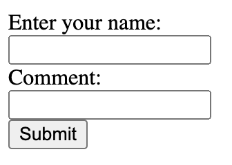
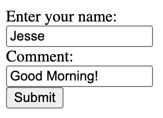

# HTTP POST


## POST Request

- A POST request, or any request containing a body, will be formatted similar to your HTTP responses

::: {style="height: 2.0em"}
:::

```
POST /path HTTP/1.1
Content-Type: text/plain
Content-Length: 5

hello
```

## POST Request

- More accurately

::: {style="height: 2.0em"}
:::

```
POST /path HTTP/1.1\r\nContent-Type: text/plain\r\nContent-Length: 5\r\n\r\nhello
```

## POST Request

- When parsing, there will be Content-Length and Content-Type headers

::: {style="height: 2.0em"}
:::

```
POST /path HTTP/1.1
Content-Type: text/plain
Content-Length: 5

hello
```

## POST Request

- Look for the blank line that separates the headers from the body
  - `\r\n\r\n`
- Read everything after this blank line
- Make sure you've read "Content-Length" number of bytes
  - It's possible to only receive part of a request and have to read the rest from the TCP socket

```
POST /path HTTP/1.1
Content-Type: text/plain
Content-Length: 5

hello
```

## POST Request

- When you read the content from the body:
  - Do whatever your server does based on its feature for this path
  - Send a response to the client

```
POST /path HTTP/1.1
Content-Type: text/plain
Content-Length: 5

hello
```

## Query String

- Allow users to send information in a URL
- Common Application:
  - User types a query in a search engine
  - Their query is sent in the URL as a query string

## URL Recall

```
Protocol://host:port/path?query_string#fragment
```

- Query String - [Optional] Contains key-value pairs set by the client
- https://www.google.com/search?q=web+development
  - HTTPS request to Google search for the phrase "web development"
- https://duckduckgo.com/?q=web+development&ia=images
  - An HTTPS request to Duck Duck Go image search for the phrase "web development"
- Fragment - [Optional] Specifies a single value commonly used for navigation
- https://en.wikipedia.org/wiki/Uniform_Resource_Identifier
  - HTTPS Request for the URI Wikipedia page
- https://en.wikipedia.org/wiki/Uniform_Resource_Identifier#Definition
  - HTTPS Request for the URI Wikipedia page that will scroll to the definition of URI

## Query String Format

```
https://duckduckgo.com/?q=web+development&ia=images
```

- Preceded by a question mark - `?`
- Consists of key-value pairs
  - Key and value separated by `=`
  - Pairs separated by `&`
- Can only contain ASCII characters
- Cannot contain white space

## Percent Encoding

- If a non-ASCII character is sent as part of a query string it must be url-encoded (or percent-encoded)
- Specify byte values with a `%` followed by 2 hex values
- `한` is encoded as `%ed%95%9c`
- ` `   <-- single space is encoded as `%20`

## White Space

- URLs cannot contain spaces
- Spaces can be percent encoded as `%20`
- Can also replace spaces with `+`
  - The reserved character `+` indicates a key mapping to multiple values

## Reserved Characters

:::: {.columns}
::: {.column width="50%"}

- Some ASCII characters are reserved
  - Example: `?` begins a query string
- Reserved characters must be %-encoded
- Notable characters that are NOT reserved
  - Dash `-`
  - Dot `.`
  - Underscore `_`
  - Tilda `~`

:::
::: {.column width="50%"}
| Reserved | Characters |
|-----------|---------|
| `:` | `#` |
| `&` | `*` |
| `/` | `+` |
| `'` | `@` |
| `?` | `,` |
| `(` | `)` |
| `[` | `]` |
| `!` | `;` |
| `$` | `=` |
:::
::::


# HTML Forms

## Dynamic Pages

- We've learned how to host static content from our servers
  - Content does not change
- For the rest of the semester we'll add dynamic features
  - Users can change content and interact with other users
- No longer making web sites
- Now we're developing Web Applications

## HTML Forms


- The action attribute is the path for the form
- The method attribute is the type of HTTP request made
- When the form is submitted, an HTTP request is sent to the path using this method
  - This behaves similar to clicking a link


::: {.absolute bottom=0 left=0 width="100%"}

:::: {.columns}
::: {.column width="70%"}
```{.html code-line-numbers="1-1"}
<form action="/form-path" method="get">

<label>Enter your name:<br/>
<input type="text" name="commenter"><br/>
</label>

<label>Comment: <br/>
<input type="text" name="comment"><br/>
</label>

<input type="submit" value="Submit">
</form>
```
:::
::: {.column width="30%"}
{fig-alt="The form rendered from this HTML"}
:::
::::

:::

## HTML Forms


- Use input elements for the user to interact with the form
- The type attribute specifies the type of input
  - This input is a text box
- The name attribute is used when the data is sent to the server


::: {.absolute bottom=0 left=0 width="100%"}

:::: {.columns}
::: {.column width="70%"}
```{.html code-line-numbers="4,8"}
<form action="/form-path" method="get">

<label>Enter your name:<br/>
<input type="text" name="commenter"><br/>
</label>

<label>Comment: <br/>
<input type="text" name="comment"><br/>
</label>

<input type="submit" value="Submit">
</form>
```
:::
::: {.column width="30%"}
{fig-alt="The form rendered from this HTML"}
:::
::::

:::

## HTML Forms


- Should provide a label for each input
  - Helps with accessibility (eg. Screen readers)
  - Clicking the label focuses the input


::: {.absolute bottom=0 left=0 width="100%"}

:::: {.columns}
::: {.column width="70%"}
```{.html code-line-numbers="3,7"}
<form action="/form-path" method="get">

<label>Enter your name:<br/>
<input type="text" name="commenter"><br/>
</label>

<label>Comment: <br/>
<input type="text" name="comment"><br/>
</label>

<input type="submit" value="Submit">
</form>
```
:::
::: {.column width="30%"}
{fig-alt="The form rendered from this HTML"}
:::
::::

:::

## HTML Forms


- An input of type submit makes a button that will send the HTTP request when clicked
- The value attribute is the text on the button

::: {.absolute bottom=0 left=0 width="100%"}

:::: {.columns}
::: {.column width="70%"}
```{.html code-line-numbers="11"}
<form action="/form-path" method="get">

<label>Enter your name:<br/>
<input type="text" name="commenter"><br/>
</label>

<label>Comment: <br/>
<input type="text" name="comment"><br/>
</label>

<input type="submit" value="Submit">
</form>
```
:::
::: {.column width="30%"}
{fig-alt="The form rendered from this HTML"}
:::
::::

:::

## HTML Forms

```
GET /form-path?commenter=Jesse&comment=Good+Morning%21 HTTP/1.1
```

- This sends a GET request containing the form data in a query string
  - Page reloads with the content of the response

::: {.absolute bottom=0 left=0 width="100%"}

:::: {.columns}
::: {.column width="70%"}
```html
<form action="/form-path" method="get">

<label>Enter your name:<br/>
<input type="text" name="commenter"><br/>
</label>

<label>Comment: <br/>
<input type="text" name="comment"><br/>
</label>

<input type="submit" value="Submit">
</form>
```
:::
::: {.column width="30%"}
{fig-alt="The form rendered from this HTML, no filled in with the text \"Jesse\" and \"Good Morning!\""}
:::
::::

:::

## HTTP GET Limitations

- Sending form data in a query string can cause issues
  - Browsers and servers have limits on the length of a URL
  - Browsers and servers have limits on the the total length of a GET request, including headers
    - Typically a 4-16kB
  - How would we upload a file? URL must be ASCII. Entire file would be % encoded
- Enter POST requests

## HTML Forms - POST

- Change the method of a form to post to send the entered data in the body of a POST request

::: {.absolute bottom=0 left=0 width="100%"}

:::: {.columns}
::: {.column width="70%"}
```{.html code-line-numbers="1-1"}
<form action="/form-path" method="post">

<label>Enter your name:<br/>
<input type="text" name="commenter"><br/>
</label>

<label>Comment: <br/>
<input type="text" name="comment"><br/>
</label>

<input type="submit" value="Submit">
</form>
```
:::
::: {.column width="30%"}
{fig-alt="The form rendered from this HTML, no filled in with the text \"Jesse\" and \"Good Morning!\""}
:::
::::

:::

## HTML Forms - POST

- A request is sent to the path from the action attribute without a query string
- Content-Type is a url encoded string containing the entered data
  - Same format as the query string
- Read the Content-Length to know how many bytes are in the body
  - Foreshadow: Very important when receiving more data than the size of your TCP buffer

::: {.absolute bottom=0 left=0 width="100%"}
```
POST /form-path HTTP/1.1
Content-Length: 27
Content-Type: application/x-www-form-urlencoded

commenter=Jesse&comment=Good+morning%21
```
:::

# HTML Injection Attacks

## HTML Injection

- When hosting static pages
  - You control all the content
  - Limited opportunity for attackers
- When hosting user-submitted content
  - You lose that control
  - Must protect against attacks
  - Never trust your users!!

# Never Trust Your Users!


## Never Trust Your Users

::: {.incremental}
- You may want to think your users will all act in good faith
  - For most users, this may be true
- Besides your intended users, who else can access your app?
  - EVERYONE!
:::

## Never Trust Your Users


[Do you trust literally everyone??]{style="font-size: 3.5em"}


## HTML Injection

- You are now handling user data and sending it to other users (Through chat messages)
- You're building a form that accepts user data and serves it to all other users
- What happens when a user enters this in chat:

::: {.absolute bottom=50 left=0 width="100%"}
```html
<script>maliciousFunction()</script>
```
:::

## HTML Injection (XSS)


- This attack is called an HTML injection attack
  - This string is uploaded to your server
  - Your server stores this string
  - Your server sends this string to all users who use your app
  - Their browsers render the injected HTML
  - Their browsers runs the injected JS

::: {.absolute bottom=50 left=0 width="100%"}
```html
<script>maliciousFunction()</script>
```
:::

## HTML Injection

- Lucky for us, Preventing this attack is very simple

## HTML Injection

- To prevent this attack:
  - Escape HTML when handling user submitted data
- Escape HTML
  - Replace `&`, `<`, and `>` with their HTML escaped characters
  - `&` -> `&amp;`
  - `<` -> `&lt;`
  - `>` -> `&gt;`

## HTML Injection

- The escaped characters `&amp;` `&lt;` `&gt;` will be rendered as characters by the browser
- Browser does not treat these as HTML

## HTML Injection

- Replace `&`, `<`, and `>` with their HTML escaped characters

```html
<script>maliciousFunction()</script>
```

becomes

```html
&lt;script&gt;maliciousFunction()&lt;/script&gt;
```

and is rendered as a string instead of interpreted as HTML

## HTML Injection

  - Replace `&`, `<`, and `>` with their HTML escaped characters
  - Order is important!
    - Always escape & first
  - If `&` is escaped last you'll get:

```html
&amp;lt;script&amp;gt;maliciousFunction()&amp;lt; /script&amp;gt;
```

  - Which will not render the way you intended

# AJAX & Polling

## User Interaction

- Our goal is to add more interactivity to our site
  - Submitting a form reloads the page after submission
- We want:
  - To send messages without a reload
  - Get new data without a reload, or any action from the user

## AJAX

Asynchronous JavaScript [And XML]

A way to make HTTP requests using JavaScript after the page loads

## AJAX - HTTP GET Request

```{.javascript code-line-numbers="1-1,7-8"}
var request = new XMLHttpRequest();
request.onreadystatechange = function(){
  if (this.readyState === 4 && this.status === 200){
    console.log(this.response);
  }
};
request.open("GET", "/path");
request.send();
```

- Use JavaScript to make an AJAX request
- Create an `XMLHttpRequest` object
- Call `open` to set the request type and path
- Call `send` to make the request

## AJAX - HTTP GET Request

```{.javascript code-line-numbers="2-6"}
var request = new XMLHttpRequest();
request.onreadystatechange = function(){
  if (this.readyState === 4 && this.status === 200){
    console.log(this.response);
  }
};
request.open("GET", "/path");
request.send();
```

- Set onreadystatechange to a function that will be called whenever the ready state changes
- A ready state of 4 means a response has been fully received
  - In this example, when the ready state changes to 4 and the response code is 200, the response is printed to the console
  - This is where the response would be processed

## AJAX - HTTP POST Request

```{.javascript code-line-numbers="7-9"}
var request = new XMLHttpRequest();
request.onreadystatechange = function(){
  if (this.readyState === 4 && this.status === 200){
    console.log(this.response);
  }
};
request.open("POST", "/path");
let data = {'username': "Jesse", 'message': "Welcome"}
request.send(JSON.stringify(data));
```

- To make a post request:
  - Change the method to POST
  - Add the body of your request as an argument to the send method

## Forms and AJAX

:::: {.columns}
::: {.column width="40%"}
- We have choices for the format when sending the data of the AJAX request
- We can use an HTML form
- Add an onsubmit attribute that calls your JavaScript function
  - Add `return false` to block the page reload
  - Or use `event.preventDefault();` in the JS function
- Use JavaScript to read the data from the entire form
:::
::: {.column width="60%"}
```html
<form id="myForm" onsubmit="sendMessageWithForm(); return false;">
<label for="form-chat">Chat: </label>
<input id="form-chat" type="text" name="message"><br/>
<input type="submit" value="Submit">
</form>
```
::: {style="height: 1.0em"}
:::
```javascript
function sendMessageWithForm() {
  const formElement = document.getElementById("myForm");
  const formData = new FormData(formElement);
  const request = new XMLHttpRequest();
  request.open("POST", "send-message-form");
  request.send(formData);
}
```
:::
::::

## Encodings - JSON

:::: {.columns}
::: {.column width="40%"}
- Another option: Manually format the data using JSON
- Don't use the form element
- Create a button instead of a submit input
- In JavaScript, read the value of each input and create your own JSON object

:::
::: {.column width="60%"}
```html
<label>Chat:
<input id="chatInput" type="text" name="message"><br/>
</label>
<button onclick="sendMessage()">Send</button>
```
::: {style="height: 1.0em"}
:::
```javascript
function sendMessage() {
  const chat = document.getElementById("chatInput");
  const data = {"message": chat.value()};
  const request = new XMLHttpRequest();
  request.open("POST", "send-message-form");
  request.send(JSON.stringify(data));
}
```
:::
::::
## Fetch

:::: {.columns}
::: {.column width="40%"}
- Fetch is an alternate way to send an asynchronous request
- Uses promises
  - Can await a promise (shown) or use "then"
- *Fetch is what the HW front end uses
:::
::: {.column width="60%"}
```html
<label>Chat:
<input id="chatInput" type="text" name="message"><br/>
</label>
<button onclick="sendMessage()">Send</button>
```
::: {style="height: 1.0em"}
:::
```javascript
function sendMessage() {
const chat = document.getElementById("chatInput");
const data = {"message": chat.value()};
const response = await fetch("/send-message-form", {
  method: "POST",
  headers: {
    "Content-Type": "application/json",
  },
  body: JSON.stringify(data),
});
}
```
:::
::::

# Polling

## Making it Live

- What if someone chats after you load the page?
  - Have to refresh or send a new AJAX call to get the new data
  - AJAX is preferred, but what triggers the AJAX request?
- Polling
  - Keep sending AJAX requests at fixed intervals to refresh the data

## Polling

```javascript
setInterval(getMessages, 1000)
```

- Browser sends requests for updates at regular intervals
- Use setInterval
  - Takes a function to be called
  - Takes the number of milliseconds to wait between function calls
- This example calls `getMessages()` (Implementation not shown) every second
  - `getMessages()` will make the AJAX call to get the most recent data from the server and render it on the page

## Polling

```javascript
setInterval(getMessages, 1000)
```

- Easy to implement
  - Assuming the AJAX calls are already setup
  - Just telling the browser to keep making requests to the server
- Limitations
  - Users wait up to an entire interval to get new content
  - Lowering the interval length increases server load and bandwidth

## Long-Polling

- Server hangs on requests (Intentionally)
- Client makes a long-poll request to get the most current data
  - If there's new data, the server responds just like polling
  - When the response is received, client makes another long- poll request
- If there's no new data, the server does not send a response
- Server waits until there is new data to be sent, then responds
- Timeouts
  - If there's no new data after ~10-20 seconds, server responds with no new data
  - Client gets the response and sends a new long-poll request

## Long-Polling

- End result
  - The client always has a request waiting at the server
  - Whenever the server has data to send to the client, it responds to the waiting request
  - Real-time updates!
  - Minimal delays between users without excess server load
    - *If designed properly. This is not true if each request requires it's own thread
- We'll reach this same goal with WebSockets
  - More modern solution
