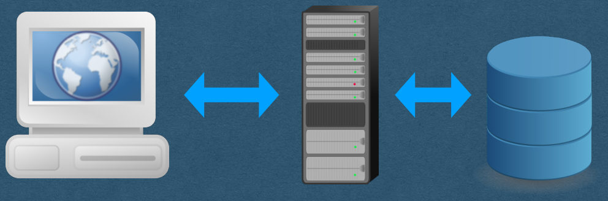
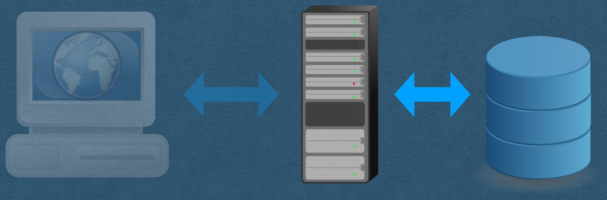
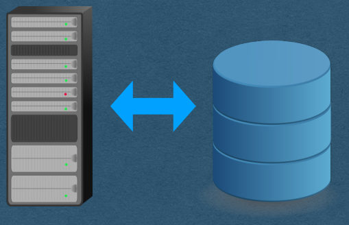
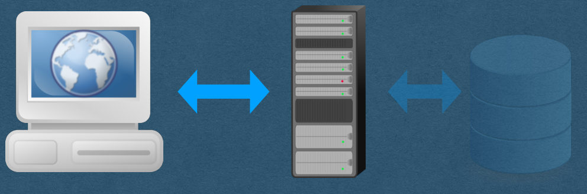
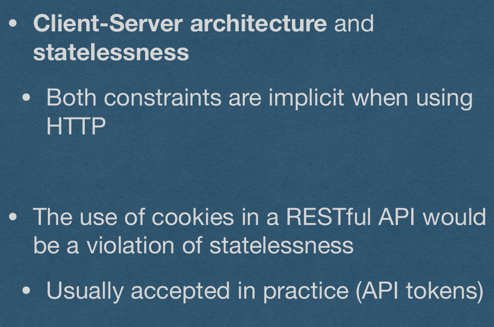
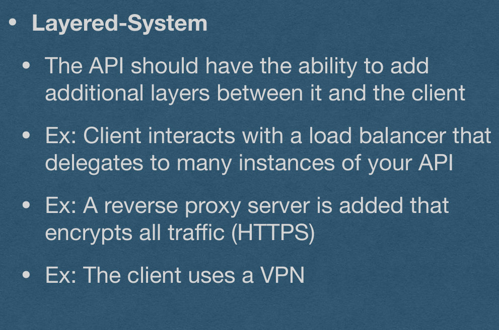
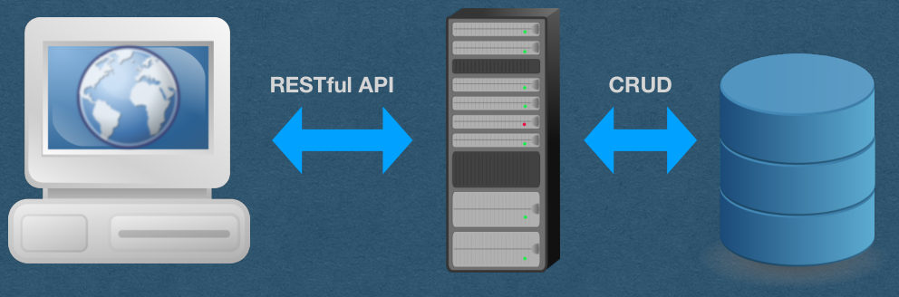

<!-- PDF page 1 -->
## API

<!-- PDF page 2 -->
## Data

- We now have a database that stores app data
- Users have to control data
  - Manage their profile/setting
  - Make posts
  - Use a shopping cart
  - etc.
- How should users interact with stored data?

<!-- PDF page 3 -->
## Data

<!-- REVIEW: diagram rendered whole; describe it in fig-alt -->

- How do users interact with stored data?

User/Client

Server

Database

{fig-alt="TODO: describe this image"}

<!-- PDF page 4 -->
## Data

<!-- REVIEW: diagram rendered whole; describe it in fig-alt -->

- How does our server interact with stored data?

Server

Database

{fig-alt="TODO: describe this image"}

<!-- PDF page 5 -->
## CRUD

<!-- REVIEW: diagram rendered whole; describe it in fig-alt -->

- CRUD is an acronym for the 4 basic operation used to control data
  - Create
  - Retrive
  - Update
  - Delete

{fig-alt="TODO: describe this image"}

<!-- PDF page 6 -->
## CRUD - Create

- Create a new record
- INSERT INTO user (?, ?)
- userCollection.insert_one({"email":"...", "username": "..."})

<!-- PDF page 7 -->
## CRUD - Create

- When a record is created, it should be assigned a unique id
  - This id will be used to identify the created record
  - The id is typically an auto-incrementing integer
    - First record had id==1, second has id==2, etc
  - MySQL can generate these ids for you
    - CREATE TABLE user (id int AUTO_INCREMENT, ...)

<!-- PDF page 8 -->
## CRUD - Create

- MongoDB does not have an auto-increment feature
- You can either:
  - Manage your own auto-incrementing ids
    - Maintain a collection that remembers the last used id
    - Increment the id each time a record is created
  - Or generate your ids any other way you'd like
    - Make sure the id's are unique
    - Id's must be UTF-8 compatible if they will be used in a url

<!-- PDF page 9 -->
## CRUD - Retrieve/List

- Retrieve all records
  - SELECT * FROM user
  - userCollection.find({})
- Retrieving all records is often called List
  - Technically, the acronym is CRUDL when list operations are allowed

<!-- PDF page 10 -->
## CRUD - Retrieve

- Retrieve a single existing record
- SELECT * FROM user WHERE id=3
- userCollection.find_one({"id":3})

<!-- PDF page 11 -->
## CRUD - Update

- Update an existing record
- UPDATE user SET email=?, username=? WHERE id=5
- userCollection.update_one({"id":5}, {"$set": {"email":"...", "username":"..."}})

<!-- PDF page 12 -->
## CRUD - Update

- Can update all fields except the id
  - The id technically can change, but you should never change it
    - It is a unique identifier

<!-- PDF page 13 -->
## CRUD - Delete

- Delete an existing record
- DELETE FROM user WHERE id=2
- userCollection.delete_one({"id":2})

<!-- PDF page 14 -->
## CRUD - Delete

- In practice, common to "soft delete"
  - Don't actually delete the data
  - Instead, mark it as deleted
  - Do not allow retrieve/update operations on data marked as deleted
- Soft deletion allows sys admins to perform additional operations
  - eg. User requests to undo an accidental delete
  - Preserves history (Helpful for debugging)
- For your HW, it’s fine to “hard delete"

<!-- PDF page 15 -->
## Data

<!-- REVIEW: diagram rendered whole; describe it in fig-alt -->

- How do users interact with our server?

User/Client

Server

{fig-alt="TODO: describe this image"}

<!-- PDF page 16 -->
## HTTP Requests

- GET
  - Request data from the server (Retrieve)
- POST
  - Send data to the server (Create)
- PATCH
  - Update a resource (Update)
- PUT
  - Replace an existing record (Update)
- DELETE
  - Delete a resource (Delete)

<!-- PDF page 17 -->
## HTTP - POST v. PATCH v. PUT

- Both POST, PATCH, and PUT are all used to send data to the server, but with different expectations
- POST
  - Requires the server to process the data
  - eg. Generating the id for a created record
- PATCH
  - Make a partial update to an existing record
  - eg. Update only the content of a chat message, but not the author
- PUT
  - Replace an entire existing record
  - Must be idempotent

<!-- PDF page 18 -->
## HTTP - Idempotent

- When multiple identical HTTP requests are sent
  - If the requests are idempotent, they will have the same effect on the server as sending a single request
- The additional requests will not change the data of the API
- In math terms, if our request is a function f
  - f(f(x)) == f(x)

<!-- PDF page 19 -->
## HTTP - Idempotent

- GET and DELETE are idempotent
- GET should not change the data/state of the API
  - Only retrieve data
- Deleting a record twice has the same effect on the API as deleting the record once

<!-- PDF page 20 -->
## HTTP - Idempotent

- PUT must be idempotent
- PUT will replace the entire record with the data of the request
- A second identical PUT doesn't change anything since the record was already replaced

<!-- PDF page 21 -->
## HTTP - Idempotent

- POST is not idempotent
- Since the server is processing the data, there is no implied idempotent property
- eg. Sending 2 identical POST requests to create a record will result in 2 records being created with different ids

<!-- PDF page 22 -->
## HTTP - Idempotent

- PATCH is not idempotent
- In practice, PATCH endpoints are usually idempotent
- There is no expectation that they must be idempotent
- Eg. A record that tracks a counter or how many times it’s been updated

<!-- PDF page 23 -->
## RESTful API

- REST -> REpresentational State Transfer
- We'll use HTTP requests to interact with API data
- REST is designed to simplify the way data is used
  - Improve reliability and scalability

<!-- PDF page 24 -->
## REST and CRUD

- User sends HTTP requests that correlate to CRUD operations on the data
- POST => Create
- GET => Retrieve
- PUT => Update
- DELETE => Delete

{fig-alt="TODO: describe this image"}

<!-- PDF page 25 -->
## RESTful API

- REST is fairly loosely defined (No RFC)
  - Or loosely understood
- Typically measured on a spectrum
  - An API can be more/less RESTful
  - "We could do that, but it's not very RESTful"
  - "Let's refactor our API to make it more RESTful"

<!-- PDF page 26 -->
## REST Constraints

<!-- REVIEW: diagram rendered whole; describe it in fig-alt -->

- Client-Server architecture and statelessness
  - Both constraints are implicit when using HTTP
- The use of cookies in a RESTful API would be a violation of statelessness
  - Usually accepted in practice (API tokens)

{fig-alt="TODO: describe this image"}

<!-- PDF page 27 -->
## REST Constraints

- Cacheablility
  - Each response must contain caching information
  - Requests should be cached if possible
  - Avoid stale data from being cached

{fig-alt="TODO: describe this image"}

<!-- PDF page 28 -->
## REST Constraints

<!-- REVIEW: diagram rendered whole; describe it in fig-alt -->

- Layered-System
  - The API should have the ability to add additional layers between it and the client
  - Ex: Client interacts with a load balancer that delegates to many instances of your API
  - Ex: A reverse proxy server is added that encrypts all traffic (HTTPS)
  - Ex: The client uses a VPN

{fig-alt="TODO: describe this image"}

<!-- PDF page 29 -->
## REST Constraints

- Uniform Interface
  - Resources are defined in the requests
  - The user is given, in a response, enough information to update/delete the resource
  - A request contains all information needed to handle that request
  - The API should be self-contained (No reliance on documentation that cannot be accessed from an API path)

{fig-alt="TODO: describe this image"}

<!-- PDF page 30 -->
## Data

<!-- REVIEW: diagram rendered whole; describe it in fig-alt -->

- Users interact with our RESTful API
- API requests correlate to CRUD operations

RESTful API

CRUD

User/Client

Server

Database

{fig-alt="TODO: describe this image"}
