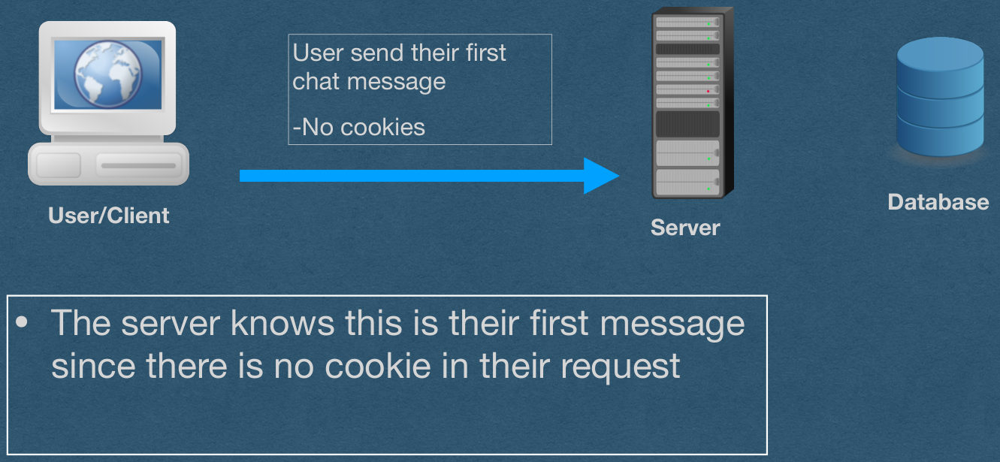
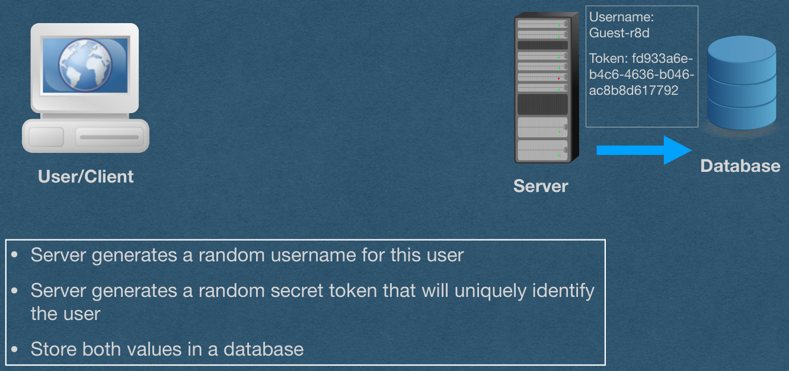
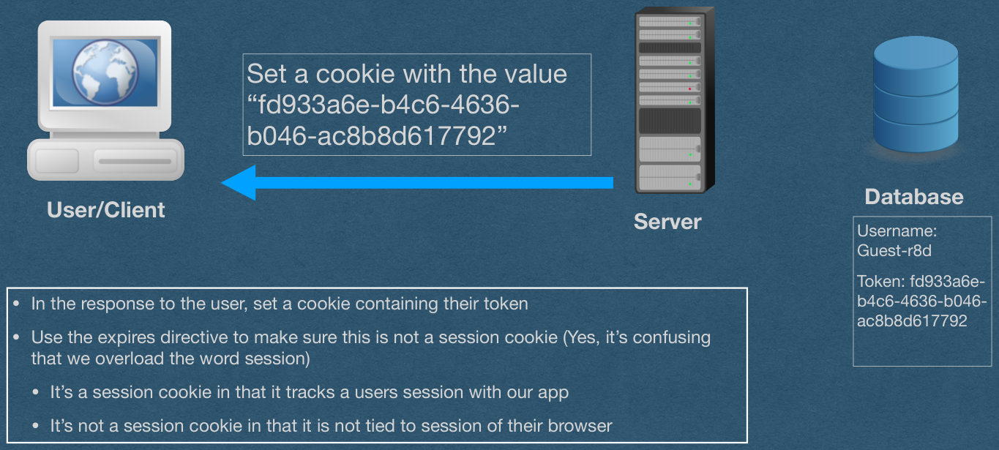
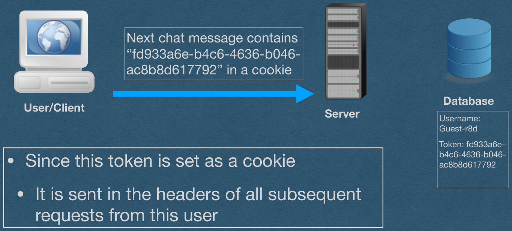
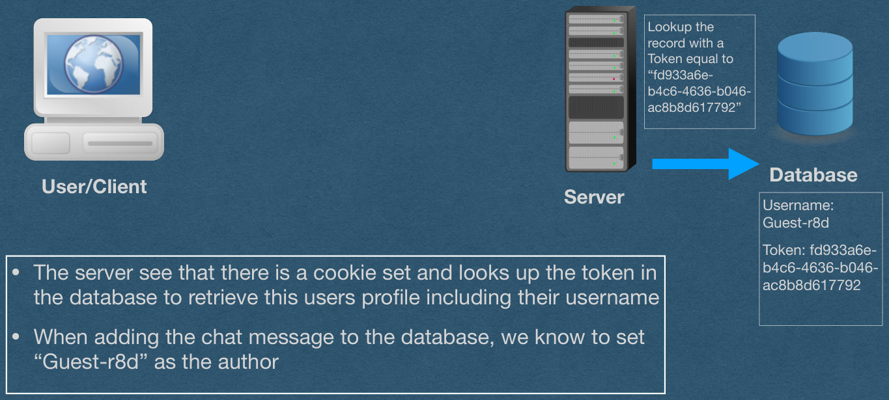
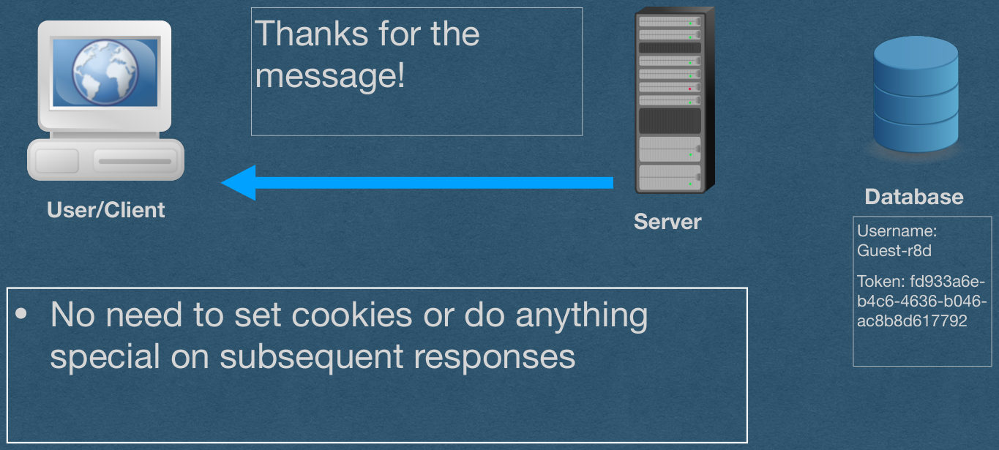

<!-- PDF page 1 -->
## Cookies

<!-- PDF page 2 -->
## State

- HTTP is stateless
  - Each HTTP request is handled independently
- Only the content of the request is used to generate the response
  - Read the request type (GET/POST), path, headers, and body
  - No other information can be requested from the client

<!-- PDF page 3 -->
## State

- We often want the client to have state
- State is required for authentication
  - Otherwise, each client would have to enter their username/password for every action they take
- We want to remember that a client is logged in
- Subsequent requests are already authenticated
- We cannot do this with HTTP alone

<!-- PDF page 4 -->
## Cookies

- Cookies allow us to "remember" information about a user
- Cookies function through HTTP headers
  - Tell the client to set a cookie using a header in your response
  - Client sends that cookie in a header on all subsequent requests

<!-- PDF page 5 -->
## Cookies

- Since cookies work through HTTP headers:
  - ASCII only

<!-- PDF page 6 -->
## Cookie Headers

- Set-Cookie
  - Use this header in your HTTP response to tell a client to set a cookie
- Cookie
  - The client will send all Cookies with each HTTP request using this header

<!-- PDF page 7 -->
## Set-Cookie

- The Set-Cookie header is used by servers to tell the client to set a cookie
- Cookies are sent as key-value pairs
- Syntax:
  - `<key>`=`<value>`
- Example:
  - Set-Cookie: id=X6kAwpgW29M
  - Set-Cookie: visits=4

<!-- PDF page 8 -->
## Set-Cookie

- Only 1 cookie can be set using Set-Cookie
- If you want to set multiple cookies
  - Send multiple Set-Cookie headers
  - Yes, duplicate headers with the same name are allowed
    - *In this course, we won't worry about this in our request parsing code, but you may want to address it in your response class (Technically not required)
    - The browser must handle this when it parses our headers

<!-- PDF page 9 -->
## Cookie

- The header used by clients to deliver all cookies that have been set
- Syntax [Similar to Set-Cookie]:
  - `<key>`=`<value>`
  - All cookies in one header
  - Multiple cookies separated by ;
- Example:
  - Cookie: id=X6kAwpgW29M; visits=4

<!-- PDF page 10 -->
## Directives

- Can add directives when setting a cookie
  - After the cookie, use a ; to specify a directive
  - Separate multiple directives with ;
  - ex: Set-Cookie: id=X6kAwpgW29M; `<directive1>`; `<directive2>`

<!-- PDF page 11 -->
## Directives - Expires

- Expires
  - The exact time when the cookie should be deleted
  - Must be in the format:
    -  `<day-name>`, `<day>` `<month>` `<year>` `<hour>`:`<minute>`:`<second>` GMT
- Set-Cookie: id=X6kAwpgW29M; Expires=Wed, 7 Feb 2024 16:35:00 GMT

<!-- PDF page 12 -->
## Directives - Max-Age

- Max-Age
  - Set the number of second before the cookie expires
  - Much simpler than setting the expires directive
- Set-Cookie: id=X6kAwpgW29M; Max-Age=3600
  - This cookie expires 1 hour after it is set

<!-- PDF page 13 -->
## Directives - Session Cookies

- If neither Expires nor Max-Age are set:
  - The cookie is a session cookie
    - It will be deleted when the user ends the session
  - ie. The cookie is deleted when the browser is closed
    - Note: Browser. Not tab
- Check your cookies in the browser console to ensure that your directives are set properly (ie. under expires, session cookies will say "session")

<!-- PDF page 14 -->
## Directives - Secure

- Secure
  - Only send this cookie over HTTPS
  - The cookie will not be sent over an HTTP connection
  - Protects against packet-sniffing
    - Using wifi, everyone in wifi range can read your HTTP requests
    - They cannot read your HTTPS requests since they are encrypted
  - If used on your HW server with HTTP, the browser won't send these cookies
- Set-Cookie: id=X6kAwpgW29M; Secure

<!-- PDF page 15 -->
## Directives - HttpOnly

- HttpOnly
  - Don't let anyone read or change this cookie using JavaScript
  - Prevents hijackers from reading/changing your cookies with a JavaScript injection attack (XSS Attack)
  - These cookies are not returned when "document.cookie" is accessed
  - Can still access these cookies from the browser console
    - An attacker with access to your machine has all your cookies
- Set-Cookie: id=X6kAwpgW29M; HttpOnly

<!-- PDF page 16 -->
## Directives - Path

- Path
  - Specify a prefix that the path must match for the cookie to be sent
- Set-Cookie: id=X6kAwpgW29M; Path=/posts
  - Cookie is only sent when the requested path begins with /posts

<!-- PDF page 17 -->
## Directives - SameSite

- SameSite
  - Determines when the cookie will be sent on 3rd party requests
  - Lax - Cookie only sent when navigating to your page -and- all 1st party requests
    - The default setting if SameSite is not set
  - Strict - The cookie is only sent on 1st party requests
    - ie. The cookie is only sent to your server when browsing your page
  - None - The cookie is always sent. Requires the secure directive to also be set
- Set-Cookie: id=X6kAwpgW29M; SameSite=Lax
- Set-Cookie: id=X6kAwpgW29M; SameSite=Strict
- Set-Cookie: id=X6kAwpgW29M; SameSite=None; Secure

<!-- PDF page 18 -->
## Client-Side Cookies

- The client can also set and change their cookies
  - Do not trust the value stored in a cookie!
- If a cookie is important for security
  - Verify its validity
- Client can read/set cookies with JavaScript (Unless HTTPOnly is set)
  - So can attackers!
- Access cookies with "document.cookie"

<!-- PDF page 19 -->
## Tracking User Sessions with Cookies

- We often want to know when multiple requests are sent by the same user
  - Eg. A chat where a user sends multiple messages that should all contain the same “username”
- To accomplish this:
  - When they send their first message, create a profile for the user that will store all information about them in a database
  - Generate a random token that is both stored in the database AND set as a cookie for the user
  - Whenever you receive a request, lookup the token in your DB to retrieve the user’s profile

<!-- PDF page 20 -->
## Example

Tracking User Sessions

with Cookies

<!-- PDF page 21 -->
## User Sessions

<!-- REVIEW: diagram rendered whole; describe it in fig-alt -->

```
User send their first
chat message
```

-No cookies

Database

User/Client

Server

- The server knows this is their first message since there is no cookie in their request

{fig-alt="TODO: describe this image"}

<!-- PDF page 22 -->
## User Sessions

<!-- REVIEW: diagram rendered whole; describe it in fig-alt -->

```
Username:
Guest-r8d
```

```
Token: fd933a6e-
b4c6-4636-b046-
ac8b8d617792
```

Database

User/Client

Server

- Server generates a random username for this user
- Server generates a random secret token that will uniquely identify the user
- Store both values in a database

{fig-alt="TODO: describe this image"}

<!-- PDF page 23 -->
## User Sessions

<!-- REVIEW: diagram rendered whole; describe it in fig-alt -->

```
Set a cookie with the value
“fd933a6e-b4c6-4636-
b046-ac8b8d617792”
```

Database

User/Client

Server

```
Username:
Guest-r8d
```

```
Token: fd933a6e-
b4c6-4636-b046-
ac8b8d617792
```

- In the response to the user, set a cookie containing their token
- Use the expires directive to make sure this is not a session cookie (Yes, it’s confusing that we overload the word session)
  - It’s a session cookie in that it tracks a users session with our app
  - It’s not a session cookie in that it is not tied to session of their browser

{fig-alt="TODO: describe this image"}

<!-- PDF page 24 -->
## User Sessions

<!-- REVIEW: diagram rendered whole; describe it in fig-alt -->

```
Next chat message contains
“fd933a6e-b4c6-4636-b046-
ac8b8d617792” in a cookie
```

Database

User/Client

Server

```
Username:
Guest-r8d
```

```
Token: fd933a6e-
b4c6-4636-b046-
ac8b8d617792
```

- Since this token is set as a cookie
  - It is sent in the headers of all subsequent requests from this user

{fig-alt="TODO: describe this image"}

<!-- PDF page 25 -->
## User Sessions

<!-- REVIEW: diagram rendered whole; describe it in fig-alt -->

```
Lookup the
record with a
Token equal to
“fd933a6e-
b4c6-4636-b046-
ac8b8d617792”
```

Database

User/Client

Server

```
Username:
Guest-r8d
```

```
Token: fd933a6e-
b4c6-4636-b046-
ac8b8d617792
```

- The server see that there is a cookie set and looks up the token in the database to retrieve this users profile including their username
- When adding the chat message to the database, we know to set “Guest-r8d” as the author

{fig-alt="TODO: describe this image"}

<!-- PDF page 26 -->
## User Sessions

<!-- REVIEW: diagram rendered whole; describe it in fig-alt -->

```
Thanks for the
message!
```

Database

User/Client

Server

```
Username:
Guest-r8d
```

```
Token: fd933a6e-
b4c6-4636-b046-
ac8b8d617792
```

- No need to set cookies or do anything special on subsequent responses

{fig-alt="TODO: describe this image"}

<!-- PDF page 27 -->
## User Sessions

- With multiple users:
  - Each user has a different username and token
  - The tokens are all secret so users cannot steal each others identities
  - Usernames are public and displayed to all users in the chat
- Server identifies each user based on their token cookie
