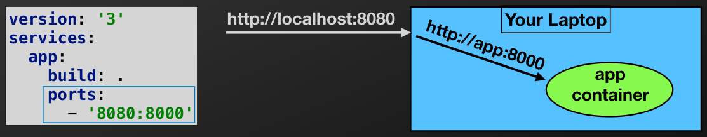
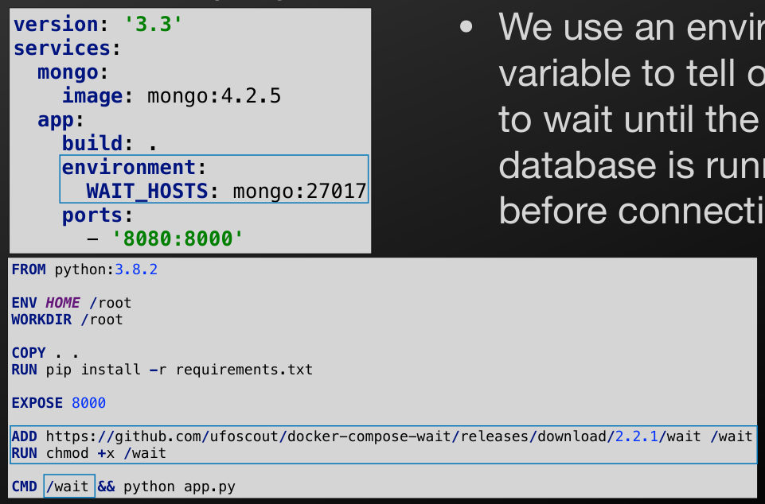
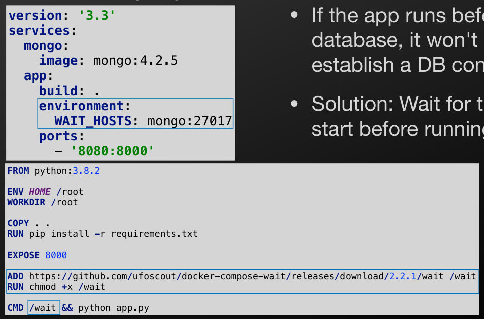
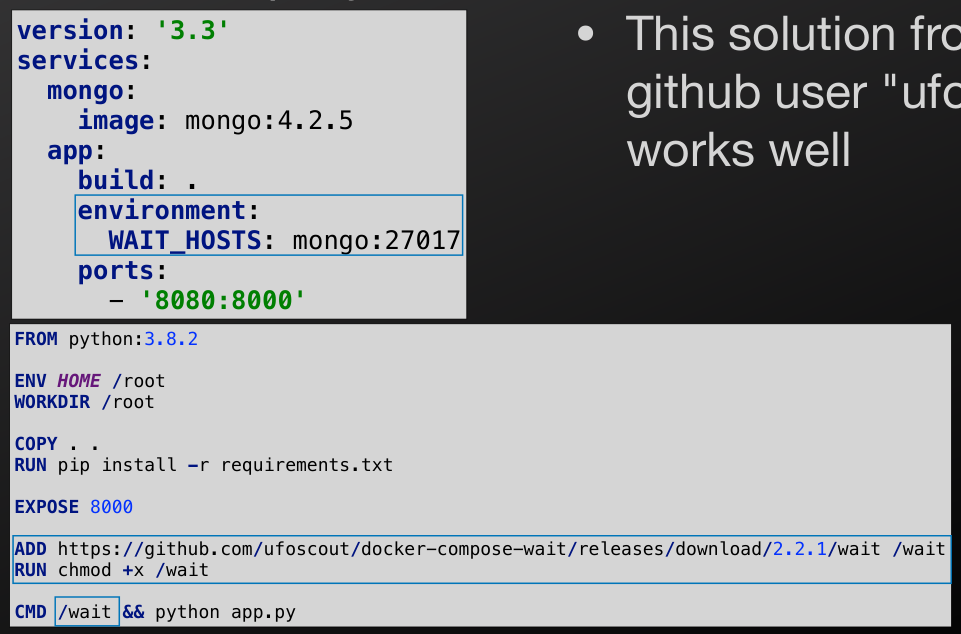
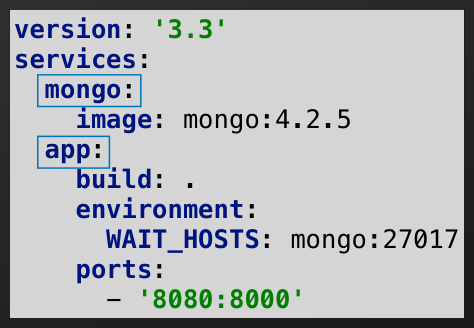
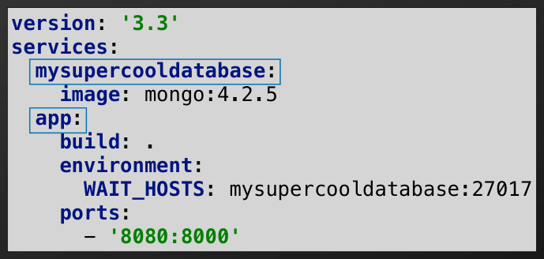

## Docker and docker compose

1

## Vocab

- Development Environment (dev)
  - The environment where you write your code
  - Ex. Your laptop
  - Add features; Find and eliminate bugs
- Production environment (prod)
  - The environment where your app will eventually live
  - The live server with real end users
  - Do everything we can to avoid bugs in production

2

## Deployment Headaches

- It works on my laptop!
- Run your code in production and it's broken
- Many causes
  - Different version of compiler/interpreter
  - Dependancies not linked
  - Hard-coded paths
  - Different environment variables
  - etc.

3

## Virtual Machines

- Simulate an entire machine
- Run the virtual machine (VM) in your development environment for testing
- Run an exact copy of the VM on the production server
- No more surprise deployment issues
- Simulating an entire machine can be inefficient
  - If you've ran a VM on your laptop you know how slow this can get

4

## Security

- Can't break out of the VM [Without sophisticated attacks]
- If an attacker compromises the server, they can only access what you put in the container
  - Can't "rm -rf /" your entire machine
  - Patch the exploited vulnerability and rebuild the image
- The attacker can still cause significant damage and steal private data
  - They just can't destroy your server box

5

## Security

- Sometimes an app has to allow code injection attacks to function
  - AutoLab
  - AWS
  - Digital Ocean
- Run user code in their own VM/Container

6

## Containers

- Effectively, lightweight VMs

7

## Docker

- Docker is software that's used to create containers
- Install Docker in your development environment to test containers
- Install Docker in your production environment and run the same containers

8

## Dockerfile

- To start working with Docker, write a Dockerfile
- This file contains all the instructions needed to build a Docker image
  - Some similarities to a Makefile

9

## Dockerfile

- Let's explore this sample Dockerfile

FROM ubuntu:18.04

RUN apt-get update

```
ENV HOME /root
```

```
WORKDIR /root
```

```
RUN apt-get update --fix-missing
RUN apt-get install -y nodejs
RUN apt-get install -y npm
```

- This Dockerfile creates an image for a node.js app

```
COPY . .
```

```
RUN npm install
```

```
EXPOSE 8000
```

# Run the app

CMD node app-www.js

10

## Dockerfile

- The first line of your Dockerfile will specify the base image
- This image is downloaded and the rest of your Dockerfile adds to this image
- In this example: We start with Ubuntu 18.04

FROM ubuntu:18.04

RUN apt-get update

```
ENV HOME /root
```

```
WORKDIR /root
```

```
RUN apt-get update --fix-missing
RUN apt-get install -y nodejs
RUN apt-get install -y npm
```

```
COPY . .
```

```
RUN npm install
```

  - Our Dockerfile can run Linux commands in Ubunutu

```
EXPOSE 8000
```

# Run the app

CMD node app-www.js

11

## Dockerfile

- Use the RUN keyword to run commands in the base image
- Use this for any setup of your OS before setting up your app
- In this example: Updating apt-get which is used to install software

FROM ubuntu:18.04

RUN apt-get update

```
ENV HOME /root
```

```
WORKDIR /root
```

```
RUN apt-get update --fix-missing
RUN apt-get install -y nodejs
RUN apt-get install -y npm
```

```
COPY . .
```

```
RUN npm install
```

```
EXPOSE 8000
```

# Run the app

CMD node app-www.js

12

## Dockerfile

- Use ENV to set environment variables
  - Setting the home directory here
  - Can use ENV to setup any other variables you need
- Use WORKDIR to change your current working directory
  - Same as "cd"

FROM ubuntu:18.04

RUN apt-get update

```
ENV HOME /root
```

```
WORKDIR /root
```

```
RUN apt-get update --fix-missing
RUN apt-get install -y nodejs
RUN apt-get install -y npm
```

```
COPY . .
```

```
RUN npm install
```

```
EXPOSE 8000
```

# Run the app

CMD node app-www.js

13

## Dockerfile

- Since we're starting with a fresh image of Ubuntu:
  - Only the default software is installed
- RUN commands to install all required software for your app
  - Typically the development tools for your language of choice

FROM ubuntu:18.04

RUN apt-get update

```
ENV HOME /root
```

```
WORKDIR /root
```

```
RUN apt-get update --fix-missing
RUN apt-get install -y nodejs
RUN apt-get install -y npm
```

```
COPY . .
```

```
RUN npm install
```

```
EXPOSE 8000
```

# Run the app

CMD node app-www.js

14

## Dockerfile

- COPY all your app file into the image
- "." denotes the current directory
- Run docker from your apps root directory

FROM ubuntu:18.04

RUN apt-get update

```
ENV HOME /root
```

```
WORKDIR /root
```

```
RUN apt-get update --fix-missing
RUN apt-get install -y nodejs
RUN apt-get install -y npm
```

  - The the first "." will refer to your apps directory
- We changed the home and working directory to /root

```
COPY . .
```

```
RUN npm install
```

  - The second "." refers to /root in the image

```
EXPOSE 8000
```

# Run the app

CMD node app-www.js

15

## Dockerfile

- Now that your apps files are in the image, run all app specific commands
- Order is important
  - Don't depend on your app files before copying them into the image
- Use RUN to install dependancies and perform any other required setup

FROM ubuntu:18.04

RUN apt-get update

```
ENV HOME /root
```

```
WORKDIR /root
```

```
RUN apt-get update --fix-missing
RUN apt-get install -y nodejs
RUN apt-get install -y npm
```

```
COPY . .
```

```
RUN npm install
```

```
EXPOSE 8000
```

# Run the app

CMD node app-www.js

16

## Dockerfile

- Use EXPOSE to allow specific ports to be accessed from outside the container
- By default, all ports are blocked

FROM ubuntu:18.04

RUN apt-get update

```
ENV HOME /root
```

```
WORKDIR /root
```

```
RUN apt-get update --fix-missing
RUN apt-get install -y nodejs
RUN apt-get install -y npm
```

  - Container is meant to run in isolation
- To run a web app in a container, expose the port you need

```
COPY . .
```

```
RUN npm install
```

```
EXPOSE 8000
```

# Run the app

CMD node app-www.js

17

## Dockerfile

- Finally, use CMD to run your app
- Important: Do not use RUN to run your app!
- RUN will execute the command when the image is being built
- CMD will execute when the container is ran
- We do not want the app to run when the image is being built

FROM ubuntu:18.04

RUN apt-get update

```
ENV HOME /root
```

```
WORKDIR /root
```

```
RUN apt-get update --fix-missing
RUN apt-get install -y nodejs
RUN apt-get install -y npm
```

```
COPY . .
```

```
RUN npm install
```

```
EXPOSE 8000
```

# Run the app

CMD node app-www.js

18

## Dockerfile

- There are many base images to choose from
- Start with an image with your language installed to simplify your docker file

FROM node:13

```
ENV HOME /root
WORKDIR /root
```

COPY . .

  - Search "docker `<language>`" to find images/tutorials for your favorite language
- This image starts with node installed so we can remove the node installation lines

```
RUN npm install
```

EXPOSE 8000

CMD node app-www.js

19

## Dockerfile

- Example for Python

FROM python:3.8

```
ENV HOME /root
WORKDIR /root
```

COPY . .

```
RUN pip3 install -r requirements.txt
```

EXPOSE 8000

CMD python3 -u app.py

20

## Dockerfile

- For Python
  - Make sure you add this -u flag
  - This will force stdout and stderr to be unbuffered
  - Without it, when running in Docker, you might not see your print statements

FROM python:3.8

```
ENV HOME /root
WORKDIR /root
```

COPY . .

```
RUN pip3 install -r requirements.txt
```

EXPOSE 8000

CMD python3 -u app.py

21

## Running Your App

- When preparing your app to run in a container
  - Do not use "localhost" [in your code]
  - Use "0.0.0.0" as the host instead
  - This allows your app to be accessed from outside the container

22

## Docker Compose

## Docker Compose

- Manages building/running docker images/containers
- Build and run with one command
  - docker compose up --build --force-recreate
- No need to use docker build and docker run
- Will be used to manage multiple containers
  - Separate container for your database
- Let's walk through a docker-compose.yml file

## Docker Compose

docker-compose.yml

```
version: '3'
services:
app:
build: .
ports:
- '8080:8000'
```

- Specify the docker compose file format version
- Version 3[.8] is the current latest version
- This line is now optional

## Docker Compose

docker-compose.yml

```
version: '3'
services:
app:
build: .
ports:
- '8080:8000'
```

- List of all the services for docker compose to run
- A docker container is created for each service

## Docker Compose

docker-compose.yml

```
version: '3'
services:
app:
build: .
ports:
- '8080:8000'
```

- Name each service
- We have one service that we name "app"
- This name becomes the hostname when communicating between containers

## Docker Compose

docker-compose.yml

```
version: '3'
services:
app:
build: .
ports:
- '8080:8000'
```

- Use 'build' to specify the path to build from
  - Docker compose will look in this directory for a Dockerfile and use it to build the image
- Same as the trailing '.' when building an image

## Docker Compose

docker-compose.yml

```
version: '3'
services:
app:
build: .
ports:
- '8080:8000'
```

- Map a local port to a container port
- Same as using "-p 8080:8000" when running a single container

## Docker Compose

docker-compose.yml

```
version: '3'
services:
app:
build: .
ports:
- '8080:8000'
```

- Mapping a port allows your app [inside the container] to be accessed from your machine
- This line maps your local port 8080 [On your machine] to port 8000 inside your container

## Docker Compose


docker-compose.yml

```
version: '3'
services:
app:
build: .
ports:
- '8080:8000'
```

http://localhost:8080

Your Laptop

http://app:8000

app

container

- When your machine receives a request for the mapped port
  - Docker forwards the request to the container on the specified port

{fig-alt="TODO: describe this image"}

## Running Your App

- To run your app
  - docker compose up
- To run in detached mode
  - docker compose up -d
- To rebuild and restart the containers
  - docker compose up --build --force-recreate
  - *This is the best command to use!
- To restart the container without rebuilding
  - docker compose restart

## Running Your App

- To rebuild and restart the containers
  - docker compose up --build --force-recreate
- Use this command during development
- Very important to rebuild your images after you change code
  - If you don't, you will not see your changes since you'll be running your old code

## Docker Compose

docker-compose.yml

```
version: '3.3'
services:
mongo:
image: mongo:4.2.5
app:
build: .
environment:
WAIT_HOSTS: mongo:27017
ports:
- '8080:8000'
```

- Let's modify our docker compose configuration to run our database

## Docker Compose

docker-compose.yml

```
version: '3.3'
services:
mongo:
image: mongo:4.2.5
app:
build: .
environment:
WAIT_HOSTS: mongo:27017
ports:
- '8080:8000'
```

- "services" is a list of all the images/ containers to create
- We'll add a second service for the DB

## Docker Compose


docker-compose.yml

```
version: '3.3'
services:
mongo:
image: mongo:4.2.5
app:
build: .
environment:
WAIT_HOSTS: mongo:27017
ports:
- '8080:8000'
```

- Name each service
- These names are used as the hostnames for each container
  - Used to communicate between containers

{fig-alt="TODO: describe this image"}

## Docker Compose

docker-compose.yml

```
version: '3.3'
services:
mongo:
image: mongo:4.2.5
app:
build: .
environment:
WAIT_HOSTS: mongo:27017
ports:
- '8080:8000'
```

- This service named 'mongo' uses a pre-built image
  - Same as having a 1-line Dockerfile:
    - "FROM mongo:4.2.5"
- No Dockerfile is needed

## Docker Compose

docker-compose.yml

```
version: '3.3'
services:
mongo:
image: mongo:4.2.5
app:
build: .
environment:
WAIT_HOSTS: mongo:27017
ports:
- '8080:8000'
```

- Use 'environment' to set any needed environment variables
- If using MySQL, set variables for your username/ password

## Docker Compose


docker-compose.yml

- We use an environment variable to tell our app to wait until the database is running before connecting to it

```
version: '3.3'
services:
mongo:
image: mongo:4.2.5
app:
build: .
environment:
WAIT_HOSTS: mongo:27017
ports:
- '8080:8000'
```

FROM python:3.8.2

```
ENV HOME /root
WORKDIR /root
```

```
COPY . .
RUN pip install -r requirements.txt
```

EXPOSE 8000

```
ADD https://github.com/ufoscout/docker-compose-wait/releases/download/2.2.1/wait /wait
RUN chmod +x /wait
```

CMD /wait && python app.py

{fig-alt="TODO: describe this image"}

## Docker Compose


docker-compose.yml

- If the app runs before the database, it won't be able to establish a DB connection
- Solution: Wait for the DB to start before running the app

```
version: '3.3'
services:
mongo:
image: mongo:4.2.5
app:
build: .
environment:
WAIT_HOSTS: mongo:27017
ports:
- '8080:8000'
```

FROM python:3.8.2

```
ENV HOME /root
WORKDIR /root
```

```
COPY . .
RUN pip install -r requirements.txt
```

EXPOSE 8000

```
ADD https://github.com/ufoscout/docker-compose-wait/releases/download/2.2.1/wait /wait
RUN chmod +x /wait
```

CMD /wait && python app.py

{fig-alt="TODO: describe this image"}

## Docker Compose


docker-compose.yml

- This solution from github user "ufoscout" works well

```
version: '3.3'
services:
mongo:
image: mongo:4.2.5
app:
build: .
environment:
WAIT_HOSTS: mongo:27017
ports:
- '8080:8000'
```

FROM python:3.8.2

```
ENV HOME /root
WORKDIR /root
```

```
COPY . .
RUN pip install -r requirements.txt
```

EXPOSE 8000

```
ADD https://github.com/ufoscout/docker-compose-wait/releases/download/2.2.1/wait /wait
RUN chmod +x /wait
```

CMD /wait && python app.py

{fig-alt="TODO: describe this image"}

## Docker Compose

docker-compose.yml

```
version: '3.3'
services:
mongo:
image: mongo:4.2.5
app:
build: .
environment:
WAIT_HOSTS: mongo:27017
ports:
- '8080:8000'
```

- This file is used to build both images and run both containers using docker-compose

## Docker Compose


docker-compose.yml

```
version: '3.3'
services:
mongo:
image: mongo:4.2.5
app:
build: .
environment:
WAIT_HOSTS: mongo:27017
ports:
- '8080:8000'
```

mongo_client = MongoClient('localhost')

mongo_client = MongoClient('mongo')

- Recall that we chose names for each service
- When connecting to the database in your app
  - The service name is the hostname for the container

{fig-alt="TODO: describe this image"}

## Docker Compose


docker-compose.yml

- version: '3.3' services: mongo: image: mongo:4.2.5 app: build: . environment: WAIT_HOSTS: mongo:27017 ports: - '8080:8000'
- Use the name of the service
- docker-compose will resolve this hostname to the appropriate container

mongo_client = MongoClient('localhost')

mongo_client = MongoClient('mongo')

{fig-alt="TODO: describe this image"}

## Docker Compose


docker-compose.yml

```
version: '3.3'
services:
mysupercooldatabase:
image: mongo:4.2.5
app:
build: .
environment:
WAIT_HOSTS: mysupercooldatabase:27017
ports:
- '8080:8000'
```

mongo_client = MongoClient('localhost')

mongo_client = MongoClient('mysupercooldatabase')

- We can name our services whatever we want
- Make sure you are consistent!

{fig-alt="TODO: describe this image"}

## Running Your App

- docker-compose up --build --force-recreate
  - Will now start both containers
  - Use the service name as the host name to communicate across containers
