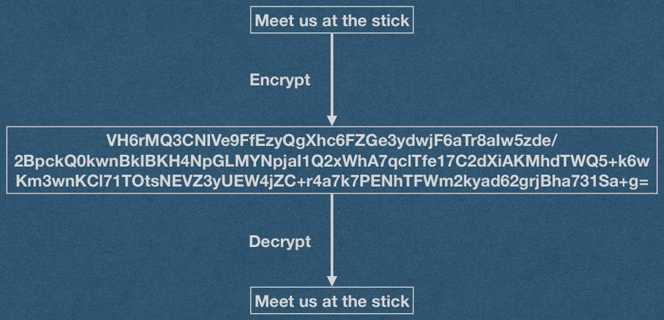

## Encryption

## The Problem

- Using HTTP, anyone with access to your packets can see everything you are doing online
  - This includes your passwords!
- Who has access to my packets?
  - Your ISP at home
  - UBIT on campus
  - Tier 1 Networks

## The Problem

- Using HTTP, anyone with access to your packets can see everything you are doing online
  - This includes your passwords!
- Who has access to my packets?
  - Your ISP at home
  - UBIT on campus
  - Tier 1 Networks
  - .. and everyone within wifi range of your device!

## The Problem

- Using HTTP, anyone with access to your packets can see everything you are doing online
  - This includes your passwords!
- Why does this include passwords? Are they not hashed?
- --Demo--

## The Problem

- Using HTTP, anyone with access to your packets can see everything you are doing online
  - This includes your passwords!
- Passwords are sent over the Internet in plain text!
  - Hashing client-side does not add any security.

## The Solution

- We'll just add an S to our protocol and call it HTTPS
  - HTTP over TLS

## Encryption

- Hide communication from attackers/eavesdroppers
- Want to send a plaintext message
  - Could be HTML, JSON, JavaScript, text, an image, etc
  - Plaintext is a cryptographic term to mean unencrypted
  - We encrypt at the byte level
- Encrypting the plaintext outputs a random looking cyphertext
- No one should be able to read this cypher text except the intended recipient
- Only the intended recipient can decrypt the cyphertext and read the plaintext message

## Encryption

Meet us at the stick

Encrypt

VH6rMQ3CNIVe9FfEzyQgXhc6FZGe3ydwjF6aTr8aIw5zde/

2BpckQ0kwnBkIBKH4NpGLMYNpjaI1Q2xWhA7qclTfe17C2dXiAKMhdTWQ5+k6w

Km3wnKCl71TOtsNEVZ3yUEW4jZC+r4a7k7PENhTFWm2kyad62grjBha731Sa+g=

Decrypt

Meet us at the stick

{fig-alt="TODO: describe this image"}

## Public Key Encryption

- How do we ensure that only the intended recipient can decrypt the message?
  - Public Key Encryption
- Generate a public and private encryption key
  - Private key is kept private
  - Public key is shared with anyone/everyone
- A message encrypted with the public key can only be decrypted by the corresponding private key
- If I want to send a message to someone, I can encrypt the message with their public key

## Public Key Encryption

- The public and private key are inherently related
- An attacker must not be able to determine the private key given the public key [In any reasonable amount of time]
- An attacker must not be able to decrypt cyphertext without the private key [In any reasonable amount of time]
- Any public key encryption algorithm must have these properties [And more]
  - Math and theory will help us

## Public Key Encryption - RSA

- RSA - Rivest-Shamir-Adleman
  - A public key crypto system with the desired properties [we hope]
- Provides algorithms to:
  - Generate a public/private key pair
  - Encrypt with the public key
  - Decrypt with the private key

## Public Key Encryption - RSA

- Key Generation
- Choose two [large] prime numbers p and q
- n = p*q
- λ(n) = lcm(p-1, q-1)
- Choose e < λ(n) and gcd(e, λ(n)) = 1
- d = e^{-1} mod λ(n)
- Share e and n as the public key
- Keep d as the private key
- Discard p, q, and λ(n)

## Public Key Encryption - RSA

- Encryption
- To send a message m
- Compute c = m^e mod(n)
- Send c
- Decryption
- Receive c
- Compute m = c^d mod(n)
- Read m

## Public Key Encryption - RSA

- RSA key generation gives us: m = m^(e*d) mod(n)
- This means that we can also encrypt with the private key and decrypt with the public key
  - We call this a signature
  - Everyone can decrypt the message so there is no privacy
  - However, there is a guarantee that the author is legitimate (You know I'm the one who sent this message)

## Public Key Encryption - RSA

- What about a brute force attack?
  - Attacker has the public key
  - Keep encrypting "guesses" of the plaintext until the cyphertext matches

## Public Key Encryption - RSA

- What about a brute force attack?
- Solution: Use a padding algorithm
  - Add random bits to the end of each message
  - Attacker must guess these random bits
  - Adds security!
  - Unlike salting, padding can be kept secret and adds entropy
  - Makes encryption of even short messages secure!

## Public Key Encryption - RSA

- Unlike salting, padding can be kept secret and adds entropy
  - Why?

## Public Key Encryption - RSA

- Unlike salting, padding can be kept secret and adds entropy
- Cyphertext will be decrypted by the recipient
  - After decrypting, discard the padding and read the message
  - Use a delimiter to indicate the beginning of the padding
- Hash will never be "unhashed"
  - Cannot identify/discard the salt

## Public Key Encryption - RSA

- Key Generation
- Choose two [large] prime numbers p and q
- n = p*q
- λ(n) = lcm(p-1, q-1)
- Choose e < λ(n) and gcd(e, λ(n)) = 1
- d = e^{-1} mod λ(n)
- Given p, q, and e an attacker can easily compute d (private key)
- Everyone already has e and n (the public key)
- So just factor n to get p and q, then compute the private key

## Public Key Encryption - RSA

Factoring is hard [We hope]

- There is no publicly known algorithm that can efficiently factor a number
- Worst case is factoring the multiplication of two large primes
  - Exactly what RSA relies on for security
- It has not been proven that factoring is a "hard" problem
  - Quantum computers can factor efficiently
- We call the factoring problem a cryptographic primitive

## Public Key Encryption - RSA

- Encryption
- To send a message m
- Compute c = m^e mod(n)
- Send c
- Everyone knows e and n (The public key)
- An attacker can read c if they are within wifi range
- Just have to compute the discrete log_e of c mod n

## Public Key Encryption - RSA

Computing a Discrete Log is hard [We hope]

- There is no publicly know algorithm that can efficiently compute discrete logarithms
- This problem is another cryptographic primitive

## Public Key Encryption

Demo
