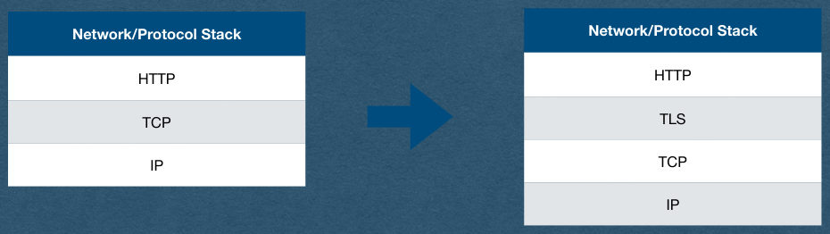
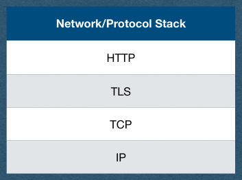

<!-- PDF page 1 -->
## HTTP over SSL/TLS

<!-- PDF page 2 -->
## Signed Certificates

<!-- PDF page 3 -->
## Vulnerability

- Man-in-the-middle attack
- The first step in an HTTPS connection:
  - Client requests the server's public key
- An attacker controlling a router in one of the networks handling your packets can intercept this request and replace it with their own public key
- Attacker then intercepts all subsequent requests, decrypts them and responds with their responses
- It looks like you're talking to the server..
- Certificate Authorities (CA) can fix that

<!-- PDF page 4 -->
## Certificate Authority (CA)

- A CA is a trusted source with a known public key
  - Public key is pre-installed with your OS or your browser (Called a root CA)
  - Assume no man-in-the-middle attack during OS and browser installation
- The CA issues certificates for domains and subdomains
  - You verify that you control the domain
  - Send them your public key (Signed with your private key)
  - They send you a certificate

<!-- PDF page 5 -->
## Certificate Authority (CA)

- Certificate includes
  - Your public key
  - Domain name and CA name
  - A cryptographic signature of a hash of the certificate body
    - The signature uses the CA's private key so you can verify it with their pre-installed public key that this was in fact issued by the CA
    - Man-in-the-middle cannot fake this without the CA's private key!

<!-- PDF page 6 -->
## Certificate Authority (CA)

- Key chain
  - Not all CA public keys are pre-installed on your machine
  - A CA can have their public key certified by a root CA
  - A domain must provide a key chain that leads to a root CA
- Example key chain
  - Let's Encrypt certificate is signed by DST Root CA
  - Let's Encrypt will sign your certificate
  - Your key chain contains your public key signed by Let's Encrypt and Let's Encrypt's certificate is signed by DST
  - Your browser starts with it's installed DST cert to verify the chain
- If a cert cannot be verified by a root CA, it is called Self-signed and should not be trusted

<!-- PDF page 7 -->
## Certificate Authority (CA)

- For your project:
  - You must obtain and install a valid signed certificate
  - There must not be any security warnings given by the browser

<!-- PDF page 8 -->
## Self-Signed Certificates

<!-- PDF page 9 -->
## Self-Signed Certificate

- A CA will only sign your certificate if you control a domain name
  - Buy a domain name and prove to the CA that you control it
- Cannot get a signed cert for "localhost"
- We'll generate our own self-signed certificates for the HW
  - For development/educational purposes only!
  - When you deploy an app for real users, do not use a self- signed cert!
  - These certs cannot be verified and are therefor vulnerable to man-in-the-middle attacks

<!-- PDF page 10 -->
## OpenSSL

- OpenSSL is a very common SSL/TLS library
  - Written in C
  - Wrappers exist for many languages
- Can be used for many encryption needs
  - Generating keys
  - Signing certs
  - Validating certs
- We'll use OpenSSL in the command line to generate self-signed certificates

<!-- PDF page 11 -->
## Self-Signed Certificate

openssl req -x509 -newkey rsa:4096 -keyout private.key -out cert.pem -days 365 -sha256 -nodes

- This command has many options
  - You can adjust the options for your HW if you'd like
- req
  - Request a signed certificate
- -x509
  - Use the x509 standard format for the certificate
- -newkey rsa:4096
  - Generate a new key for this cert using the RSA algorithm and a 4k key size

<!-- PDF page 12 -->
## Self-Signed Certificate

openssl req -x509 -newkey rsa:4096 -keyout private.key -out cert.pem -days 365 -sha256 -nodes

- -keyout private.key
  - Save the private key in a file named "private.key"
- -out cert.pem
  - Save the public certificate in a file named "cert.pem"
- -days 365
  - This certificate will expire in 1 year
- -nodes
  - Do not require a password to use the private key

<!-- PDF page 13 -->
## Self-Signed Certificate

openssl req -x509 -newkey rsa:4096 -keyout private.key -out cert.pem -days 365 -sha256 -nodes

- Once SSL is installed (Required on Windows) you can run commands in the command line
- This command will generate a self-signed certificate

<!-- PDF page 14 -->
## Self-Signed Certificate

openssl req -x509 -newkey rsa:4096 -keyout private.key -out cert.pem -days 365 -sha256 -nodes -subj "/C=US"

- If you run the command on the previous slides, you’ll be asked a lot of questions
  - For most, you can hit enter and leave them blank
  - You must enter your country code though (eg. "us")
- Or add -subj "/C=US"
  - This lets you set your answers to all the questions
  - Required to set country code, and you can leave the rest blank
  - Allows you run this command in a script

<!-- PDF page 15 -->
## Installing the Certificate

- Now that we have a certificate, we need to use it in our server to enable TLS
- Could add the cert to our server code directly
- We'll prefer to use a reverse proxy server

<!-- PDF page 16 -->
## HTTPS

<!-- PDF page 17 -->
## HTTPS

- Commonly called HTTP Secure or Secure HTTP
- From a web app development perspective
  - HTTPS is the same protocol as HTTP
  - We reuse all of our HTTP code
- The difference is that all our requests/responses are encrypted via SSL/TLS
  - SSL (Secure Socket Layer) was renamed to TLS (Transport Layer Security) after SSL 3.0
  - I'll only refer to the protocol as TLS after this note

<!-- PDF page 18 -->
## TLS

<!-- REVIEW: diagram rendered whole; describe it in fig-alt -->

- TLS fits between TCP and HTTP on our protocol stack
- All these protocols are modular
  - TCP is not aware that the bytes it's sending are encrypted
  - HTTP is not aware that the requests were encrypted or that the responses will be encrypted

Network/Protocol Stack

Network/Protocol Stack

HTTP

HTTP

TCP

TLS

TCP

IP

IP

{fig-alt="TODO: describe this image"}

<!-- PDF page 19 -->
## TLS

<!-- REVIEW: diagram rendered whole; describe it in fig-alt -->

- This allows us to continue to use TCP and HTTP
- We only need to add the TLS layer to our web apps to gain encryption
  - This will not require any changes to the HTTP side of our servers!

Network/Protocol Stack

HTTP

TLS

TCP

IP

{fig-alt="TODO: describe this image"}

<!-- PDF page 20 -->
## Communication with TLS

<!-- PDF page 21 -->
## TLS

- What we want:
  - Two-way encrypted traffic
- What we have:
  - A server with a public/private key pair verified by a CA
- A client could encrypt using the servers public key
- How does the server encrypt responses sent to the client?

<!-- PDF page 22 -->
## TLS Overview

- Client and server negotiate a TLS handshake
- During the handshake, a symmetric encryption key is agreed upon
  - Same key encrypts and decrypts
- Client and server both have this key
- All communication in both directions is encrypted with this key
- With this goal in mind, how do a client and server securely agree on this key without an eavesdropper also knowing the key?

<!-- PDF page 23 -->
## Diffie-Hellman Key Exchange

- Client and server agree on a prime number p with a group generator g
  - A generator for a prime group means that
    - For each value 0 < i < p
    - g^i mod p is a unique value
    - We say g generates the group since multiplying g by itself p times (mop p) will provide every value 1 to p-1
- Both p and g are public

<!-- PDF page 24 -->
## Diffie-Hellman Key Exchange

- Client and server both generate a random number
  - Call the clients number a
  - Call the servers number b
- Both a and b are private
  - Client and server cannot even share these values with each other

<!-- PDF page 25 -->
## Diffie-Hellman Key Exchange

- Client computes g^a mod p
  - Sends this value to the server
  - Server raises this value to the power of b mod p
  - Server now has g^{ab} mod p
- Server computes g^b mod p
  - Sends this value to the client
  - Client raises this value to the power of a mod p
  - Client now has g^{ab} mod p

<!-- PDF page 26 -->
## Diffie-Hellman Key Exchange

- Client and server now have a shared secret g^{ab} mod p
  - This secret is used as a seed to generate a symmetric encryption key
    - Or used directly as the key
- The only values containing secret values that were sent over the network were
  - g^a mod p
  - g^b mod p
- And computing a or b from these values involves computing a discrete logarithm which is a cryptographic primitive

<!-- PDF page 27 -->
## Symmetric Key Encryption

- Once the Client and server have a shared symmetric key, they can encrypt all their communication with this key
- The same key encrypts and decrypts
- Typical choice of algorithm is AES (Advanced Encryption Standard)
  - Very brief description: AES repeatedly scrambles bytes and XORs them with values generated by the encryption key
  - AES does not reduce to a cryptographic primitive
  - Theoretical attacks exist, but no known practical attacks

<!-- PDF page 28 -->
## TLS 1.2 Handshake

- Client Hello
  - Here are the algorithms I support
- Server Hello
  - Here are the algorithms we'll use for this connection
- Server sends its certificate
- Client and server both generate their part of the symmetric key based on the chosen algorithms
  - Ex. Generate a and send g^a mod p
  - Server signs its portion with the private key from its certificate
- With the partial key received from the client/server, compute the rest of the symmetric key
- Both parties now have the symmetric key and can encrypt/decrypt all following traffic

<!-- PDF page 29 -->
## Forward Secrecy

- Note that the servers keys from its certificate were only used to verify the servers identity during the key exchange
- The encryption of traffic was done with a one-time symmetric key
  - A different key is generated for every TLS connection
- Even if an eavesdropper stored all of the encrypted traffic and later stole the servers private key linked to the certificate
  - They are still out of luck (Cannot use this private key to find the symmetric key)
  - This is called forward secrecy

<!-- PDF page 30 -->
## Algorithms Note

- RSA, Diffie-Hellman Key Exchange, and AES were mentioned as examples
- The algorithms change and evolve over time
- Different servers/clients may support different sets of algorithms over time
- TLS is very flexible and allows for any algorithms to be used, so long as the client and server both agree which ones will be used
  - TLS itself does not define how to exchange keys or encrypt and instead defers to the algorithms for details

<!-- PDF page 31 -->
## Privacy Note

- TLS Encrypts the entire HTTP request/response using the symmetric key
- Eavesdroppers can still see TCP/IP headers
  - Including source/destination IP addresses!
    - They don't know what you're saying, but they know who you're talking to
  - This is why VPNs are still popular even though most sites use HTTPS in current year
