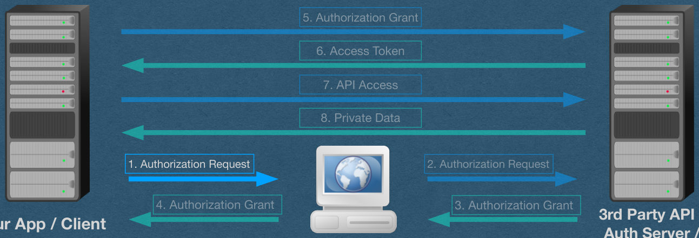
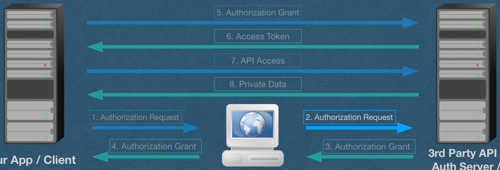
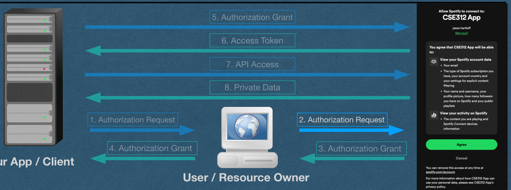
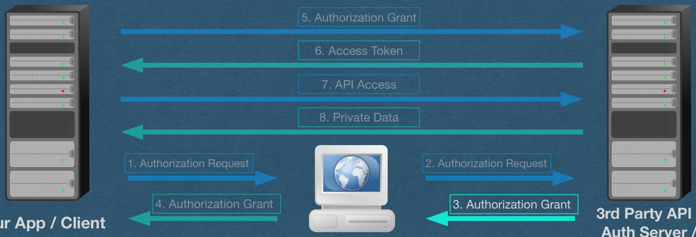
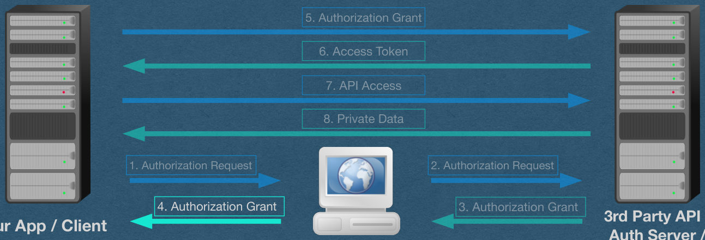
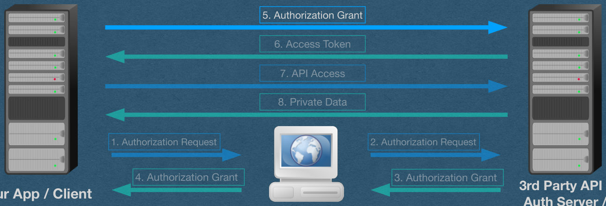
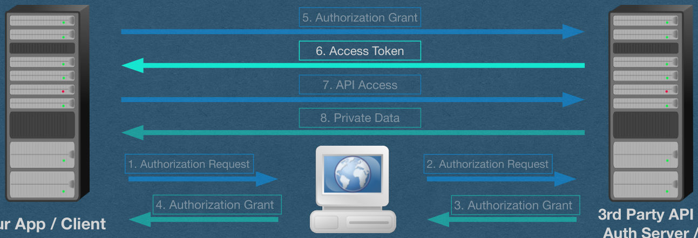
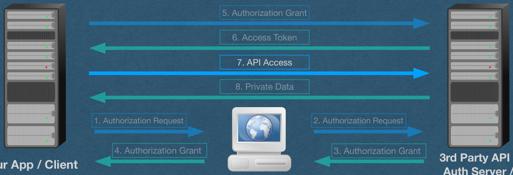
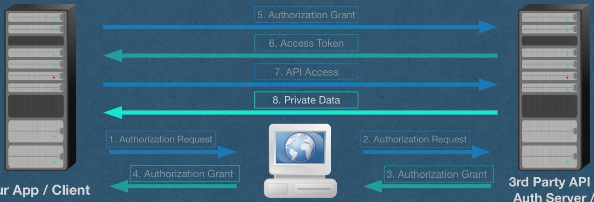
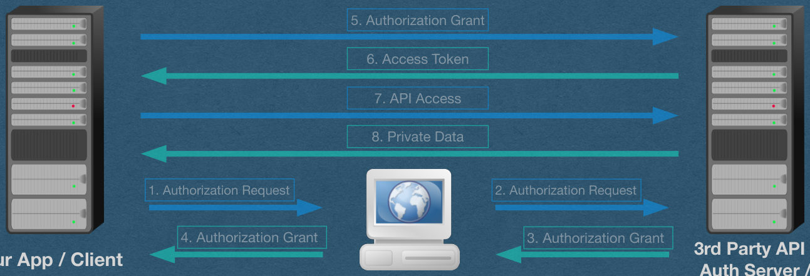

<!-- PDF page 1 -->
## OAuth 2.0 - Details

<!-- PDF page 2 -->
## OAuth 2.0 - Authorization Code Flow

<!-- REVIEW: diagram rendered whole; describe it in fig-alt -->

5. Authorization Grant

6. Access Token

7. API Access

8. Private Data

1. Authorization Request

2. Authorization Request

4. Authorization Grant

3. Authorization Grant

Your App / Client

3rd Party API /

Auth Server /

Resource Server

User / Resource Owner

{fig-alt="TODO: describe this image"}

<!-- PDF page 3 -->
## We'll walk through the specific details of a user logging in with the 3rd party

<!-- REVIEW: diagram rendered whole; describe it in fig-alt -->

5. Authorization Grant

6. Access Token

7. API Access

8. Private Data

1. Authorization Request

2. Authorization Request

4. Authorization Grant

3. Authorization Grant

Your App / Client

3rd Party API /

Auth Server /

Resource Server

User / Resource Owner

{fig-alt="TODO: describe this image"}

<!-- PDF page 4 -->
## Slide 4

<!-- REVIEW: no clear title found; check the heading -->

<!-- REVIEW: diagram rendered whole; describe it in fig-alt -->

Authorization Request - App

- The user sends a request to our server by clicking the "login with ..." button
- Our app will need access to the user's account from the 3rd party API
- We ask the user for permission to use the API on their behalf
- The API will need several parameters in this request

5. Authorization Grant

6. Access Token

7. API Access

8. Private Data

1. Authorization Request

2. Authorization Request

4. Authorization Grant

3. Authorization Grant

3rd Party API /

Auth Server /

Resource Server

Your App / Client

User / Resource Owner

{fig-alt="TODO: describe this image"}

<!-- PDF page 5 -->
## Slide 5

<!-- REVIEW: no clear title found; check the heading -->

<!-- REVIEW: diagram rendered whole; describe it in fig-alt -->

Authorization Request - Parameters

- Response type: Equal to "code" to indicate that we are requesting an authorization code
- Our client id: To identify our app
- scopes: A space-separated list of permissions we want from the user
- redirect URI: Must match the redirect URI when you registered your app

5. Authorization Grant

6. Access Token

7. API Access

8. Private Data

1. Authorization Request

2. Authorization Request

4. Authorization Grant

3. Authorization Grant

3rd Party API /

Auth Server /

Resource Server

Your App / Client

User / Resource Owner

{fig-alt="TODO: describe this image"}

<!-- PDF page 6 -->
## • Parameters: Response type, client id, scopes, redirect URI • We need to tell the user to send these 4 parameters to the API • How? Use a redirect!

<!-- REVIEW: diagram rendered whole; describe it in fig-alt -->

Authorization Request - Redirect

5. Authorization Grant

6. Access Token

7. API Access

8. Private Data

1. Authorization Request

2. Authorization Request

3. Authorization Grant

Your App / Client

4. Authorization Grant

3rd Party API /

Auth Server /

Resource Server

User / Resource Owner

{fig-alt="TODO: describe this image"}

<!-- PDF page 7 -->
## Slide 7

<!-- REVIEW: no clear title found; check the heading -->

<!-- REVIEW: diagram rendered whole; describe it in fig-alt -->

Authorization Request - Redirect

- We respond to the "login with ..." button press request with a 302 redirect
- The location header of the redirect is the URL of the api's authentication server and the "/authorize" path
- The 4 parameters are added to the query string of the request

5. Authorization Grant

6. Access Token

7. API Access

8. Private Data

1. Authorization Request

2. Authorization Request

3. Authorization Grant

Your App / Client

4. Authorization Grant

3rd Party API /

Auth Server /

Resource Server

User / Resource Owner

{fig-alt="TODO: describe this image"}

<!-- PDF page 8 -->
## Slide 8

<!-- REVIEW: no clear title found; check the heading -->

<!-- REVIEW: diagram rendered whole; describe it in fig-alt -->

Authorization Request - Redirect

- By using a redirect, all the parameters are in the URL itself
  - They won't be removed/blocked by the browser during redirection
- This means all values must be URL encoded, using percent-encoding

5. Authorization Grant

6. Access Token

7. API Access

8. Private Data

1. Authorization Request

2. Authorization Request

3. Authorization Grant

Your App / Client

4. Authorization Grant

3rd Party API /

Auth Server /

Resource Server

User / Resource Owner

{fig-alt="TODO: describe this image"}

<!-- PDF page 9 -->
## Slide 9

<!-- REVIEW: no clear title found; check the heading -->

<!-- REVIEW: diagram rendered whole; describe it in fig-alt -->

Authorization Request - API

- Their browser redirects the user to the API with all the required parameters
- The API authenticates the request using an auth token in a cookie (Implies this cookie is not SameSite: strict)
  - If no token, ask for username/password

5. Authorization Grant

6. Access Token

7. API Access

8. Private Data

1. Authorization Request

2. Authorization Request

3. Authorization Grant

Your App / Client

4. Authorization Grant

3rd Party API /

Auth Server /

Resource Server

User / Resource Owner

{fig-alt="TODO: describe this image"}

<!-- PDF page 10 -->
## Slide 10

<!-- REVIEW: no clear title found; check the heading -->

<!-- REVIEW: diagram rendered whole; describe it in fig-alt -->

Authorization Request - API

- The API now authenticated the user's identity and can pull their profile
- The API knows our identity via the client id, but this is not authenticated
- The API knows the scopes that are being requested

5. Authorization Grant

6. Access Token

7. API Access

8. Private Data

1. Authorization Request

2. Authorization Request

3. Authorization Grant

Your App / Client

4. Authorization Grant

3rd Party API /

Auth Server /

Resource Server

User / Resource Owner

{fig-alt="TODO: describe this image"}

<!-- PDF page 11 -->
## Slide 11

<!-- REVIEW: no clear title found; check the heading -->

<!-- REVIEW: diagram rendered whole; describe it in fig-alt -->

Authorization Request - API

- So the API knows everything it needs to know
- Ask the user to authorize our app
- User is shown the name of the app and the list of scopes that are being requests

5. Authorization Grant

6. Access Token

7. API Access

8. Private Data

1. Authorization Request

2. Authorization Request

3. Authorization Grant

Your App / Client

4. Authorization Grant

User / Resource Owner

{fig-alt="TODO: describe this image"}

<!-- PDF page 12 -->
## Slide 12

<!-- REVIEW: no clear title found; check the heading -->

<!-- REVIEW: diagram rendered whole; describe it in fig-alt -->

Authorization Grant - API redirect

- Assuming the user accepts, the API will respond to their "agree" button press with a redirect to our redirect URI
  - If the user does not agree, the process ends and our app does not get API access
- If the user has already agreed in the past, they are redirected immediately

5. Authorization Grant

6. Access Token

7. API Access

8. Private Data

1. Authorization Request

2. Authorization Request

3. Authorization Grant

Your App / Client

4. Authorization Grant

3rd Party API /

Auth Server /

Resource Server

User / Resource Owner

{fig-alt="TODO: describe this image"}

<!-- PDF page 13 -->
## Slide 13

<!-- REVIEW: no clear title found; check the heading -->

<!-- REVIEW: diagram rendered whole; describe it in fig-alt -->

Authorization Grant - API redirect

- Since our response type was "code", the redirect will contain an authorization code
- The API needs to send our app information through the user just like we did in step 1
  - The API will use a 302 redirect with the code in a query string
- The browser will redirect the user back to our app by following this location header

5. Authorization Grant

6. Access Token

7. API Access

8. Private Data

1. Authorization Request

2. Authorization Request

3. Authorization Grant

Your App / Client

4. Authorization Grant

3rd Party API /

Auth Server /

Resource Server

User / Resource Owner

{fig-alt="TODO: describe this image"}

<!-- PDF page 14 -->
## Authorization Grant - Redirect URI

<!-- REVIEW: diagram rendered whole; describe it in fig-alt -->

- Our app receives the redirected request containing the authorization code
- http://localhost:8080/spotify? code=AQAS7s9-7krg_hO5jdO1mKOLKTmgoG4p9U25QpdcNPrFwDS9YIyfjqDmRg97gEfSJ vQ5Ri3AyzyNiWVFxLEWJDm7G4poswnXs_AQuSkerCQ7_8ghIbwYTXoWE2BJFVGae5rpSH nHbAL_MxYiyTJqNMtXaClXSv7QfCviNJpRaOd51z4ga5jQzRoVaaSikR8hQwjkjCuXydvjSHIp 9_ARiNJJrcDuKMshIs7VfCggwLX9yMH80lnvkMsA5GxXtSU

5. Authorization Grant

6. Access Token

7. API Access

8. Private Data

1. Authorization Request

2. Authorization Request

3. Authorization Grant

Your App / Client

4. Authorization Grant

3rd Party API /

Auth Server /

Resource Server

User / Resource Owner

{fig-alt="TODO: describe this image"}

<!-- PDF page 15 -->
## Slide 15

<!-- REVIEW: no clear title found; check the heading -->

<!-- REVIEW: diagram rendered whole; describe it in fig-alt -->

Authorization Grant - Authorization Code

- This code, and all tokens/codes, will have very high entropy
- The RFC requires >128 bits of entropy; recommends > 160
- [Assuming uniform randomness] This 255 character code has 1536 bits of entropy!

```
AQAS7s9-7krg_hO5jdO1mKOLKTmgoG4p9U25QpdcNPrFwDS9YIyfjqDmRg97gEfSJvQ5Ri3AyzyNiWVFxLEWJDm7G4poswnXs_AQuSkerCQ7_8ghIbwYTXoWE2BJFV
Gae5rpSHnHbAL_MxYiyTJqNMtXaClXSv7QfCviNJpRaOd51z4ga5jQzRoVaaSikR8hQwjkjCuXydvjSHIp9_ARiNJJrcDuKMshIs7VfCggwLX9yMH80lnvkMsA5GxXtSU
```

5. Authorization Grant

6. Access Token

7. API Access

8. Private Data

1. Authorization Request

2. Authorization Request

3. Authorization Grant

Your App / Client

4. Authorization Grant

3rd Party API /

Auth Server /

Resource Server

User / Resource Owner

{fig-alt="TODO: describe this image"}

<!-- PDF page 16 -->
## • Our app parses the query string and extracts this authorization • This is a 1-time code and is assumed to be comprisable since

<!-- REVIEW: diagram rendered whole; describe it in fig-alt -->

Authorization Grant - Authorization Code

```
code
the user handled it
```

5. Authorization Grant

6. Access Token

7. API Access

8. Private Data

1. Authorization Request

2. Authorization Request

3. Authorization Grant

Your App / Client

4. Authorization Grant

3rd Party API /

Auth Server /

Resource Server

User / Resource Owner

{fig-alt="TODO: describe this image"}

<!-- PDF page 17 -->
## Slide 17

<!-- REVIEW: no clear title found; check the heading -->

<!-- REVIEW: diagram rendered whole; describe it in fig-alt -->

Authorization Grant - Request for Access Token

- The user will sit out the next few rounds and wait for our server to respond to the authorization grant redirect
- Our app will connect directly to the API server while the user waits
- The next goal is to trade the authorization token for an access token

5. Authorization Grant

6. Access Token

7. API Access

8. Private Data

1. Authorization Request

2. Authorization Request

3. Authorization Grant

Your App / Client

4. Authorization Grant

3rd Party API /

Auth Server /

Resource Server

User / Resource Owner

{fig-alt="TODO: describe this image"}

<!-- PDF page 18 -->
## Slide 18

<!-- REVIEW: no clear title found; check the heading -->

<!-- REVIEW: diagram rendered whole; describe it in fig-alt -->

Authorization Grant - Request for Access Token

- Our server needs to send HTTP requests to the API
  - Recommendation: Use the requests library (This is allowed for your HW)
- Since we don't have to go through the user via redirects, we can use POST requests and add parameters to the body of the requests

5. Authorization Grant

6. Access Token

7. API Access

8. Private Data

1. Authorization Request

2. Authorization Request

3. Authorization Grant

Your App / Client

4. Authorization Grant

3rd Party API /

Auth Server /

Resource Server

User / Resource Owner

{fig-alt="TODO: describe this image"}

<!-- PDF page 19 -->
## • The API needs to authenticate our app during this step • Note: Steps 1-4 can all be spoofed by an attacker • We authenticate by sending the server our client secret

<!-- REVIEW: diagram rendered whole; describe it in fig-alt -->

Authorization Grant - Request for Access Token

5. Authorization Grant

6. Access Token

7. API Access

8. Private Data

1. Authorization Request

2. Authorization Request

3. Authorization Grant

Your App / Client

4. Authorization Grant

3rd Party API /

Auth Server /

Resource Server

User / Resource Owner

{fig-alt="TODO: describe this image"}

<!-- PDF page 20 -->
## Slide 20

<!-- REVIEW: no clear title found; check the heading -->

<!-- REVIEW: diagram rendered whole; describe it in fig-alt -->

Authorization Grant - Client Authentication

- The RFC requires both client id and client secret for authentication of our app
  - Recommends adding the secret in an "Authorization" header
  - Allows the secret to be sent in the body if unable to use headers
  - The secret cannot be sent in the URL

5. Authorization Grant

6. Access Token

7. API Access

8. Private Data

1. Authorization Request

2. Authorization Request

3. Authorization Grant

Your App / Client

4. Authorization Grant

3rd Party API /

Auth Server /

Resource Server

User / Resource Owner

{fig-alt="TODO: describe this image"}

<!-- PDF page 21 -->
## • APIs will vary in the exact method of sending the id and secret • Spotify: Send "{client_id}:{client_secret}" base64 encoded

<!-- REVIEW: diagram rendered whole; describe it in fig-alt -->

Authorization Grant - Authorization Header

using an Authorization header of type Basic

5. Authorization Grant

6. Access Token

7. API Access

8. Private Data

1. Authorization Request

2. Authorization Request

3. Authorization Grant

Your App / Client

4. Authorization Grant

3rd Party API /

Auth Server /

Resource Server

User / Resource Owner

{fig-alt="TODO: describe this image"}

<!-- PDF page 22 -->
## Authorization Grant - Authorization Header

<!-- REVIEW: diagram rendered whole; describe it in fig-alt -->

- If client_id == "abc" and client_secret == "123"
- "{client_id}:{client_secret}" == "abc:123"
- base64("abc:123") == "YWJjOjEyMw==" <-- base64 works with bytes so encode/decode before/after base64 encoding
- And your header is "Authorization: Basic YWJjOjEyMw=="

5. Authorization Grant

6. Access Token

7. API Access

8. Private Data

1. Authorization Request

2. Authorization Request

3. Authorization Grant

Your App / Client

4. Authorization Grant

3rd Party API /

Auth Server /

Resource Server

User / Resource Owner

{fig-alt="TODO: describe this image"}

<!-- PDF page 23 -->
## Authorization Grant - Content • The API needs the following values in the content of the request • Grant type: set to "authorization_code" • Code: The value of the authorization code we're sending • Redirect URI: Must exactly match the redirect URI we used to obtain this code

<!-- REVIEW: diagram rendered whole; describe it in fig-alt -->

5. Authorization Grant

6. Access Token

7. API Access

8. Private Data

1. Authorization Request

2. Authorization Request

3. Authorization Grant

Your App / Client

4. Authorization Grant

3rd Party API /

Auth Server /

Resource Server

User / Resource Owner

{fig-alt="TODO: describe this image"}

<!-- PDF page 24 -->
## Slide 24

<!-- REVIEW: no clear title found; check the heading -->

<!-- REVIEW: diagram rendered whole; describe it in fig-alt -->

Authorization Grant - Content

- Parameters: Grant type, code, and redirect URI
- These values and sent as the content of the request
  - Formats vary. Spotify uses URL encoding (eg. same format as a query string, but in the body of a POST request)

5. Authorization Grant

6. Access Token

7. API Access

8. Private Data

1. Authorization Request

2. Authorization Request

3. Authorization Grant

Your App / Client

4. Authorization Grant

3rd Party API /

Auth Server /

Resource Server

User / Resource Owner

{fig-alt="TODO: describe this image"}

<!-- PDF page 25 -->
## Slide 25

<!-- REVIEW: no clear title found; check the heading -->

<!-- REVIEW: diagram rendered whole; describe it in fig-alt -->

Authorization Grant - Final Request

- Send the final request to the "/token" endpoint of the API using a POST request
  - Authorization header for authentication
  - Content in the body for details about the request

5. Authorization Grant

6. Access Token

7. API Access

8. Private Data

1. Authorization Request

2. Authorization Request

3. Authorization Grant

Your App / Client

4. Authorization Grant

3rd Party API /

Auth Server /

Resource Server

User / Resource Owner

{fig-alt="TODO: describe this image"}

<!-- PDF page 26 -->
## Slide 26

<!-- REVIEW: no clear title found; check the heading -->

<!-- REVIEW: diagram rendered whole; describe it in fig-alt -->

Access Token

- The API will verify all the information we sent
- Assuming everything is verified:
  - Respond with an access token that we can use to access the API on behalf of our user

5. Authorization Grant

6. Access Token

7. API Access

8. Private Data

1. Authorization Request

2. Authorization Request

3. Authorization Grant

Your App / Client

4. Authorization Grant

3rd Party API /

Auth Server /

Resource Server

User / Resource Owner

{fig-alt="TODO: describe this image"}

<!-- PDF page 27 -->
## • The body of this response will contain the access token • Will often also contain a refresh token (A topic for another lecture) • Spotify: Response is a JSON object with an "access_token"

<!-- REVIEW: diagram rendered whole; describe it in fig-alt -->

Access Token - Response

5. Authorization Grant

6. Access Token

7. API Access

8. Private Data

1. Authorization Request

2. Authorization Request

3. Authorization Grant

Your App / Client

4. Authorization Grant

3rd Party API /

Auth Server /

Resource Server

User / Resource Owner

{fig-alt="TODO: describe this image"}

<!-- PDF page 28 -->
## Slide 28

<!-- REVIEW: no clear title found; check the heading -->

<!-- REVIEW: diagram rendered whole; describe it in fig-alt -->

API Access

- We can now access the API on behalf of our user
- Each request must contain the access token
- Spotify: Access token is sent via an Authorization header of type Bearer
  - eg. If the token is "abc" Your header is "Authorization: Bearer abc"

5. Authorization Grant

6. Access Token

7. API Access

8. Private Data

1. Authorization Request

2. Authorization Request

3. Authorization Grant

Your App / Client

4. Authorization Grant

3rd Party API /

Auth Server /

Resource Server

User / Resource Owner

{fig-alt="TODO: describe this image"}

<!-- PDF page 29 -->
## API Access • Notice that we can't use cookies to authenticate API access • Our app will be making requests for different users • Would need a cookie for every user, or change the cookie value for each user • Headers are a much cleaner solution for this use case

<!-- REVIEW: diagram rendered whole; describe it in fig-alt -->

5. Authorization Grant

6. Access Token

7. API Access

8. Private Data

1. Authorization Request

2. Authorization Request

3. Authorization Grant

Your App / Client

4. Authorization Grant

3rd Party API /

Auth Server /

Resource Server

User / Resource Owner

{fig-alt="TODO: describe this image"}

<!-- PDF page 30 -->
## • Now that we have API access, we can finally log the user in • We'll make an API request for the user's profile information • This allows us to identify the user with a unique id (Usually email)

<!-- REVIEW: diagram rendered whole; describe it in fig-alt -->

API Access - Login with ...

5. Authorization Grant

6. Access Token

7. API Access

8. Private Data

1. Authorization Request

2. Authorization Request

3. Authorization Grant

Your App / Client

4. Authorization Grant

3rd Party API /

Auth Server /

Resource Server

User / Resource Owner

{fig-alt="TODO: describe this image"}

<!-- PDF page 31 -->
## Slide 31

<!-- REVIEW: no clear title found; check the heading -->

<!-- REVIEW: diagram rendered whole; describe it in fig-alt -->

Private Data - Login with ...

- Once we have an ID for the user verified by the 3rd party:
  - Create an account for the user with this ID (Just like the registered with your app, except you don't store a password)
  - Issue them an authentication token and set it as a cookie (Just like they logged into your app with a username/password)

5. Authorization Grant

6. Access Token

7. API Access

8. Private Data

1. Authorization Request

2. Authorization Request

3. Authorization Grant

Your App / Client

4. Authorization Grant

3rd Party API /

Auth Server /

Resource Server

User / Resource Owner

{fig-alt="TODO: describe this image"}

<!-- PDF page 32 -->
## Slide 32

<!-- REVIEW: no clear title found; check the heading -->

<!-- REVIEW: diagram rendered whole; describe it in fig-alt -->

Login with ...

- When a user logs in again with a 3rd party (Assuming their auth token expired)
  - Check if they already have an account
  - If this is not their first time logging in, make sure you use their existing account

5. Authorization Grant

6. Access Token

7. API Access

8. Private Data

1. Authorization Request

2. Authorization Request

3. Authorization Grant

Your App / Client

4. Authorization Grant

3rd Party API /

Auth Server /

Resource Server

User / Resource Owner

{fig-alt="TODO: describe this image"}

<!-- PDF page 33 -->
## Slide 33

<!-- REVIEW: no clear title found; check the heading -->

<!-- REVIEW: diagram rendered whole; describe it in fig-alt -->

Login with ...

- Store their access token in their account
  - Don't need to go through this whole process every time you need API access
- Note: These token cannot be hashed since you need to send the original value to the API (Be careful! Don't ask for more scopes than you need to limit the risk)

5. Authorization Grant

6. Access Token

7. API Access

8. Private Data

1. Authorization Request

2. Authorization Request

3. Authorization Grant

Your App / Client

4. Authorization Grant

3rd Party API /

Auth Server /

Resource Server

User / Resource Owner

{fig-alt="TODO: describe this image"}
