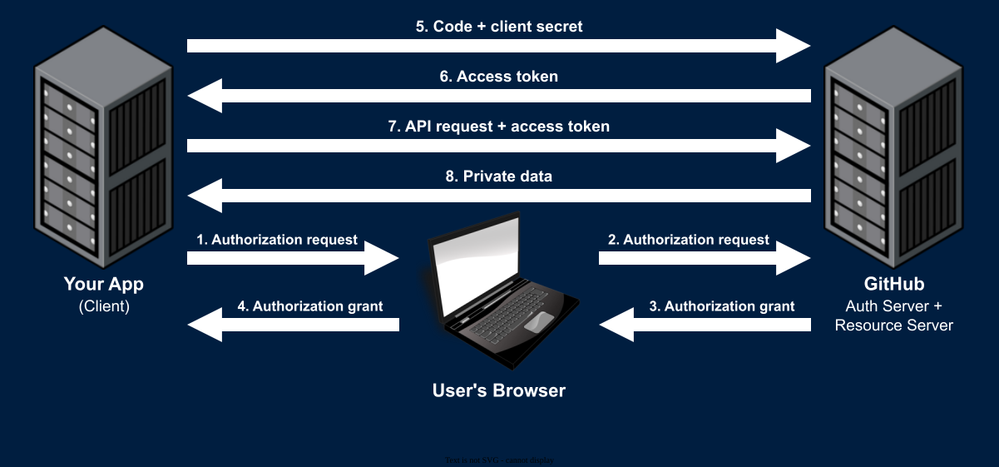
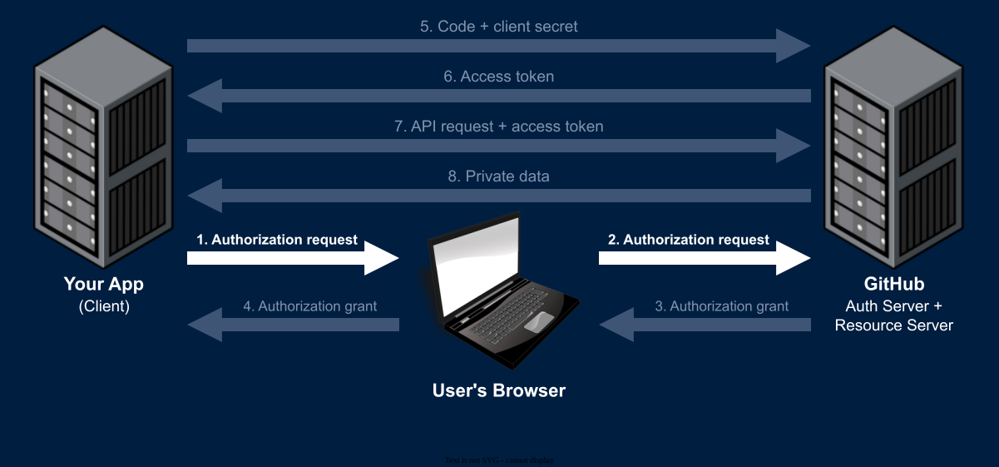
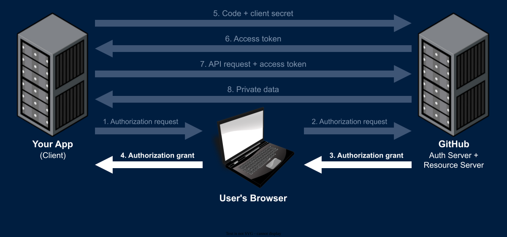
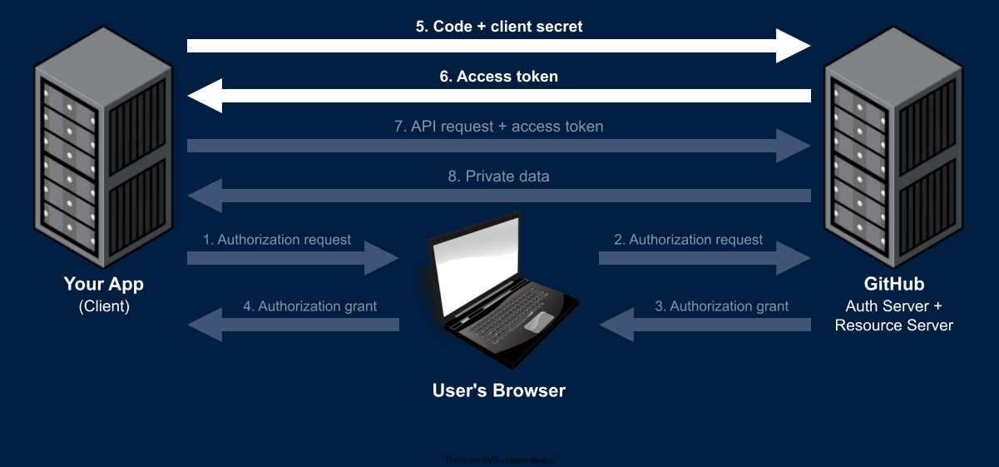
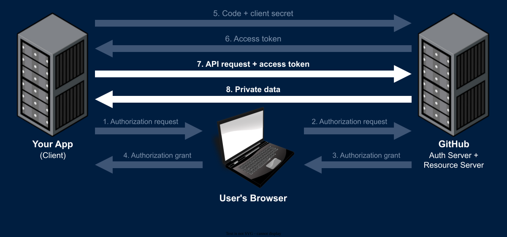

# Third-Party APIs

## Web APIs

- Many apps have APIs that let programs access user data with HTTP requests
  - `GET api.github.com/user` - The logged-in user's profile
  - `GET api.github.com/user/repos` - Their repositories, including private ones
  - `POST api.github.com/repos/<owner>/<repo>/issues` - Create an issue
- Sometimes, you want **your app** to use this API on behalf of **your users**
  - A scrum board app that creates GitHub issues when your users' create cards
  - A "Login with GitHub" button (Which you'll implement on HW2)
- How can your users let your app access their GitHub accounts securely?

## Bad Ideas: Ask for Their Password

- ~~Have your users give you their GitHub username and password~~
- Never ask for a password to someone else's site
  - You'd have to store it in plain text to reuse it
  - Your app gets full access to their account. Not just what you need
  - The user can't revoke your access without changing their password
  - It trains users to type their passwords into random sites

## Bad Idea: Ask for Their API Key

- ~~Have the user create an API key on GitHub and paste it into your app~~
- Better than a password, but:
  - The user has to handle a secret. Never trust your users, not even with their own security
  - Requests from your app look exactly like requests from the user
    - No accountability. If your app misbehaves, GitHub can't tell it was you
    - If the key leaks, there's no way to tell who is using it
  - Your usage counts against the user's rate limits (Or bill!)

## OAuth 2.0

- **OAuth 2.0** (Open Authorization) - The standard way for a user to grant an app limited access to their account on another service
- The user approves your app on GitHub's site
  - Your app never sees their password
- GitHub issues an **access token** directly to your app
  - The user never handles the access token
  - The token is tied to your app. GitHub knows it's you (Accountability)
  - The token is limited to the permissions (**scopes**) the user approved
  - The user can revoke your app's access at any time
- The user still has to trust your app with the data they approve

## Client Registration

- Before any user can log in, you register **your app** with GitHub
  - You get/set at least 3 important values during registration
- **Client ID** - Identifies your app. Public
- **Client Secret** - Effectively a *password* for your app
  - Only ever stored on your server (In your `.env` file). Never in your front end or your git repo
- **Redirect URI** - Where GitHub sends users after they approve your app
  - `http://localhost:8080/authcallback` on the HW
  - GitHub only redirects to the URI you registered

## OAuth Flows

- OAuth has several **flows** for different kinds of apps
- We'll use the **Authorization Code Flow**
  - For apps with a server that can keep a secret
  - The most common flow

# The Authorization Code Flow

## The Authorization Code Flow

{fig-alt="The full authorization code flow. 1: your app sends an authorization request to the user's browser. 2: the browser forwards it to GitHub. 3: GitHub sends an authorization grant back to the browser. 4: the browser delivers the grant to your app. 5: your app sends the code and its client secret to GitHub. 6: GitHub returns an access token. 7: your app makes an API request with the access token. 8: GitHub returns private data."}

## Steps 1-2: Authorization Request

{fig-alt="Steps 1 and 2 highlighted: your app redirects the user's browser to GitHub with an authorization request."}

## Authorization Request

- The user clicks "Login with GitHub," which sends a GET request to your server
- Your server responds with a `302` redirect to GitHub's authorization endpoint:
  - The location of the redirect is a github url
  - This redirect is a cross-origin request!

## Authorization Request - Parameters

- Need to send several parameters in the query string of this redirect
- `client_id` - Which app is asking
- `redirect_uri` - Where to send the user back to
- `scope` - A space-separated list of the permissions you're asking for
- `state` - XSRF protection (More details later)
- `response_type=code` - Required by the RFC to request a code (GitHub doesn't require it)
- All values must be percent-encoded (Although none of these values should contain characters that need to be percent-encoded)

## At GitHub

- The browser follows the redirect to GitHub
- GitHub authenticates the user
  - With their GitHub auth token cookie, or by asking them to log in
  - This is GitHub's job. Your app never sees any of it
- GitHub shows the user your app's name and the scopes you asked for
  - The user chooses to approve or deny
  - If they already approved your app with these scopes, they skip straight to the redirect

## Why Redirects?

- In steps 1-4, your app and GitHub communicate through the user's browser
- These requests need to have lax cookies attached  
  - Must be GET requests that navigate to the other site
- Need to send information in these requests
  - Use a cross-site redirect with a query string

## Steps 3-4: Authorization Grant

{fig-alt="Steps 3 and 4 highlighted: GitHub redirects the user's browser back to your app's redirect URI with an authorization code."}

## Authorization Grant

- If the user approves, GitHub responds with a `302` redirect to your redirect URI
- The redirect url will contain a `code` in a query string  
  - It will also contain the `state` value (Discussed later)
- This code is a one-time value that your server can trade for an access token
- High entropy (The RFC requires at least 128 bits)
- Short-lived (GitHub codes expire after 10 minutes)
- Assume the code has been compromised
  - It traveled through the browser in a URL: history, logs, extensions
  - The user handled it (Should you trust them?)
- So the code alone must not be enough to get an access token

## Steps 5-6: Token Exchange

{fig-alt="Steps 5 and 6 highlighted: your server sends the code and client secret directly to GitHub and receives an access token."}

## Token Exchange

- Your server sends a request directly to GitHub (You can use libraries to send request to GitHub on your HW)
  - Since this is direct communication, we can use any HTTP method and format (Enter JSON)
- You will "trade in" the code for an access token
- GitHub must verify that it's really your app redeeming the code
- Your app authenticates with its client secret
  - The RFC recommends HTTP Basic authentication:
    - `Authorization: Basic base64(client_id:client_secret)`
  - It also allows them in the body of the POST request
  - Never in the URL
- APIs vary in these details. Read their documentation

## Token Response

- The access token went straight from GitHub to your server
  - It never touched the user's browser
  - The user does not know the value of this token
- No need to trust the user!

## Steps 7-8: API Access

{fig-alt="Steps 7 and 8 highlighted: your server calls the GitHub API with the access token and receives the user's private data."}

## API Access

- Send the access token in the `Authorization` header with type `Bearer`
  - "Bearer" - Whoever holds (bears) the token has access
- Why not a cookie?
  - Your server is sending requests on behalf of many different users
  - Cookies are how *browsers* store tokens. A header is simpler for a server

## Login With GitHub

- You can now use the GitHub API to access the user's account information 
  - Find a suitable unique id and use it to identify this user
- First login: Create an account linked to their GitHub ID (No password)
- Later logins: Find their existing account by GitHub ID
- Then log them in exactly like a password login
  - Issue **your own** auth token in a cookie
  - Never use GitHub's access token as your auth token
- If you're only using OAuth for login, no need to even store the access token
  - Requires a new access token for each login though (Tradeoff)

# State

## Recall: Login XSRF

- Login XSRF: The attacker logs the victim into the **attacker's** account
- Your `/authcallback` endpoint is a login endpoint!
- The usual XSRF defenses don't help here:
  - `/authcallback` is *designed* to receive cross-site requests (A redirect from github.com)
  - It's a GET navigation, so `SameSite=Lax` cookies are sent
  - GitHub builds the request, not your front end. There's no chance to add a XSRF token

## The Attack

- The attacker starts "Login with GitHub" on your app using their own GitHub account
- They stop before following the final redirect and keep the unused code
- The attacker gets the victim to open a link to your callback with the attacker's code
- To your app, this looks exactly like the end of a normal login
- Your app redeems the code with its own client secret. Everything checks out
- The victim is now logged in to the attacker's account!
  - Everything they save goes to an account the attacker controls

## The State Parameter

- Before redirecting to GitHub (Step 1):
  - Generate a random, unguessable `state` value
  - Bind it to **this browser**
  - Add it to the authorization request
- GitHub sends the same `state` back with the code (Step 4)
- At `/authcallback`:
  - Check that the `state` matches the one bound to this browser
  - If it's missing or doesn't match: `400 Bad Request` and stop. Never redeem the code
  - Delete the state after checking. Each state is single use
- The state is a XSRF token for your OAuth callback

## Binding State to the Browser

- The user usually isn't logged in yet, so there's no session to attach the state to
- One approach: Store it in a cookie before the redirect
  - `Set-Cookie: oauth_state=Xk3fR9...; HttpOnly; Max-Age=600; SameSite=Lax`
  - At the callback, compare the query string `state` to the cookie
- Attacker cannot set a cookie for our site
- Attacker can't read this cookie since our site never redirects to the attack site
- SOP will block responses so they can't fake a request and read the set-cookie header
- You have some freedom in how you implement this on the HW, as long as it stops the attack

# Refresh Tokens

## Refresh Tokens

- Many APIs make access tokens expire quickly (e.g. 1 hour)
- Along with the access token, they issue a long-lived **refresh token**
- When the access token expires, use the refresh token to obtain a new one:
  - You get a new access token (And sometimes a new refresh token)
- The user doesn't have to do anything
- Why not just have the access tokens be long-lived?
  - More secure when the auth server and resource server are not the same server
    - More on this much later when we discus JWTs

