## OAuth 2.0 - Extras

## OAuth 2.0 - Authorization Code Flow

5. Authorization Grant

6. Access Token

7. API Access

8. Private Data

1. Authorization Request

2. Authorization Request

4. Authorization Grant

3. Authorization Grant

Your App / Client

3rd Party API /

Auth Server /

Resource Server

User / Resource Owner

{fig-alt="TODO: describe this image"}

## XSRF and State

## Slide 4

XSRF - Cross-Site Request Forgery

- An attacker initiates their own authorization request with their credentials
  - They use your app's valid client id and redirect URI
- To the API, this is identical to a valid request as if the attacker was using your app

1. Authorization Request

3rd Party API /

Auth Server /

Resource Server

Your App / Client

User / Resource Owner

Attacker

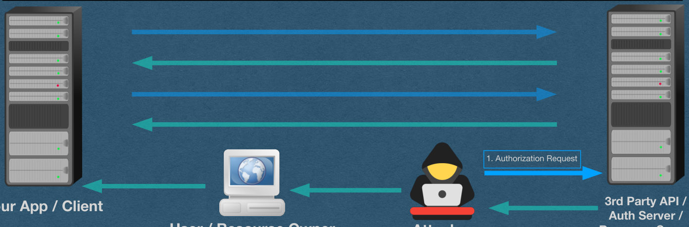{fig-alt="TODO: describe this image"}

## • The attacker receives a legitimate Authorization grant • This code is linked to the attackers account in the API

XSRF - Cross-Site Request Forgery

containing a legitimate code

2. Authorization Grant

3rd Party API /

Auth Server /

Resource Server

Your App / Client

User / Resource Owner

Attacker

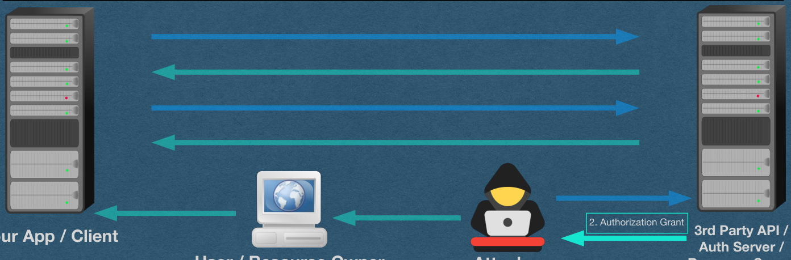{fig-alt="TODO: describe this image"}

## XSRF - Cross-Site Request Forgery

- The attacker launches an XSRF attack by getting the user to click any link controlled by the attacker
- Respond with a 302 to send them to your app with a properly formatted query string with the authorization code
  - Most XSRF prevention (eg. SOP, SameSite cookie directive) don't help since these endpoints are designed for cross-site requests

3. Authorization Grant

3rd Party API /

Auth Server /

Resource Server

Your App / Client

User / Resource Owner

Attacker

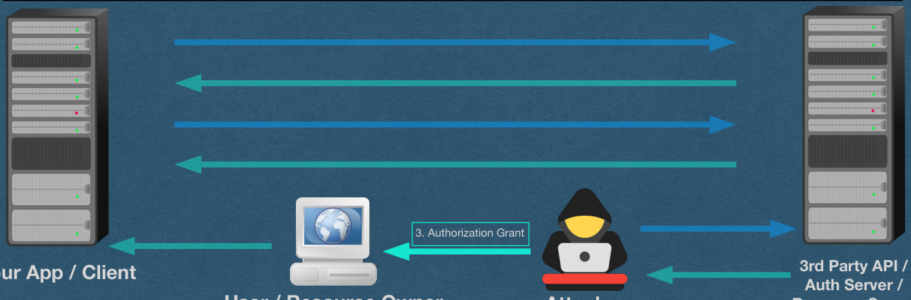{fig-alt="TODO: describe this image"}

## • User is redirected to your app • This makes the link seem legitimate since they never see the attacker's • Your app sees an authorization code and does its thing

XSRF - Cross-Site Request Forgery

content

4. Authorization Grant

3rd Party API /

Auth Server /

Resource Server

Your App / Client

User / Resource Owner

Attacker

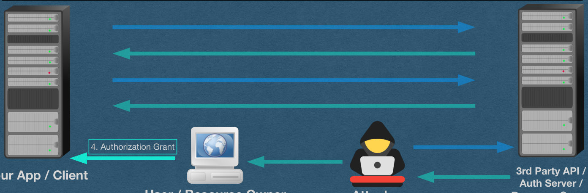{fig-alt="TODO: describe this image"}

## Slide 8

XSRF - Cross-Site Request Forgery

- Your app trades the code in for an access token
- Your app links this token to the user!!
  - Create/update their account with the access token
  - Create an authentication token and give it to the user in a cookie

5. Authorization Grant

6. Access Token

3rd Party API /

Auth Server /

Resource Server

Your App / Client

User / Resource Owner

Attacker

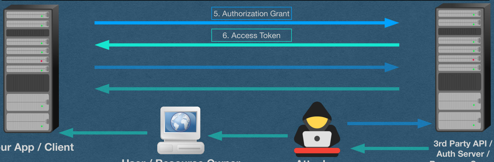{fig-alt="TODO: describe this image"}

## Slide 9

XSRF - Cross-Site Request Forgery

- When the user uses your app, API accesses are made on behalf of the attacker (The access token is linked to the attacker)
  - ex. If this is a bank, deposits go to the attacker's account
  - ex. All private information the user sends is stored in the attacker's account

7. API Access

8. Private Data

3rd Party API /

Auth Server /

Resource Server

Your App / Client

User / Resource Owner

Attacker

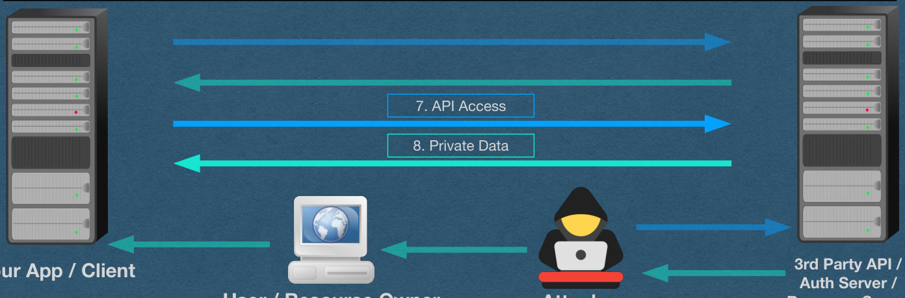{fig-alt="TODO: describe this image"}

## • To prevent this attack, generate a "state" value and add it to the • The state value is linked to the user initiating the request • RFC suggest using a hash of their state token (eg. Session token)

XSRF Prevention - State

query string

1. Authorization Request

3rd Party API /

Auth Server /

Resource Server

Your App / Client

User / Resource Owner

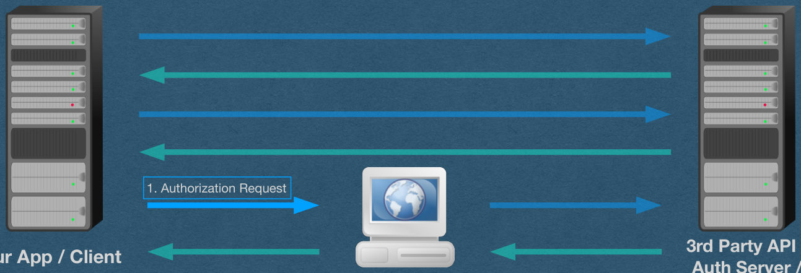{fig-alt="TODO: describe this image"}

## • If a state is present: • The API sends it back in addition to the authorization code • Your app verifies that it's the same state that was given to this user

XSRF Prevention - State

in the authorization request

4. Authorization Grant

3rd Party API /

Auth Server /

Resource Server

Your App / Client

User / Resource Owner

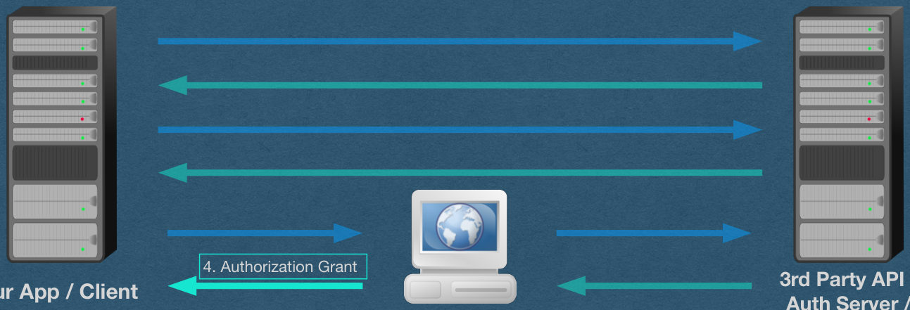{fig-alt="TODO: describe this image"}

## • During an attack, the authorization grant will contain the attacker's state • Or a value that was guessed/generated by the attack • Important to have enough entropy that the attacker cannot guess the

XSRF Prevention - State

user's state

4. Authorization Grant

3. Authorization Grant

3rd Party API /

Auth Server /

Resource Server

Your App / Client

User / Resource Owner

Attacker

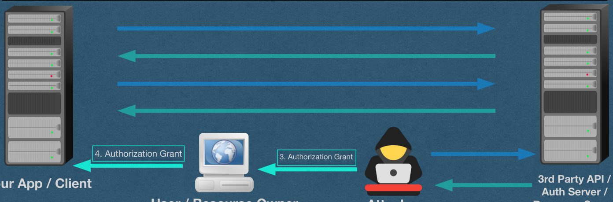{fig-alt="TODO: describe this image"}

## Refresh Tokens

## Slide 14

Refresh Tokens

- Very common for the API to issue a refresh token in addition to the access token
- The access token expires in a short amount of time (1 hour for Spotify)
- When the access token expires, use the refresh token to obtain a new access token [and sometimes a new refresh token]

6. Access Token and Refresh Token

3rd Party API /

Auth Server /

Resource Server

Your App / Client

User / Resource Owner

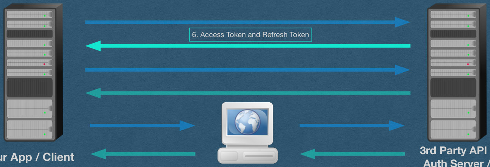{fig-alt="TODO: describe this image"}

## Refresh Tokens • If the authentication server and resource server are a single server -> refresh • Authentication server handles all token generation and authentication • Resource server only sees the access token and hosts the protected resources

tokens don't make much sense

Authorization Grant

Access Token and Refresh Token

Authentication

Refresh Token

Server

Access Token [and Refresh Token]

API Access - Access Token Only

Resource

Private Data

Your App / Client

Server

{fig-alt="TODO: describe this image"}

## Slide 16

Refresh Tokens - Advantages (Security)

- The access token is used often and is sent to the resource server on each request
- If the access token is compromised, the attacker has a limited window to use it before it expires
- It expires, use the refresh token to obtain a new access token, the attacker cannot use the compromised token without stealing another one

Authorization Grant

Access Token and Refresh Token

Authentication

Refresh Token

Server

Access Token [and Refresh Token]

API Access - Access Token Only

Resource

Private Data

Your App / Client

Server

{fig-alt="TODO: describe this image"}

## Slide 17

Refresh Tokens - Advantages (Performance)

- The access token must be verified on every request with the resource server
- This might involve this slow process:
  - Sending an HTTP request to the auth server
  - Auth server has a DB lookup, verifies, and responds

Authorization Grant

Access Token and Refresh Token

Authentication

Refresh Token

Server

Access Token [and Refresh Token]

API Access - Access Token Only

Resource

Private Data

Your App / Client

Server

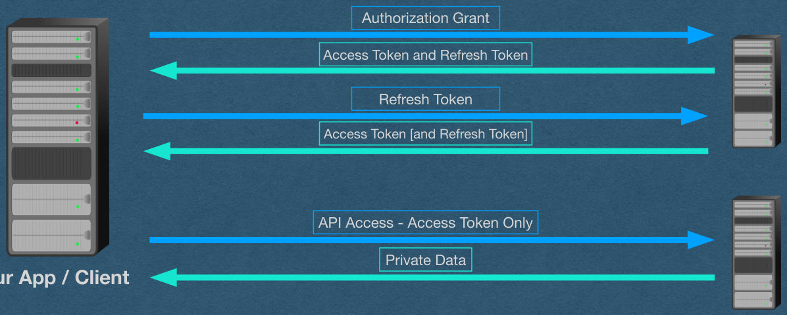{fig-alt="TODO: describe this image"}

## Slide 18

Refresh Tokens - Advantages (Performance)

- A faster method is to make access token self contained and verifiable without the auth server
- Encode or encrypt the token in a way that requires a private key to read/verify that is only known to the auth/resource servers
- Resource server verifies the access token without talking to the auth server (fast)

Authorization Grant

Access Token and Refresh Token

Authentication

Refresh Token

Server

Access Token [and Refresh Token]

API Access - Access Token Only

Resource

Private Data

Your App / Client

Server

{fig-alt="TODO: describe this image"}

## Compromised Tokens

## Compromised Access Token

- The attacker can use the access token to make API calls on behalf of the user
- These accesses will look legitimate since the access token is the only value required for API access
- Even worse - If the tokens are self-contained, there's no mechanism for revoking a token
  - ie. No database lookups are involved. Where could we check for validity?
- Countermeasure:
  - Access tokens are short-lived to limit the amount of time a compromised token can be used

## Compromised Refresh Token

- Not a big deal if compromised since the attacker cannot use it without authenticating as the client with the client secret
- Note that these tokens must be stored by our app in plain text
  - Same is true for access tokens
- Countermeasures:
  - The refresh token cannot be used without the client secret
    - Keep the client secret a secret
  - The API can revoke a refresh token at any time since the auth server is involved, including DB lookup of your client account, each time a refresh token is used

## Compromised Client Secret

- The attacker can now authenticate as the client
  - Can trade in authorization codes for access/refresh tokens
  - Can trade in refresh tokens for new access tokens
  - Cannot obtain authorization grants without control of the clients redirect URI
- Countermeasures:
  - Attacker doesn't control our redirect URI (If they do, we have bigger problems)
  - API or client can revoke the secret and generate a new one

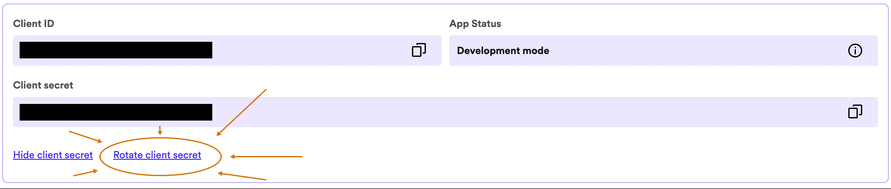{fig-alt="TODO: describe this image"}

## Alternate Flows

## Slide 24

Client Flow

- A simplified flow used for a client to access the API on its own behalf
- Cannot access private user data (Not even your own. Note the difference between client and your account)
- Can be used to access public information or client-specific endpoints
  - Spotify: Can use this to look up public song/album/artist information

1. Authorization Request

2. Access Token

3. API Access

4. Private Client Data

3rd Party API /

Auth Server /

Resource Server

Your App / Client

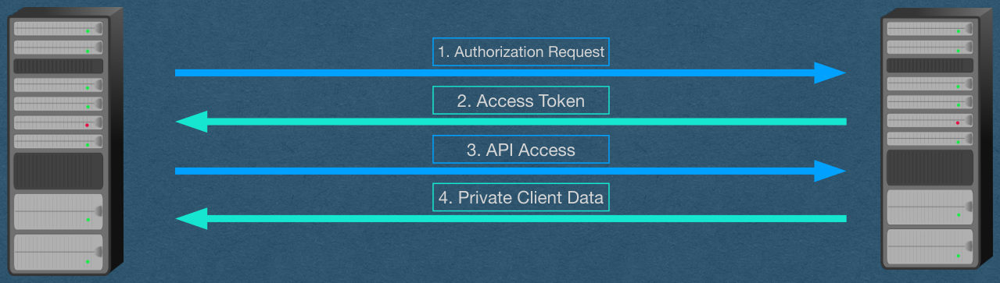{fig-alt="TODO: describe this image"}

## Slide 25

Implicit/Device Flow

- Similar to Client flow in its simplicity
- Used for public apps that cannot keep a secret
- There is no client secret and no client authentication
  - eg. A front-end only web app; A self-contained mobile/desktop app

1. Authorization Request

2. Access Token

3. API Access

4. Private Data

User / Resource Owner

3rd Party API /

Auth Server /

Resource Server

Running your app

without a server

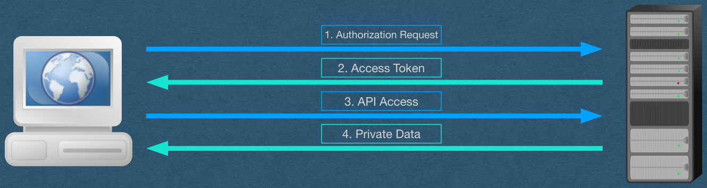{fig-alt="TODO: describe this image"}

## Slide 26

Implicit Flow

- This flow should not be used when there is a server that can keep a secret
  - Implicit flow is much less secure (It trusts the user with their access token)
  - Only use this when there's no other option

1. Authorization Request

2. Access Token

3. API Access

4. Private Data

User / Resource Owner

3rd Party API /

Auth Server /

Resource Server

Running your app

without a server

{fig-alt="TODO: describe this image"}

## PKCE

- Proof Key for Code Exchange (Sometimes pronounced "Pixy")
- The implicit flow is vulnerable to Man-in-the-middle attacks (MITM)
- Add authorization grant back into the flow
- The authorization grant step involves sending the user away from your native app to their web browser
- Browser sends them back to your app
  - We lose our web protections since this communication is between browser and native app
  - This communication can be intercepted by other processes running on the device
- An attacker can intercept the authorization code
  - This would be the access token when using the implicit flow and it would be game over

## PKCE

- PKCE Flow:
  - During the Authorization request, your app sends the hash of a "code verifier" which is a random value
  - When your app trades in the authorization code for an access token, send the plain text code verifier
    - This cannot be computed by the attacker, but is easily verified by the API by hashing the code verifier
  - This communication is an HTTP request made by your app
    - Much more difficult to intercept
