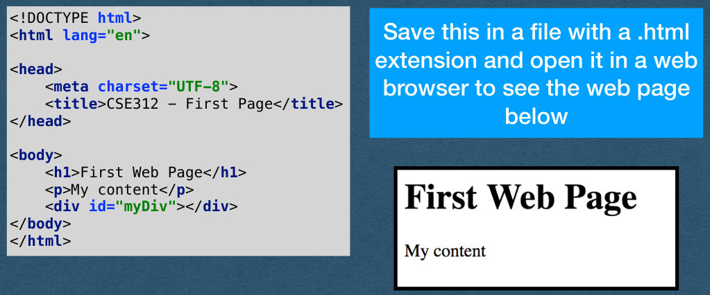
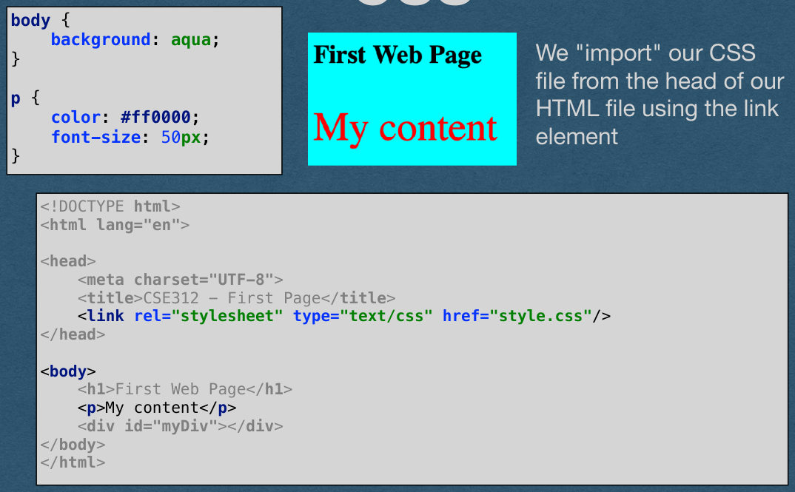
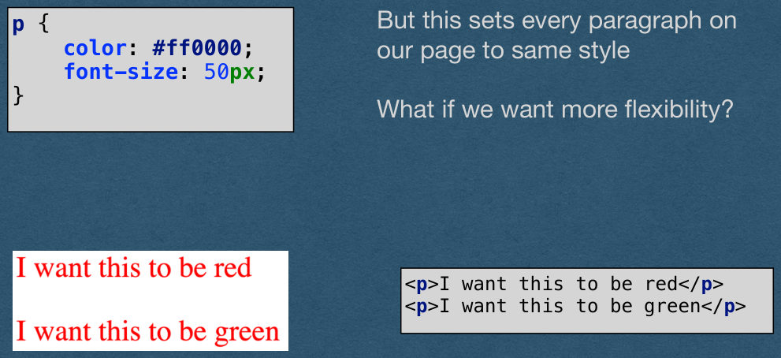
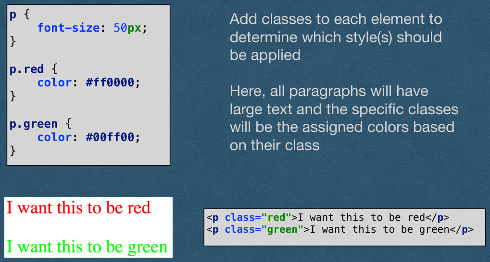
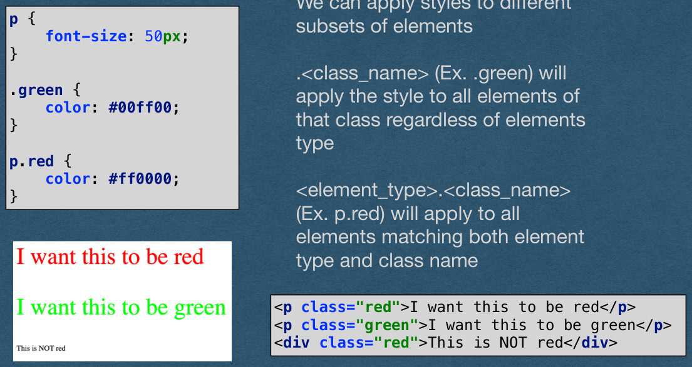
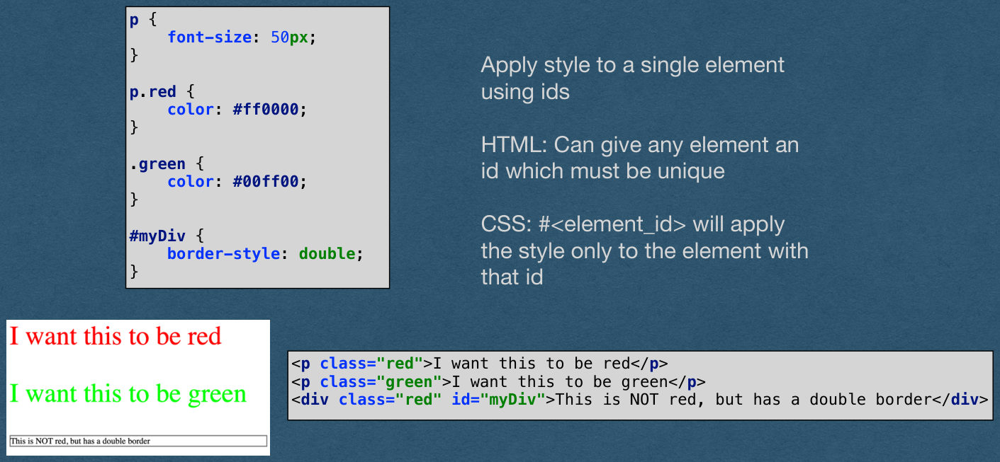
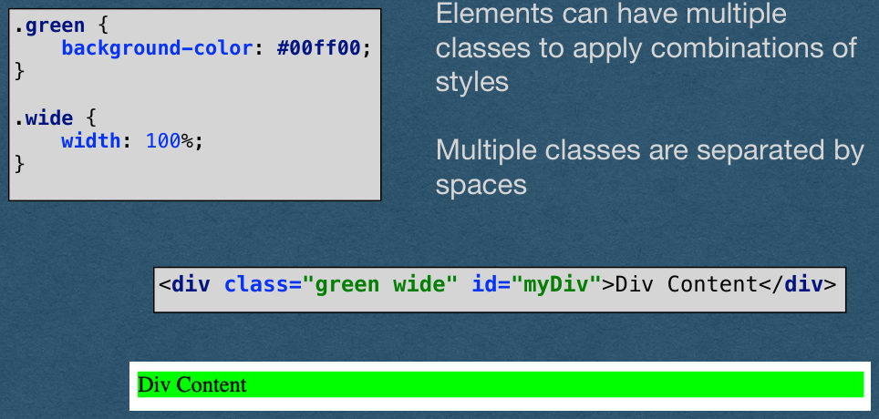
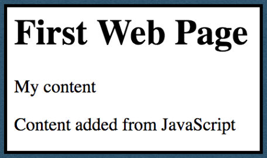

## Front End Development

## Roadmap for Today

- HTML
  - The foundation of any web page
- CSS
  - Adding style to the page
- JavaScript
  - Adding dynamic functionality to the page

## HTML

## HTML

Hyper Text Markup Language

Hyper Text: Text that can contain links to other resources

```
Markup Language: Special markers add information to the text
that is not visible to users. In HTML we use tags to tell the
browser how to display the text
```

HTML is not a programming language

## HTML


```
<!DOCTYPE html>
<html lang="en">
```

Save this in a file with a .html

extension and open it in a web

```
<head>
<meta charset="UTF-8">
<title>CSE312 - First Page</title>
</head>
```

browser to see the web page

below

```
<body>
<h1>First Web Page</h1>
<p>My content</p>
<div id="myDiv"></div>
</body>
</html>
```

{fig-alt="TODO: describe this image"}

## HTML - Elements

```
HTML uses angle brackets to
define elements
```

```
<!DOCTYPE html>
<html lang="en">
```

```
Each element has an open tag
<h1> and close tag </h1>
```

```
<head>
<meta charset="UTF-8">
<title>CSE312 - First Page</title>
</head>
```

```
Everything between the open and
close tag is the content of that
element
```

```
<body>
<h1>First Web Page</h1>
<p>My content</p>
<div id="myDiv"></div>
</body>
</html>
```

```
Elements can be nested
-The h1, p, and div elements on
this page are nested inside the
body element
```

## HTML - Elements

```
head - Content that does not
appear on the page
```

```
<!DOCTYPE html>
<html lang="en">
```

```
title - The text that appears on the
browser tab
```

```
<head>
<meta charset="UTF-8">
<title>CSE312 - First Page</title>
</head>
```

```
body - Content that appears on
the page
```

```
<body>
<h1>First Web Page</h1>
<p>My content</p>
<div id="myDiv"></div>
</body>
</html>
```

```
h1 - Header 1 (can use h1 - h6
where h1 is the largest header)
```

p - Paragraph of text

```
div - A division. Typically used as
a featureless container
```

## HTML - Self-Closing Elements

```

```

```
<br/>
```

Some elements are self-closing

```
<hr/>
```

```
The open and close tags are
contained in one tag
```

img - image

br - Line break

hr - horizontal rule (line)

## HTML - Attributes

```
<!DOCTYPE html>
<html lang="en">
```

```
Elements can contain attributes
which are defined in the open tag
of the element
```

```
<head>
<meta charset="UTF-8">
<title>CSE312 - First Page</title>
</head>
```

```
These Attributes are key-value
pairs
```

```
<body>
<h1>First Web Page</h1>
<p>My content</p>
<div id="myDiv"></div>
</body>
</html>
```

```
We have an empty division with a
property named id with a value of
"myDiv"
```

## HTML - Comments

```
<!DOCTYPE html>
<html lang="en">
```

```
<head>
<meta charset="UTF-8">
<title>CSE312 - First Page</title>
</head>
```

```
HTML only supports block
comments
```

```
<div id="myDiv"></div>
</body>
</html>
```

## HTML - Unicode

```
Insert any unicode character with
the syntax &#<unicode_value>;
```

```
<!DOCTYPE html>
<html lang="en">
```

&#9820; == ♜

```
<head>
<meta charset="UTF-8">
<title>CSE312 - First Page</title>
</head>
```

```
Some common characters have
names
```

```
<body>
<h1>&#9820; &nbsp; Web Page</h1>
<div id="myDiv"></div>
</body>
</html>
```

&rarr; == →

```
Extra white space is ignored in
HTML. Add extra spaces with
&nbsp; (non-breaking space)
```

## HTML

That's HTML.

We'll use many more elements and attributes as they come up

```
You are expected to pick up HTML quickly and understand new
elements (Links, lists, tables, etc.) by studying documentation
```

```
I recommend W3 Schools to explore other elements/attributes
available to you
```

https://www.w3schools.com/html/default.asp

## CSS

## CSS

Used to add style to HTML elements

```
Keep CSS in an external file to separate structure
from style (Good practice)
```

```
HTML should only be concerned with raw content
and basic organization of the page
```

CSS is concerned with how that content is styled

## CSS

```
Note: You will not be graded on the quality of your
CSS in this class (This is not an art class)
```

```
We'll cover the absolute basics so you are aware of
CSS and how it functions
```

```
You are encouraged to explore CSS further if you
want to make your sites visually appealing
```

## CSS

```
CSS allows us to edit the look of
each element
```

```
body {
background: aqua;
}
```

```
Here, we change the background
color to "aqua" which is a named
color
```

```
p {
color: #ff0000;
font-size: 50px;
}
```

```
We change the text of each
paragraph using the RGB value
of red and setting the font size to
50 pixels
```

```
Many more properties that can be
set
```

## CSS


```
body {
background: aqua;
}
```

```
We "import" our CSS
file from the head of our
HTML file using the link
element
```

```
p {
color: #ff0000;
font-size: 50px;
}
```

```
<!DOCTYPE html>
<html lang="en">
```

```
<head>
<meta charset="UTF-8">
<title>CSE312 - First Page</title>
<link rel="stylesheet" type="text/css" href="style.css"/>
</head>
```

```
<body>
<h1>First Web Page</h1>
<p>My content</p>
<div id="myDiv"></div>
</body>
</html>
```

{fig-alt="TODO: describe this image"}

## CSS


```
But this sets every paragraph on
our page to same style
```

```
p {
color: #ff0000;
font-size: 50px;
}
```

What if we want more flexibility?

```
<p>I want this to be red</p>
<p>I want this to be green</p>
```

{fig-alt="TODO: describe this image"}

## CSS - Classes


```
p {
font-size: 50px;
}
```

```
Add classes to each element to
determine which style(s) should
be applied
```

```
p.red {
color: #ff0000;
}
```

```
Here, all paragraphs will have
large text and the specific classes
will be the assigned colors based
on their class
```

```
p.green {
color: #00ff00;
}
```

```
<p class="red">I want this to be red</p>
<p class="green">I want this to be green</p>
```

{fig-alt="TODO: describe this image"}

## CSS


```
We can apply styles to different
subsets of elements
```

```
p {
font-size: 50px;
}
```

```
.<class_name> (Ex. .green) will
apply the style to all elements of
that class regardless of elements
type
```

```
.green {
color: #00ff00;
}
```

```
p.red {
color: #ff0000;
}
```

```
<element_type>.<class_name>
(Ex. p.red) will apply to all
elements matching both element
type and class name
```

```
<p class="red">I want this to be red</p>
<p class="green">I want this to be green</p>
<div class="red">This is NOT red</div>
```

{fig-alt="TODO: describe this image"}

## CSS


```
p {
font-size: 50px;
}
```

```
Apply style to a single element
using ids
```

```
p.red {
color: #ff0000;
}
```

```
HTML: Can give any element an
id which must be unique
```

```
.green {
color: #00ff00;
}
```

```
CSS: #<element_id> will apply
the style only to the element with
that id
```

```
#myDiv {
border-style: double;
}
```

```
<p class="red">I want this to be red</p>
<p class="green">I want this to be green</p>
<div class="red" id="myDiv">This is NOT red, but has a double border</div>
```

{fig-alt="TODO: describe this image"}

## CSS - Multiple Classes


```
Elements can have multiple
classes to apply combinations of
styles
```

```
.green {
background-color: #00ff00;
}
```

```
.wide {
width: 100%;
}
```

```
Multiple classes are separated by
spaces
```

```
<div class="green wide" id="myDiv">Div Content</div>
```

{fig-alt="TODO: describe this image"}

## CSS

There are many more features of CSS that we won't cover

As with HTML, I recommend W3 Schools for more

https://www.w3schools.com/css/default.asp

## JavaScript

## JavaScript

We will not thoroughly cover JavaScript syntax

```
If you haven't used JavaScript before, you are expected to learn the
basic syntax and concepts on your own (or stop by office hours)
```

```
Topics such as variables, conditionals, loops, functions, and data
structures won't be explicitly covered in lecture
```

```
As with HTML/CSS, I recommend W3 Schools for a good tutorial/
reference
https://www.w3schools.com/js/default.asp
```

## Front End JavaScript

We've seen the basic building blocks for web pages in HTML and CSS

```
This allows us to build what I call "poster sites" - The equivalent of
hanging a poster on the Internet for people to see
```

```
In this course we want to make web apps that allow our users to interact
with our content
```

To start this interaction, we need JavaScript (Specifically, ECMAScript)

## Front End JavaScript

HTML and CSS are not programming languages (well.. technically)

JavaScript is a programming language

Javascript allows us to add code to our page

```
When a user visits your site their browser will:
1. Download your JavaScript code
2. Run your code on their machine
```

What are the security implications of this?

## Front End JavaScript - Security

There are restrictions to what JavaScript can do in the browser:

```
Cannot read/write files
Cannot access other tabs or windows
Cannot [directly] access data (ex. cookies, local storage) from other sites
```

Vulnerabilities are still exposed/patched

With that, let's see our first script

## Front End JavaScript

var myDiv = document.getElementById("myDiv");

myDiv.innerHTML = "Content added from JavaScript";

```
Here we call the document.getElementById method which returns
the element with the provided id
```

```
The element is an object with a key "innerHTML" whose value is
the content (between the open and close tags) of the element
```

We'll save this code in a file named "script.js"

## Front End JavaScript

var myDiv = document.getElementById("myDiv");

myDiv.innerHTML = "Content added from JavaScript";

```
<!DOCTYPE html>
<html lang="en">
```

```
We "import" our javascript
code by adding a script
element at the bottom of the
body element with a src
(source) attribute containing
our JavaScript filename
```

```
<head>
<meta charset="UTF-8">
<title>CSE312 - First Page</title>
</head>
```

```
<body>
<h1>First Web Page</h1>
<p>My content</p>
<div id="myDiv"></div>
<script src="script.js"></script>
</body>
</html>
```

```
This runs our script once the
body is loaded
```

## Front End JavaScript


```
The script runs when the body loads and sets the content of
"myDiv" resulting in this page (CSS removed)
```

{fig-alt="TODO: describe this image"}

## JavaScript - Events

What about JS that reacts to the user?

Let's explore browser events and write code that can react to them

```
See here for a list of events
-https://www.w3schools.com/js/js_events_examples.asp
```

## Front End JavaScript

```
<div class="green wide" id="myDiv" onmouseenter="makeBlue(this)" onmouseleave="makeGreen(this)"></div>
```

```
function makeBlue(elem) {
elem.style.setProperty("color", "#000077")
}
```

```
function makeGreen(elem) {
elem.style.setProperty("color", "#007700")
}
```

```
We add a few more attributes to our div to run JavaScript functions on
the mouse enter and mouse leave events
```

The value of these attributes is any valid JavaScript

```
To keep our project organized, we'll call functions that are defined in a
separate file
```

## Front End JavaScript

```
<div class="green wide" id="myDiv" onmouseenter="makeBlue(this)" onmouseleave="makeGreen(this)"></div>
```

```
function makeBlue(elem) {
elem.style.setProperty("color", "#000077")
}
```

```
function makeGreen(elem) {
elem.style.setProperty("color", "#007700")
}
```

We pass the element itself as an argument to the functions

In the function, we change one of the style properties of the element

```
We can run any valid JavaScript here so what you can do is only
limited by what you can conceive and code
```

## Browser Console

- Open the browser console to run your own JavaScript on the pages you visit
- This is also where console.log outputs
  - Helpful for seeing the output of your JavaScript

## Browser Extensions

- Extensions allow additional JavaScript code to be injected into a website
- Useful when we want to modify a site without opening the browser console and typing commands after every page load
- Extensions automate this process

## Browser Extensions

- Extension have some limitations
  - Cannot access variables or functions from the page
  - More specifically: Extensions and page source run in two different environments
- Extension can modify the DOM (HTML elements)
