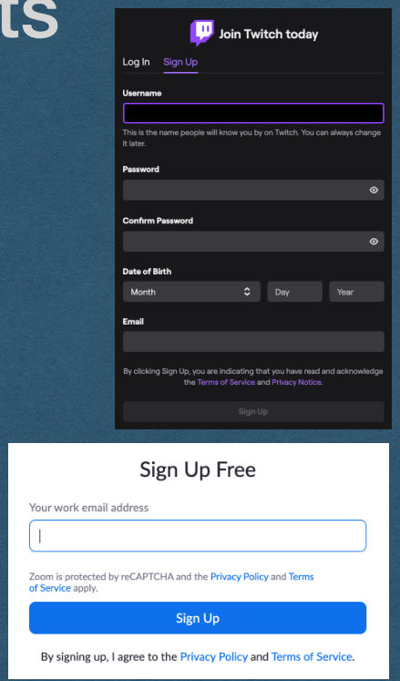
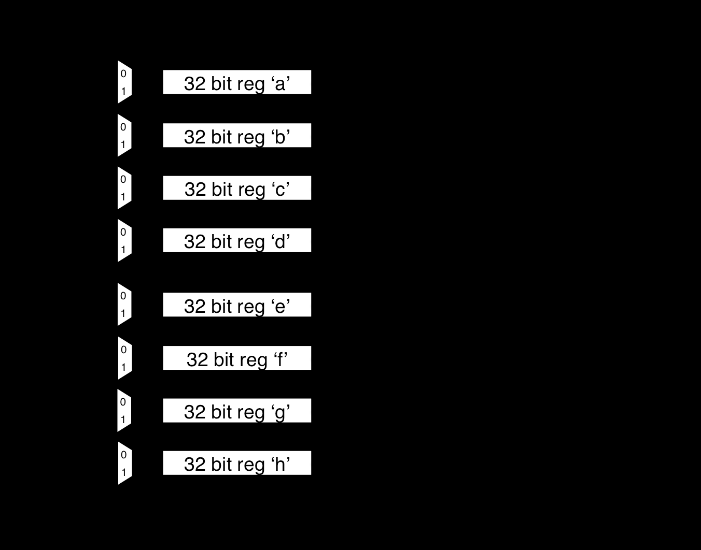

## Authentication

## User Accounts

- Everything we've built so far treats every user the same and delivers the same content to all visitors
  - Only exception was setting a cookie to count visits
- For many features of a web app we want to remember a user across multiple visits and verify their identity

## User Accounts

- Registration
  - Users can create an account on your app
  - Choose a username and password
- Authentication
  - Verify that a user is [likely] a registered account holder by providing their username/password
  - Log them into your app
  - Serve content specific to them

## User Accounts


- Registration
  - Can be a simple web form
  - At a minimum, provide a username and password
- Common to affiliate an account with a valid email address
  - And verify that email
  - Limits the number of bots that register

{fig-alt="TODO: describe this image"}

## Authentication

- On the server
  - Store each username/password in a database
  - This data must persist so the users can log in even after a server restart
  - What if this database is compromised?
    - Perhaps by a SQL injection attack

## Authentication

- NEVER store passwords as plain text
- Not even the admins of a website should know the passwords of their users
- We do this by hashing the passwords and storing only the hashes

## Hash Function

- A function that converts one value into another with certain properties
  - Typically a fixed length value
- Used to build hash tables
  - Among other applications
- Hash functions might not add any security!

## Cryptographic Hash Function

- A hash function that is meant for secure purposes
- Goal of being a one-way function
  - Easy to compute a hash value from plain text
  - Very difficult to compute the plain text of a given hash
- Hashes can be shared without compromising the plain text

password

5e884898da28047151d0e56f8dc6292773603d0d6aabbdd62a11ef721d1542d8

## Cryptographic Hash Function

- Only a cryptographic hash of your password is stored
- By only storing the hash of a password:
  - Even the admins of a site can't read your password!
- SHA256 is a commonly used cryptographic hash function
  - https://www.xorbin.com/tools/sha256-hash-calculator

## SHA256

- Runs input through multiple rounds of bit-level manipulation
- Easy (Fast) to compute
- Very difficult to compute in reverse

Ref: opencores.org

{fig-alt="TODO: describe this image"}

## Brute Force Attack

- Storing SHA256 hashes is not always secure!
  - Surprisingly common misconception
- Hashes are easy to compute, but hard to reverse
- To attack a hash:
  - Hash every possible password
  - If the hashes match, you know the password

## Entropy

- Entropy is a measure of uncertainty
  - Number of guesses required to guarantee a hash is matched
- Examples:
  - If you know the plain text is a single lowercase letter the entropy is 26
  - If it's two lowercase letters, the entropy is 26^2 = 676
  - If it's two letters that can be upper or lower case, 52^2 = 2704
- Tend to measure the "bits of entropy"
  - The log base 2 of these values
- Typically consider >=80 bits of entropy to be secure

## Dictionary Attack

-  More advanced version of the brute force attack
-  Use common words with common replacements
  -  a -> @
  -  O -> 0
  -  i -> !
-  Real words are easier to remember
  -  Attackers take advantage of this
-  Lists of common passwords are freely available
  -  Start with these

## Rainbow Table

- A table containing the start and end of "chains" of hashes
- Repeatedly rehash the start to reach the end
- To attack a hash:
  - Rehash until you reach the end of a chain
  - Rehash the beginning of the chain to find the value before the hash
- Takes a long time to compute a large table
- Effectively trades space for time once the table is computed

## Salting

- Salt hashes to prevent attacks like rainbow tables
- A salt is a randomly generated string that is stored in plain text with the hash
- The salt is appended to the plain text before hashing
  - Nearly all hashes in the rainbow table will not use this salt
- The salt does not add entropy since it is stored in the clear

## Authentication

- Registration
  - User provides username/password
  - Generate a random salt
  - Append the salt to the password and compute a secure hash of this value
  - Store the username/salt/hash in your database

## Authentication

- Authentication
  - User provides username/password
  - Lookup the salt/hash for the given username
  - Append the salt to the provided password and compute the SHA256 hash
  - If this hash matches the stored hash, the user is verified
  - If this hash does not match the stored hash, the user is not logged in

## Authentication

- The bcrypt library implements hashing, salting, and other security related functions
- Available in many different languages
- It is highly recommended that you use this library in your assignment

## Redirects

## Redirects

- To redirect the user to a different page:
  - Respond with a 300-level status code
  - Ex. Redirect HTTP requests to HTTPS requests
  - Ex. Respond with 301 Moved Permanently when the server is updated with new paths, redirect the old paths to the new paths instead of maintaining both
  - Ex. Response with 302 Found to redirect temporarily (Avoids browsers caching the new path)

```
HTTP/1.1 301 Moved Permanently
Content-Length: 0
Location: /new-path
```

## Redirects

- A redirect response must contain a Location header
  - This is the path of the redirect
- The client will make a second HTTP request for the Location path and load the page with the new response

```
HTTP/1.1 301 Moved Permanently
Content-Length: 0
Location: /new-path
```

## Redirects

- If the Location is not a full url, it will be treated as a relative path
- New request is made with the same protocol/host/port as the original request
- Example:
  - First request was for "http://cse312.com:8080/old-path"
  - Second request is "http://cse312.com:8080/new-path"

```
HTTP/1.1 301 Moved Permanently
Content-Length: 0
Location: /new-path
```

## Redirects

- If the location is a full url, the user can be redirected to a different server
- Example:
  - First request was for "http://cse312.com:8080/old-path"
  - Second request is "https://google.com/"

```
HTTP/1.1 301 Moved Permanently
Content-Length: 0
Location: https://google.com/
```

## Redirects

- Add a Content-Length of 0 since there are no bytes to read from the body
  - This is technically optional. The lack of a Content-Length header should imply a length of 0
  - However, this confuses Firefox.. so we'll add the header

```
HTTP/1.1 301 Moved Permanently
Content-Length: 0
Location: /new-path
```
