<!-- PDF page 1 -->
## Authentication Tokens

<!-- PDF page 2 -->
## Authentication Overview

- Registration
  - User sends username and password
  - Validate password strength
  - Store salted hash of the password
- Authentication
  - User sends username/password
  - Retrieve the stored salted hash
  - Salt and hash the provided password
  - If both salted hashes are identical, the user is authenticated

<!-- PDF page 3 -->
## Authentication

- With authentication, we want users to be able to:
  - Access their private data
  - Make authenticated posts to the server
- When you take these actions on a web app:
  - The app should verify that you made the request
  - Only serve your private data to you
  - Do not let anyone else make posts in your name

<!-- PDF page 4 -->
## Authentication

- How does the server verify that you are the one who made a specific request?
- We only have authentication, so...
  - .. Users type their username and password with every single protected request?..
  - Authenticate using the stored [salted hash of the] password?..
  - No! Terrible user experience
  - You would not use this site

<!-- PDF page 5 -->
## Authentication

- Insecure Idea:
  - .. Store the username/password in cookies and send them on every request?..
  - Password is stored client-side in plain text
  - No! Never store passwords in plain text
    - Not even client-side! Don't do it.

<!-- PDF page 6 -->
## Authentication Tokens

- Instead of authenticating the username/password on every request:
  - Issue an authentication token
- When a user is authenticated, generate a random authentication token
- Store this token in your database and mark the username of the account that was authenticated
- Set the token as a cookie for that user
- Whenever a request comes with that token, treat them as the user associated with that token

<!-- PDF page 7 -->
## Authentication Tokens

- With authentication tokens:
  - We have a login system
- 🎉
- As long as the user has the authentication token as their cookie, they are logged in*
  - All their requests are authenticated by the server

```
*You can/should set these tokens to expire either client-side
(cookie expiration), server-side (storing an expiration timestamp in
your database and ignoring the token after that timestamp), or both
```

{fig-alt="TODO: describe this image"}

<!-- PDF page 8 -->
## Authentication Tokens

- Authentication tokens need to be random
  - The token must have enough entropy that they cannot be guessed
  - Eg. An attacker should not be able to send requests with random tokens until one matches a logged in user
- Generally, there should be at least 2^80 unique tokens that could be generated (80 bits of entropy)
  - More is better!

<!-- PDF page 9 -->
## Authentication

- Once a token is generated, set it as a cookie
- Now the token will be sent with all subsequent requests
- Use the token to lookup the user
- The possession of the token verifies that this user did authenticate in the past

<!-- PDF page 10 -->
## Storing Authentication Tokens

- Caution: These tokens need to be stored on the server
- These tokens are as sensitive as passwords!
  - Stealing a token and setting a cookie with that value grants access to an account without even needing a password
- Solution: Only store hashes of the tokens
- Do not salt these tokens
  - Salting makes DB lookups more difficult
  - Salting not necessary since the entropy is so high

<!-- PDF page 11 -->
## Authentication w/ Tokens

- Check each request for a cookie with a token
  - Lookup the hash of the token in the database
  - If the token is found, read the associated username
  - Proceed as though this request was made by that user
- If the token is invalid or no cookie is set
  - Do not respect the request and return a 400-level response code:
    - 401 Unauthorized - User is not logged in
    - 403 Forbidden - User in logged in, but trying to do something that they are not allowed to do
- Ensure all sensitive pages/features are secured this way!
  - The front end cannot be trusted (NEVER trust your users)
  - All checks must be performed server-side

<!-- PDF page 12 -->
## Logging Out

- When a user logs out:
  - Invalidate the token
    - This needs to done server-side
    - Remove the token from your database, or mark it as revoked
    - If you see a logged out token again, do not treat the request as authenticated
    - If a token is stolen, this allows the user to regain control of their account
  - Delete the cookie
    - Set it with an expiration date in the past
    - The browser is supposed to delete the cookie

<!-- PDF page 13 -->
## Registration and Login

<!-- REVIEW: diagram rendered whole; describe it in fig-alt -->

- Let's look at the whole process of creating an account and logging in

Database

User/Client

Server

{fig-alt="TODO: describe this image"}

<!-- PDF page 14 -->
## Registration and Login

<!-- REVIEW: diagram rendered whole; describe it in fig-alt -->

- User registers a new account

username

XX_UBStudent_XX

password

P@$$w0rd

Database

User/Client

Server

{fig-alt="TODO: describe this image"}

<!-- PDF page 15 -->
## Registration and Login

<!-- REVIEW: diagram rendered whole; describe it in fig-alt -->

- Server generates a random salt

username

XX_UBStudent_XX

password

P@$$w0rd

salt

hJ33fqAwscJmp3MacoQ8uO

Database

User/Client

Server

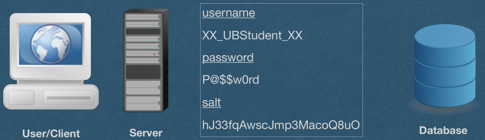{fig-alt="TODO: describe this image"}

<!-- PDF page 16 -->
## Registration and Login

<!-- REVIEW: diagram rendered whole; describe it in fig-alt -->

- Append the salt to the password and hash

username

XX_UBStudent_XX

password

P@$$w0rd

salt

hJ33fqAwscJmp3MacoQ8uO

hash

f(P@$$w0rdhJ33fqAwscJmp3MacoQ8uO)

==

```
0144c52c5b68f662f4529fd43093873fdd8b86b84a94b8
5c7cb91e9e10008ec8
```

Database

User/Client

Server

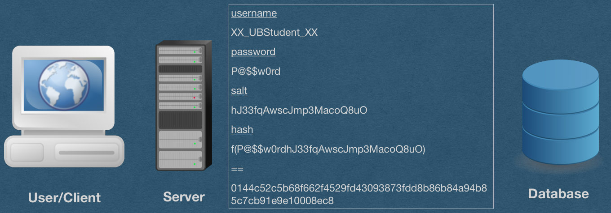{fig-alt="TODO: describe this image"}

<!-- PDF page 17 -->
## Registration and Login

<!-- REVIEW: diagram rendered whole; describe it in fig-alt -->

username

- Discard the plain text password
- Store username, salt, and salted hash in DB

XX_UBStudent_XX

salt

hJ33fqAwscJmp3MacoQ8uO

password hash

username

```
0144c52c5b68f662f4529fd43093873fd
d8b86b84a94b85c7cb91e9e10008ec8
```

XX_UBStudent_XX

salt

hJ33fqAwscJmp3MacoQ8uO

hash

```
0144c52c5b68f662f4529fd43093873fd
d8b86b84a94b85c7cb91e9e10008ec8
```

Database

User/Client

Server

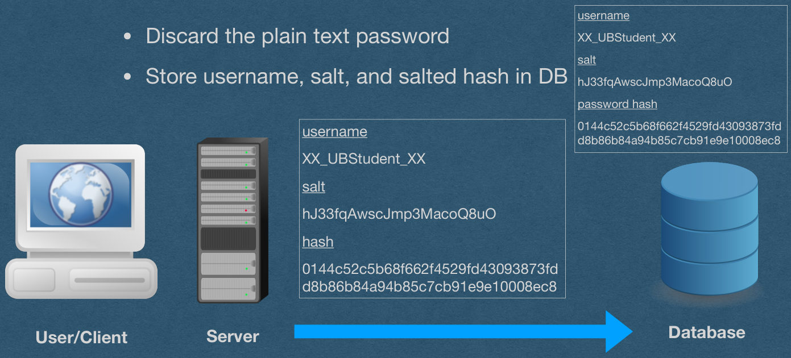{fig-alt="TODO: describe this image"}

<!-- PDF page 18 -->
## Registration and Login

<!-- REVIEW: diagram rendered whole; describe it in fig-alt -->

username

- When using bcrypt, salt and hash are stored as a single value

XX_UBStudent_XX

bcrypt salt + hash

```
$2b$12$9IoK6aMp5snMH2Fv
Z8rcWexyveqs8mFKojG7Jvq
VhfRxSDmwfAZHW
```

Database

User/Client

Server

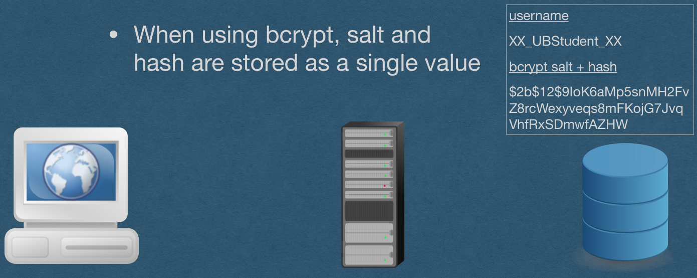{fig-alt="TODO: describe this image"}

<!-- PDF page 19 -->
## Registration and Login

<!-- REVIEW: diagram rendered whole; describe it in fig-alt -->

username

- User wants to login
- Provide username and password

XX_UBStudent_XX

salt

hJ33fqAwscJmp3MacoQ8uO

password hash

0144c52c5b68f662f4529fd43093873fd

username

d8b86b84a94b85c7cb91e9e10008ec8

XX_UBStudent_XX

password

P@$$w0rd

Database

User/Client

Server

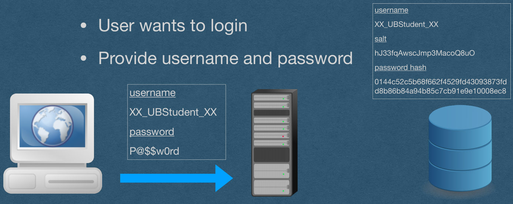{fig-alt="TODO: describe this image"}

<!-- PDF page 20 -->
## Registration and Login

<!-- REVIEW: diagram rendered whole; describe it in fig-alt -->

username

- Server pulls the hash and salt for this username

XX_UBStudent_XX

salt

hJ33fqAwscJmp3MacoQ8uO

password hash

```
0144c52c5b68f662f4529fd43093873fd
d8b86b84a94b85c7cb91e9e10008ec8
```

find({"username", "XX_UBStudent_XX"})

username

username

XX_UBStudent_XX

XX_UBStudent_XX

password

salt

P@$$w0rd

hJ33fqAwscJmp3MacoQ8uO

hash

Server

Database

User/Client

```
0144c52c5b68f662f4529fd43093873fd
d8b86b84a94b85c7cb91e9e10008ec8
```

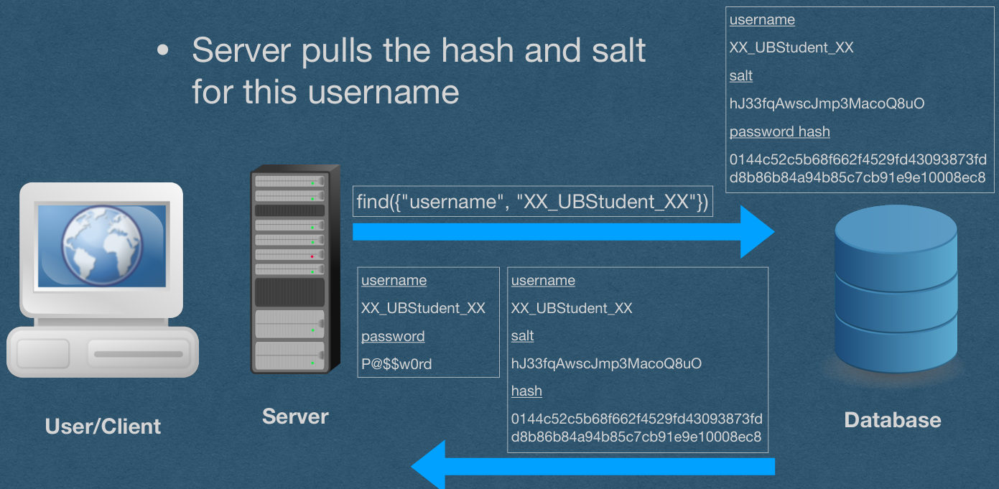{fig-alt="TODO: describe this image"}

<!-- PDF page 21 -->
## Registration and Login

<!-- REVIEW: diagram rendered whole; describe it in fig-alt -->

username

- Server now has everything it needs for authentication

XX_UBStudent_XX

salt

hJ33fqAwscJmp3MacoQ8uO

password hash

username

0144c52c5b68f662f4529fd43093873fd

d8b86b84a94b85c7cb91e9e10008ec8

XX_UBStudent_XX

password

P@$$w0rd

salt

hJ33fqAwscJmp3MacoQ8uO

hash

```
0144c52c5b68f662f4529fd43093873fd
d8b86b84a94b85c7cb91e9e10008ec8
```

Server

Database

User/Client

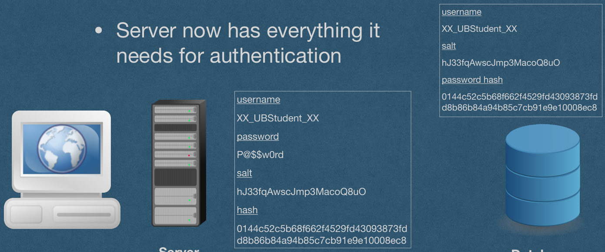{fig-alt="TODO: describe this image"}

<!-- PDF page 22 -->
## Registration and Login

<!-- REVIEW: diagram rendered whole; describe it in fig-alt -->

username

- Append the salt to the password provided at login and hash

XX_UBStudent_XX

salt

hJ33fqAwscJmp3MacoQ8uO

username

password hash

XX_UBStudent_XX

```
0144c52c5b68f662f4529fd43093873fd
d8b86b84a94b85c7cb91e9e10008ec8
```

password

P@$$w0rd

salt

hJ33fqAwscJmp3MacoQ8uO

new hash

f(P@$$w0rdhJ33fqAwscJmp3MacoQ8uO)

==

```
0144c52c5b68f662f4529fd43093873fdd8b8
6b84a94b85c7cb91e9e10008ec8
```

Server

Database

User/Client

hash

```
0144c52c5b68f662f4529fd43093873fdd8b8
6b84a94b85c7cb91e9e10008ec8
```

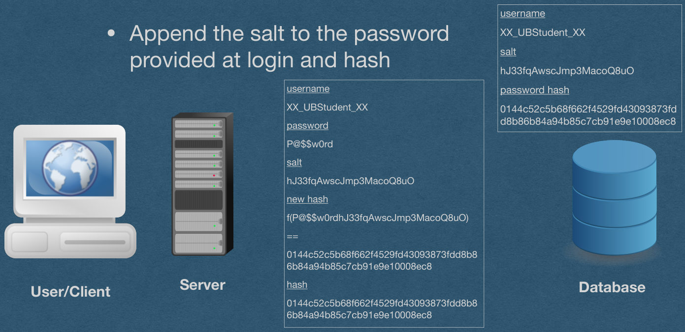{fig-alt="TODO: describe this image"}

<!-- PDF page 23 -->
## Registration and Login

<!-- REVIEW: diagram rendered whole; describe it in fig-alt -->

- If the two hashes do not match exactly, the user is not authenticated
- This password is changed to be 1 char off
  - The hashes are completely different

username

XX_UBStudent_XX

salt

hJ33fqAwscJmp3MacoQ8uO

username

password hash

XX_UBStudent_XX

```
0144c52c5b68f662f4529fd43093873fd
d8b86b84a94b85c7cb91e9e10008ec8
```

password

Pa$$w0rd

salt

hJ33fqAwscJmp3MacoQ8uO

new hash

f(Pa$$w0rdhJ33fqAwscJmp3MacoQ8uO)

==

```
296069c8595a636361af0c65acfd819178ee1
f9ce235c554ce1a0c37598138f5
```

Server

Database

User/Client

hash

```
0144c52c5b68f662f4529fd43093873fdd8b8
6b84a94b85c7cb91e9e10008ec8
```

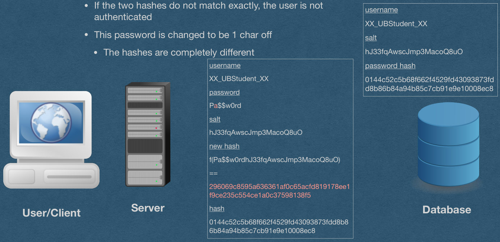{fig-alt="TODO: describe this image"}

<!-- PDF page 24 -->
## Registration and Login

<!-- REVIEW: diagram rendered whole; describe it in fig-alt -->

username

- If the two hashes match, the user is authenticated with this username
- Server is done with all values related to the password

XX_UBStudent_XX

salt

hJ33fqAwscJmp3MacoQ8uO

username

password hash

XX_UBStudent_XX

```
0144c52c5b68f662f4529fd43093873fd
d8b86b84a94b85c7cb91e9e10008ec8
```

password

P@$$w0rd

salt

hJ33fqAwscJmp3MacoQ8uO

new hash

```
0144c52c5b68f662f4529fd43093873fd
d8b86b84a94b85c7cb91e9e10008ec8
```

hash

Server

Database

User/Client

```
0144c52c5b68f662f4529fd43093873fd
d8b86b84a94b85c7cb91e9e10008ec8
```

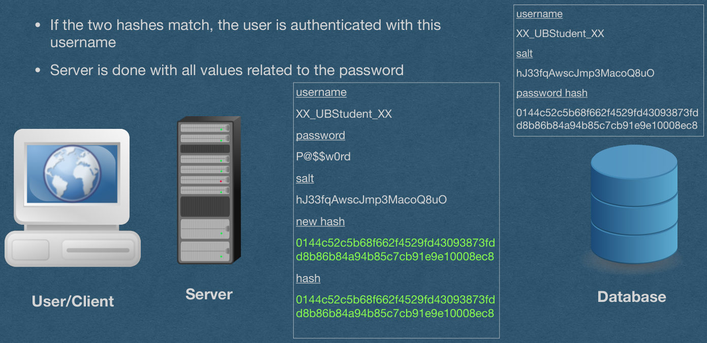{fig-alt="TODO: describe this image"}

<!-- PDF page 25 -->
## Registration and Login

<!-- REVIEW: diagram rendered whole; describe it in fig-alt -->

username

XX_UBStudent_XX

salt

- Generate an authentication token
- Store a hash of the token in your DB

hJ33fqAwscJmp3MacoQ8uO

password hash

```
0144c52c5b68f662f4529fd43093873fd
d8b86b84a94b85c7cb91e9e10008ec8
```

hashed authentication token

username

```
754b1fb1b5ab6787441bfb410a40a7b
9929f712497fb1f57788f4a6b699e1d7b
```

XX_UBStudent_XX

authentication token

jixFFgT1xPhXKcLrOavlQO

update XX_UBStudent_XX's record with

```
{"hashed authentication token":
"754b1fb1b5ab6787441bfb410a40a7b99
29f712497fb1f57788f4a6b699e1d7b"}
```

Database

User/Client

Server

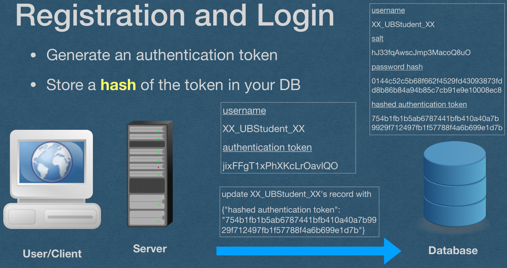{fig-alt="TODO: describe this image"}

<!-- PDF page 26 -->
## Registration and Login

<!-- REVIEW: diagram rendered whole; describe it in fig-alt -->

username

XX_UBStudent_XX

salt

- Set the plain text of the token to a cookie
- The user is now logged in

hJ33fqAwscJmp3MacoQ8uO

password hash

```
0144c52c5b68f662f4529fd43093873fd
d8b86b84a94b85c7cb91e9e10008ec8
```

hashed authentication token

```
754b1fb1b5ab6787441bfb410a40a7b
9929f712497fb1f57788f4a6b699e1d7b
```

Set authentication cookie

jixFFgT1xPhXKcLrOavlQO

Database

User/Client

Server

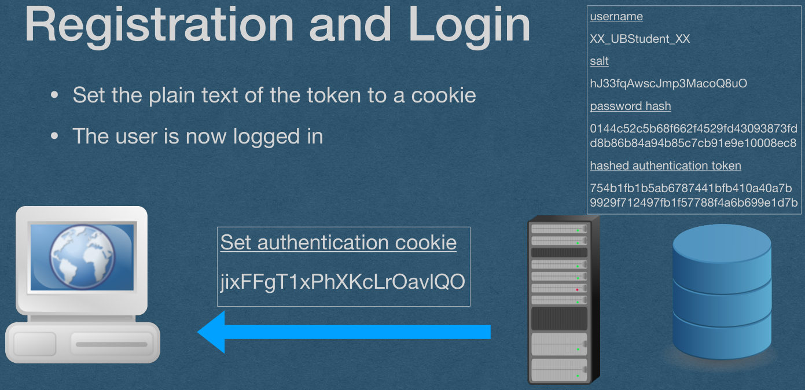{fig-alt="TODO: describe this image"}

<!-- PDF page 27 -->
## Registration and Login

<!-- REVIEW: diagram rendered whole; describe it in fig-alt -->

username

XX_UBStudent_XX

salt

- Token is sent on all subsequent requests

hJ33fqAwscJmp3MacoQ8uO

password hash

```
0144c52c5b68f662f4529fd43093873fd
d8b86b84a94b85c7cb91e9e10008ec8
```

hashed authentication token

```
754b1fb1b5ab6787441bfb410a40a7b
9929f712497fb1f57788f4a6b699e1d7b
```

```
Request containing
authentication cookie
```

jixFFgT1xPhXKcLrOavlQO

Database

User/Client

Server

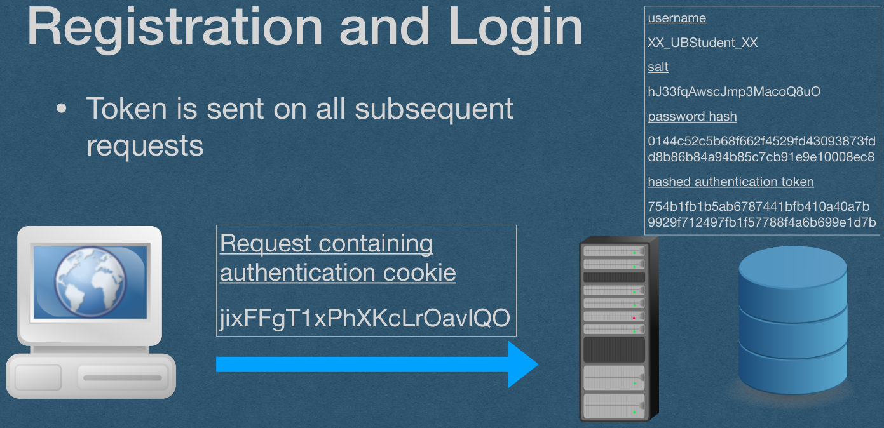{fig-alt="TODO: describe this image"}

<!-- PDF page 28 -->
## Registration and Login

<!-- REVIEW: diagram rendered whole; describe it in fig-alt -->

username

XX_UBStudent_XX

salt

- Read the token from the cookie and hash it
- If the cookie does not exist, the user is not logged in

hJ33fqAwscJmp3MacoQ8uO

password hash

```
0144c52c5b68f662f4529fd43093873fd
d8b86b84a94b85c7cb91e9e10008ec8
```

hashed authentication token

```
754b1fb1b5ab6787441bfb410a40a7b
9929f712497fb1f57788f4a6b699e1d7b
```

token to verify

jixFFgT1xPhXKcLrOavlQO

hash of token to verify

```
754b1fb1b5ab6787441bfb410a40a7b9929
f712497fb1f57788f4a6b699e1d7b
```

Database

User/Client

Server

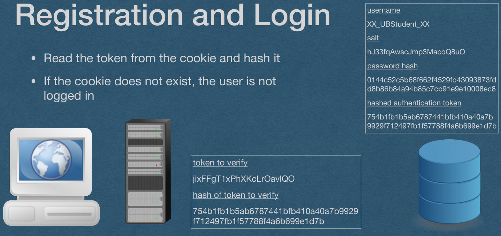{fig-alt="TODO: describe this image"}

<!-- PDF page 29 -->
## Registration and Login

<!-- REVIEW: diagram rendered whole; describe it in fig-alt -->

username

XX_UBStudent_XX

salt

- Look up the hash in the DB
- If a record is returned, that's the logged in user and the request is authenticated

hJ33fqAwscJmp3MacoQ8uO

```
find({"hashed authentication token":
"754b1fb1b5ab6787441bfb410a40a7b9
929f712497fb1f57788f4a6b699e1d7b"})
```

password hash

```
0144c52c5b68f662f4529fd43093873fd
d8b86b84a94b85c7cb91e9e10008ec8
```

hashed authentication token

```
754b1fb1b5ab6787441bfb410a40a7b
9929f712497fb1f57788f4a6b699e1d7b
```

username

XX_UBStudent_XX

salt

hJ33fqAwscJmp3MacoQ8uO

password hash

```
0144c52c5b68f662f4529fd43093873fd
d8b86b84a94b85c7cb91e9e10008ec8
```

hashed authentication token

```
754b1fb1b5ab6787441bfb410a40a7b
9929f712497fb1f57788f4a6b699e1d7b
```

Database

User/Client

Server

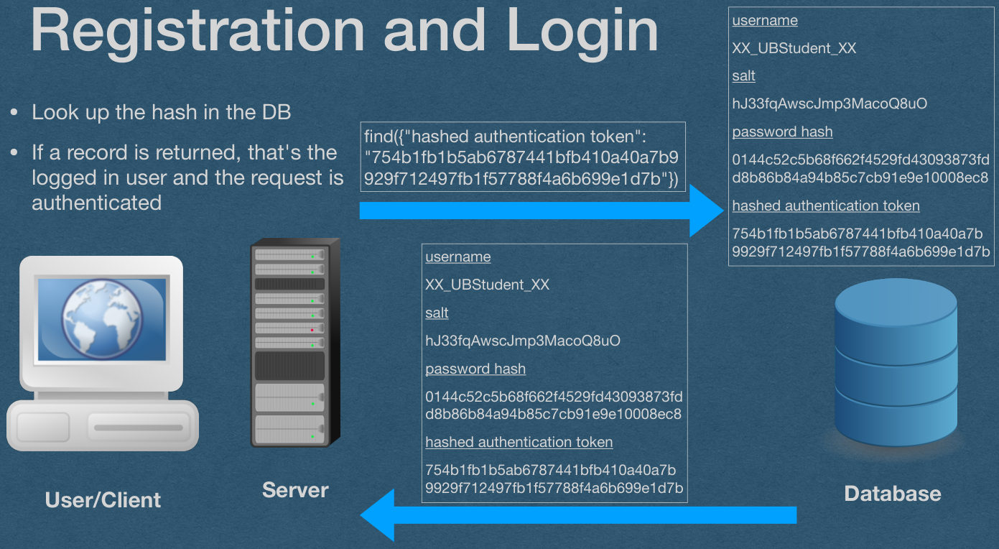{fig-alt="TODO: describe this image"}

<!-- PDF page 30 -->
## Registration and Login

<!-- REVIEW: diagram rendered whole; describe it in fig-alt -->

username

XX_UBStudent_XX

salt

- We now have the verified username of the requester

hJ33fqAwscJmp3MacoQ8uO

password hash

```
0144c52c5b68f662f4529fd43093873fd
d8b86b84a94b85c7cb91e9e10008ec8
```

hashed authentication token

```
754b1fb1b5ab6787441bfb410a40a7b
9929f712497fb1f57788f4a6b699e1d7b
```

username

XX_UBStudent_XX

Database

User/Client

Server

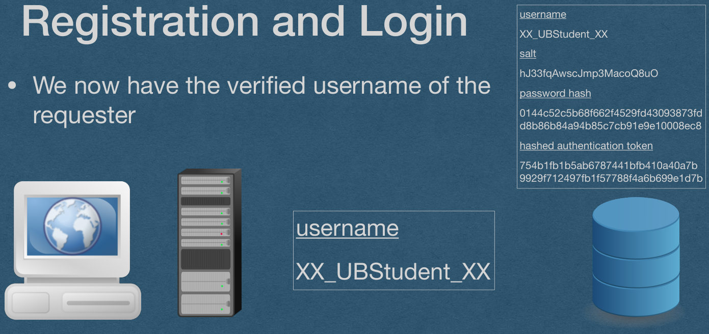{fig-alt="TODO: describe this image"}

<!-- PDF page 31 -->
## Registration and Login

<!-- REVIEW: diagram rendered whole; describe it in fig-alt -->

username

XX_UBStudent_XX

salt

- We now have the verified username of the requester

hJ33fqAwscJmp3MacoQ8uO

password hash

```
0144c52c5b68f662f4529fd43093873fd
d8b86b84a94b85c7cb91e9e10008ec8
```

hashed authentication token

```
754b1fb1b5ab6787441bfb410a40a7b
9929f712497fb1f57788f4a6b699e1d7b
```

```
Response that can contain
XX_UBStudent_XX's private data
```

Database

User/Client

Server

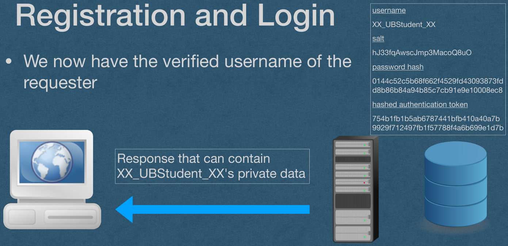{fig-alt="TODO: describe this image"}

<!-- PDF page 32 -->
## Cookie Hijacking

- We're now using cookies for authentication
- The possession of the token verifies that this user did authenticate in the past
- What if someone steals your cookies?
  - They can authenticate as you without needing your password!
