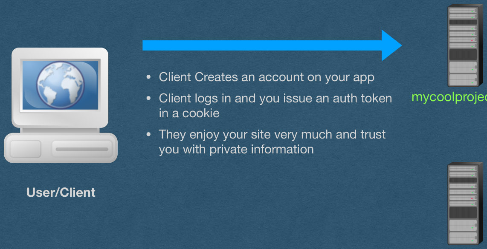
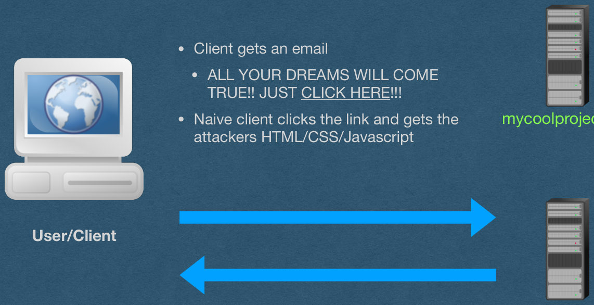
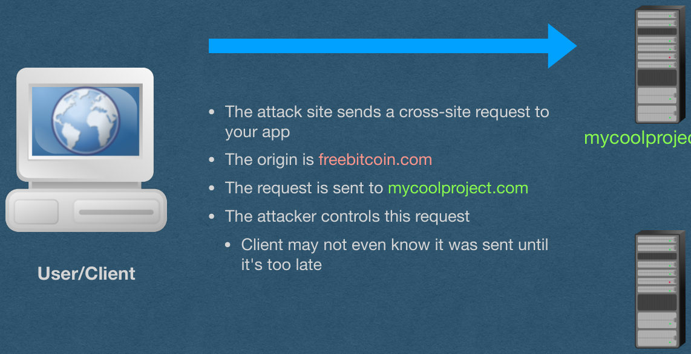
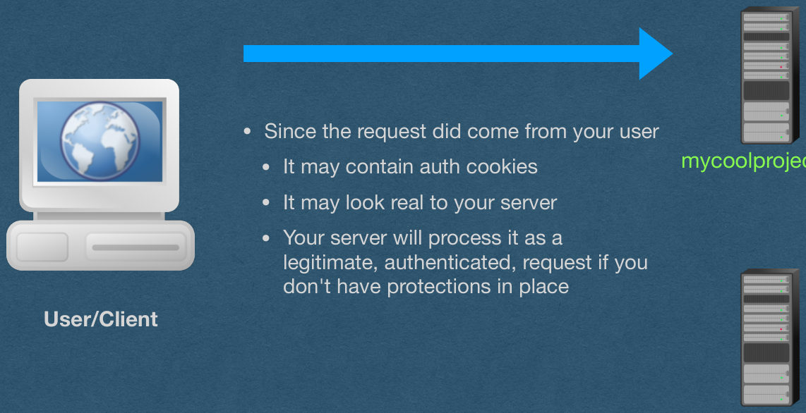
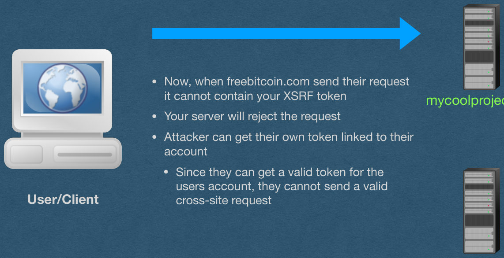

<!-- PDF page 1 -->
## XSRF

Cross-Site Request Forgery

<!-- PDF page 2 -->
## XSRF

- Cross-Site Request Forgery
- A request that is sent from a different "origin"
- Origin:
  - The combination of protocol, host, and port
  - If all three do not match, it is a cross-site request
- What's the danger?

<!-- PDF page 3 -->
## XSRF - Example

Potential outcomes:

- An attack page can make a request to AutoLab
  - Requests your grades
  - Makes a submission on your behalf
- Attack page makes a request to your bank and transfers your funds to the attacker's account
- Attack page makes embarrassing posts on social media

<!-- PDF page 4 -->
## XSRF

- We have a form that sends authenticated POST requests to our server
  - You host this app at mycoolproject.com
- The format of these POST requests is known (Anyone can visit and view your front end)
- An attacker makes their own web app
- The app will send a POST request to mycoolproject.com in the proper format
  - They host this app at freebitcoin.com and get someone to goto their site
  - The site sends the POST request on behalf of the user -> Hacked!

<!-- PDF page 5 -->
## XSRF

<!-- REVIEW: diagram rendered whole; describe it in fig-alt -->

- Client Creates an account on your app
- Client logs in and you issue an auth token in a cookie
- They enjoy your site very much and trust you with private information

mycoolproject.com

User/Client

freebitcoin.com

{fig-alt="TODO: describe this image"}

<!-- PDF page 6 -->
## XSRF

<!-- REVIEW: diagram rendered whole; describe it in fig-alt -->

- Client gets an email
  - ALL YOUR DREAMS WILL COME TRUE!! JUST CLICK HERE!!!
- Naive client clicks the link and gets the attackers HTML/CSS/Javascript

mycoolproject.com

User/Client

freebitcoin.com

{fig-alt="TODO: describe this image"}

<!-- PDF page 7 -->
## XSRF

<!-- REVIEW: diagram rendered whole; describe it in fig-alt -->

- The attack site sends a cross-site request to your app
- The origin is freebitcoin.com
- The request is sent to mycoolproject.com
- The attacker controls this request
  - Client may not even know it was sent until it's too late

mycoolproject.com

User/Client

freebitcoin.com

{fig-alt="TODO: describe this image"}

<!-- PDF page 8 -->
## XSRF

<!-- REVIEW: diagram rendered whole; describe it in fig-alt -->

- Since the request did come from your user
  - It may contain auth cookies
  - It may look real to your server
  - Your server will process it as a legitimate, authenticated, request if you don't have protections in place

mycoolproject.com

User/Client

freebitcoin.com

{fig-alt="TODO: describe this image"}

<!-- PDF page 9 -->
## XSRF

- How to send a XSRF attack?
- As the src of an image
  - Can send a GET request
    - If your server uses query strings, these can be set by the attacker
  - Easy to setup. Embed an image in an email
    - Client only has to open the email (Doesn't even require them to click a shady link)
    - This is why images are often blocked in email

<!-- PDF page 10 -->
## XSRF

- How to send a XSRF attack?
- Submit an HTML form
  - Get the user to navigate to your page
  - The page automatically submits and HTML form on their behalf (They don't have to click a button. Send it with JS)
  - The user will be navigated to the site that was attacked
  - Can send GET and POST requests
  - Must follow specific encodings supported by HTML forms
  - Attacker cannot see the response of the request (No stealing private data with this method)

<!-- PDF page 11 -->
## XSRF

- How to send a XSRF attack?
- Make an AJAX request
  - Get the user to navigate to your page
  - Page automatically sends an AJAX request, or several, onload
  - Attacker has full control
    - They can read the responses and have multiple interactions with the attacked site
    - They can use any HTTP method
    - They can put anything in the body of the requests

<!-- PDF page 12 -->
## How do we protect against XSRF attacks?

<!-- PDF page 13 -->
## Referrer?

- Every request should have a referrer header
  - Specifies the origin of the request
- If the referrer doesn't match your app
  - Deny the request
- Simple enough
- Unfortunately, the referrer can be spoofed and must not be relied upon for security reasons

<!-- PDF page 14 -->
## SOP

- Same-Origin Policy (SOP)
- The SOP is implemented in modern browsers and blocks many cross-origin requests by default
- All AJAX responses are blocked by the SOP
  - This is a relief since AJAX is so powerful

<!-- PDF page 15 -->
## SOP

- The SOP does NOT block "safe" requests
- Safe requests include
  - Any GET request
  - Any request that navigates away from the origin (Including HTML Form submissions using POST)
- A GET request should be idempotent AND not change the state of the server
  - Your GET requests should only retrieve data since they are not protected by CORS

<!-- PDF page 16 -->
## Slide 16

<!-- REVIEW: no clear title found; check the heading -->

SOP

- The SOP does NOT block "safe" requests
- HTML form submissions are more difficult to protect against since they can make POST requests
  - We need better protections

<!-- PDF page 17 -->
## Recall SameSite - Cookie Directive

- SameSite
  - Determines when the cookie will be sent on 3rd party requests
  - Lax - Cookie only sent when navigating to your page (Includes HTML form submissions)
    - Or "safe" requests including all GET requests (Except Cross-Site AJAX GET requests)
    - The default setting if SameSite is not set
  - Strict - The cookie is only sent on 1st party requests
    - ie. The cookie is only sent to your server
  - None - The cookie is always sent. Requires the secure directive to also be set
- Set-Cookie: id=X6kAwpgW29M; SameSite=Lax
- Set-Cookie: id=X6kAwpgW29M; SameSite=Strict
- Set-Cookie: id=X6kAwpgW29M; SameSite=None; Secure

<!-- PDF page 18 -->
## SOP Limitations

- Since the SOP is enforced by the browser, we have limited control over its enforcement
  - What if a user has a very outdated browser that doesn't implement the SOP?
  - What if the user installed a plug-in that disables the SOP?
  - What if the user is using an obscure browser that does not implement the SOP properly?
- The SOP will protect most users, but not 100%
  - And won't protect any users from a GET or HTML form attack

<!-- PDF page 19 -->
## Slide 19

<!-- REVIEW: no clear title found; check the heading -->

XSRF - Tokens

- Let's add server-side protection from XSRF attacks
- Will work for all users and all XSRF attacks

<!-- PDF page 20 -->
## XSRF - Tokens

- On the Server:
  - Generate a long random XSRF token on page load (Attacker must not be able to guess the token)
  - Embed this XSRF token in the page
  - Store this XSRF token as being sent to this user
- In the browser:
  - XSRF token can be a hidden input on the form
  - Send this XSRF token along with form submissions

<!-- PDF page 21 -->
## XSRF - Tokens

- Back to the Server on HTTP requests:
  - Read the XSRF token value and the auth token from the request
  - Authenticate the user based on their auth token
  - Verify that this XSRF token was sent to this user
- If the XSRF token was issues to this user
  - Accept the request as valid
- If the XSRF token was NOT issued to this user
  - This is an invalid request and might be a XSRF attack

<!-- PDF page 22 -->
## XSRF Token

- Add a new input to your form for the token
- Generate and inject the token as a value using HTML templates
- Add the hidden attribute so the token is not displayed to the user
- Read the token from the request and verify

```
<form action="/image-upload" id="image-form" method="post" enctype="multipart/form-data">
<input value="AQAAAjppCA8mhugn2UvwOTaKnVY" name="xsrf_token" hidden>
<label for="form-file">Image: </label>
<input id="form-file" type="file" name="upload">
<br/>
<label for="image-form-name">Caption: </label>
<input id="image-form-name" type="text" name="name">
<input type="submit" value="Submit">
</form>
```

<!-- PDF page 23 -->
## XSRF

<!-- REVIEW: diagram rendered whole; describe it in fig-alt -->

- Now, when freebitcoin.com send their request it cannot contain your XSRF token
- Your server will reject the request
- Attacker can get their own token linked to their account
  - Since they can get a valid token for the users account, they cannot send a valid cross-site request

mycoolproject.com

User/Client

freebitcoin.com

{fig-alt="TODO: describe this image"}

<!-- PDF page 24 -->
## CORS

- The SOP can be too restrictive is some cases
  - eg. You host an API that is consumed by other apps via AJAX
- Cross-Origin Resource Sharing
  - A policy that lets you relax the SOP
- Can explicitly allow cross-origin requests with the header:

Access-Control-Allow-Origin: *

<!-- PDF page 25 -->
## CORS

- The * is a wildcard that allows all cross-site requests
  - It is very dangerous and exposes you to XSRF attacks
- Can specify specific origins as well
  - Common if you have an app with multiple servers

Access-Control-Allow-Origin: cse312.com

<!-- PDF page 26 -->
## Slide 26

<!-- REVIEW: no clear title found; check the heading -->

CORS

- CORS determines which cross-origin requests are allowed and which are blocked
- By default, browsers will block many cross-origin requests

Access-Control-Allow-Origin: *
