# The Attack

## The Browser Acts on Your Behalf

- Recall: After you log in, your auth token is stored in a cookie
- The browser attaches that cookie to **every** request sent to your server
  - No matter which page caused the request to be sent
  - The request is authenticated as you, even if you didn't choose to send it
- Your browser has many tabs open to many different sites at once
  - Some you trust (Your bank, Autolab)
  - Some you shouldn't (Clicking a link in a shady email)

## Potential Attack

- You are logged into your bank in one tab and have a cookie for your auth token
- You click a link for `freemoney4you.com`
- `freemoney4you.com` serves you this JavaScript which runs in your browser:

```javascript
const response = await fetch("https://bank.com/account", {credentials: "include"});
const accountDetails = await response.text();
```

- This request comes from your browser
  - Will this attack work?
  - Will a request be sent to your bank that contains your auth token?
  - Can an attacker use this attack to transfer your money to their account?

## Cross-Site Request Forgery

- **Cross-Site Request Forgery (XSRF)** - A malicious site causes your browser to send a request to another site
  - The browser attaches your cookies
  - The server sees an authenticated request from you and processes it
  - You never intended to send it
- The attacker doesn't need to see the response. The damage is done when the request is processed
  - Transfer your money, make an Autolab submission, post in your name, change your email address

## XSRF - The Attack

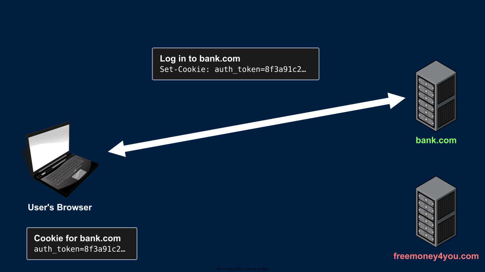{fig-alt="The user logs in to bank.com. The server responds with Set-Cookie: auth_token=8f3a91c2, and the browser stores the cookie."}

- You log in to bank.com and get an auth token in a cookie

## XSRF - The Attack {.unnumbered .unlisted}

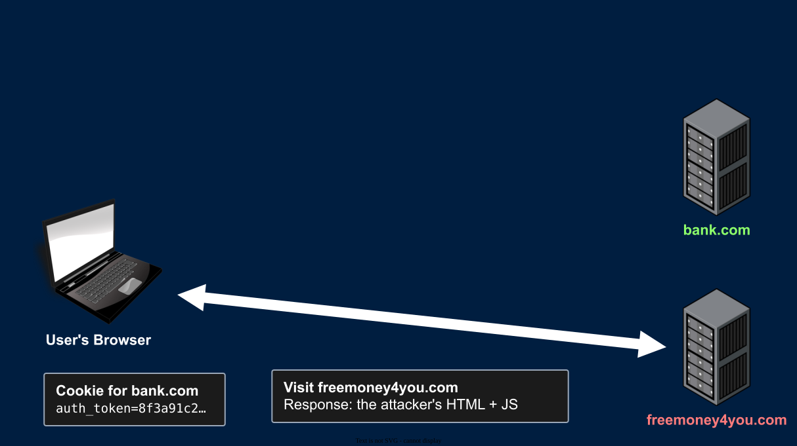{fig-alt="The user visits freemoney4you.com, maybe from a link in an email. freemoney4you.com responds with the attacker's HTML and JavaScript."}

- You click a link in an email: ALL YOUR DREAMS WILL COME TRUE!! JUST CLICK HERE!!!
- Your browser loads the attacker's HTML/JavaScript

## XSRF - The Attack {.unnumbered .unlisted}

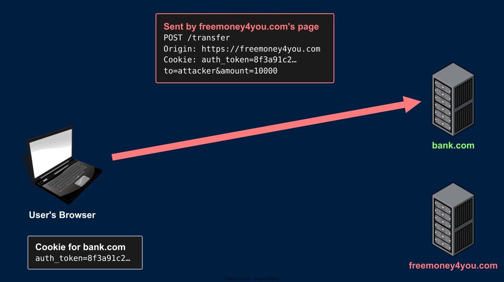{fig-alt="The attacker's page makes the browser send POST /transfer to bank.com with the body to=attacker&amount=10000. The browser attaches the user's bank.com auth cookie automatically."}

- The attacker's page sends a transfer request to bank.com, and your browser attaches your auth cookie
  - The attacker knows the format of the request. Anyone can read bank.com's front end

## XSRF - The Attack {.unnumbered .unlisted}

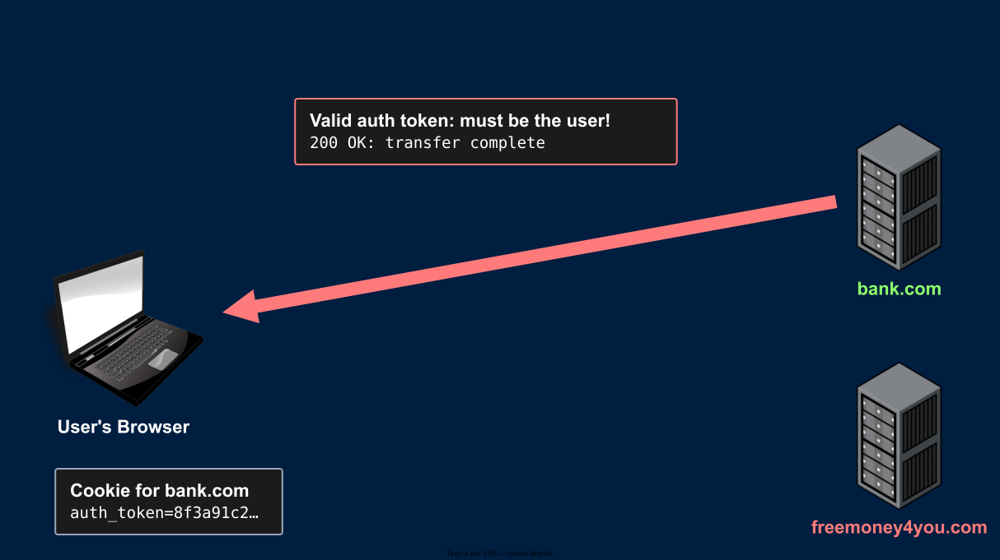{fig-alt="bank.com sees a valid auth token, treats the request as coming from the user, and completes the transfer. The attacker never saw the response but the damage is done."}

- bank.com sees a valid auth token and processes the request. Hacked!

## Sending the Forged Request

```html
<form id="attack" action="https://bank.com/transfer" method="post">
  <input type="hidden" name="to" value="attacker">
  <input type="hidden" name="amount" value="10000">
</form>
<script>document.getElementById("attack").submit();</script>
```

- A hidden form that submits itself as soon as the page loads. No click needed
- Or an image tag, which sends a GET request (Works in emails too!)
  - ``
- Or `fetch`, like the potential attack
- Will any of these work? It depends on what the browser allows

# The Same-Origin Policy

## Same-Origin Policy

- The **Same-Origin Policy (SOP)** is a set of rules enforced by every modern browser
- **Content from one origin cannot read content from a different origin**
  - `freemoney4you.com`'s JavaScript cannot read the response from `bank.com`
- SOP sometimes blocks the entire request
- To understand the rules, we first need to define "origin"

## Origin

- An origin is the combination of:
  - Protocol - `http`, `https`, `ws`, `ftp`
  - Host - `cse312.com`
  - Port - `443`
- Two URLs have the same origin if all three match exactly
- The path is not part of the Origin
- Origin is what the SOP checks

## Site

- A **site** is broader than an origin
- Site = protocol + domain (Not host)
- Ports and subdomains are ignored
  - `https://api.cse312.com` and `https://cse312.com` are the same site
  - `https://autograder.cse.buffalo.edu` and `https://buffalo.edu` are the same site
  - `http://localhost:8080` and `http://localhost:5000` are the same site
- For local testing, you can use `http://localhost:8080` and `http://127.0.0.1:8080` which
are different sites, but both reach your server
- This is the definition of site used by the `SameSite` cookie directive

## Reading vs. Sending

- The SOP does not always stop cross-origin requests from being **sent**
- It stops cross-origin responses from being **read**

| Cross-origin... | Examples | SOP |
|-----------------|----------|-----|
| Writes | Links, redirects, form submissions | Allowed |
| Embeds | Multimedia, JS Scripts, links, CSS | Allowed |
| Reads | Reading a `fetch` response| Blocked |

- Writes and embeds are allowed for backward compatibility

## Writes and Embeds

- Writes navigate the browser to the other origin
  - The response replaces the page that sent the request
  - The page that sent the request never sees the response
- Embeds can be **used**, but not **read** [via JS. You can still read them in your console]
  - The page can display the image, run the script, and apply the styles
  - The page's JavaScript can't read the image's pixels or the script's source
- A script from another origin runs as part of **your page's** origin
  - This is how CDNs and analytics scripts work
  - It's also why you should only include scripts you trust

## The Request Still Arrives

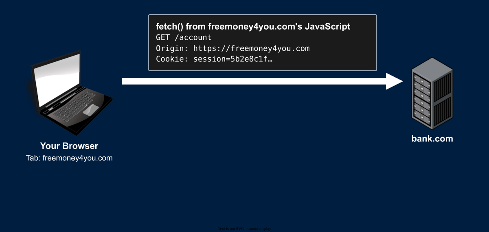{fig-alt="JavaScript on freemoney4you.com calls fetch. The browser sends GET /account to bank.com with the header Origin: https://freemoney4you.com and the user's bank.com session cookie."}

- Cookies will follow the `SameSite` directive rules (A lax cookie would not be sent on this request)

## The Request Still Arrives {.unnumbered .unlisted}

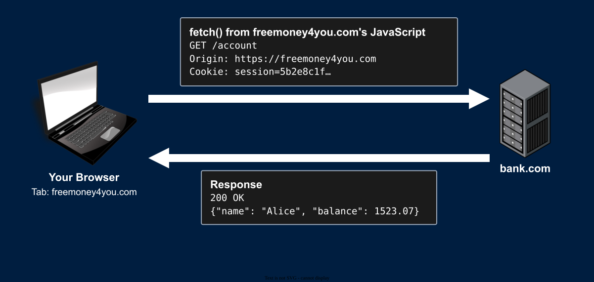{fig-alt="bank.com processes the request and responds 200 OK with the user's name and balance. The response travels back to the browser."}

## The Request Still Arrives {.unnumbered .unlisted}

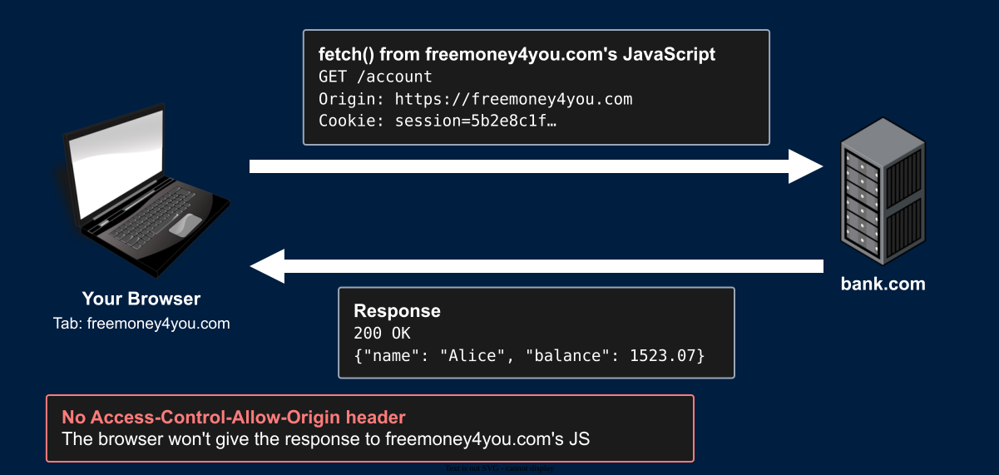{fig-alt="The response has no Access-Control-Allow-Origin header, so the browser refuses to give it to freemoney4you.com's JavaScript. The request was still sent and processed."}

## The Request Still Arrives {.unnumbered .unlisted}

- Try it: From a page on one origin, `fetch` a URL on another origin
  - Console: `Access to fetch at '...' from origin '...' blocked by CORS`
  - Misleading error message: Devs often blame CORS for SOP behavior
- Now check the Network tab and your server's logs
  - The request was sent
  - Your server processed it and sent a 200 response
  - The browser received the response and refused to give it to the JavaScript
- [The SOP protects the response. It does not protect your server]{.yellow}

## Can Any Page Send Any Request?

- If the request is still sent, can `freemoney4you.com` send `bank.com`:
  - A `DELETE` request?
  - A JSON body?
  - Any headers they want?
- No! The browser splits cross-origin requests into 2 kinds:
  - **Simple requests** - Sent immediately. The SOP blocks reading the response
  - **Preflighted requests** - The browser asks the server for permission before sending

## Simple Requests

A cross-origin request is **simple** if all of these are true:

- The method is `GET`, `HEAD`, or `POST`
- Only sets "CORS-safelisted" headers
  - `Accept`, `Accept-Language`, `Content-Language`, `Content-Type`
- The `Content-Type`, if set, is one of:
  - `application/x-www-form-urlencoded`
  - `multipart/form-data`
  - `text/plain`

Every other request is "to be preflighted"

## Why These Rules?

- A simple request is a request that an HTML form could already send without any JavaScript
  - Forms could send these cross-origin long before `AJAX` existed
  - Blocking them in `fetch` wouldn't make anything safer. An attacker would simply use a form
- Anything else (`PUT`, `DELETE`, a JSON body, a custom header) were **impossible** to send cross-origin before `AJAX`
  - Servers were written assuming they would never receive these cross-origin
  - SOP predates `AJAX` so it was able to block these without breaking existing apps
  - Browsers won't send them without the server's permission

## Preflight

- Before sending a non-simple cross-origin request, the browser sends a **preflight** request
  - Method `OPTIONS`, same path
  - Asks the server whether the real request is allowed
- If the server does not allow it, [the real request is never sent]{.yellow}

## Preflight {.unnumbered .unlisted}

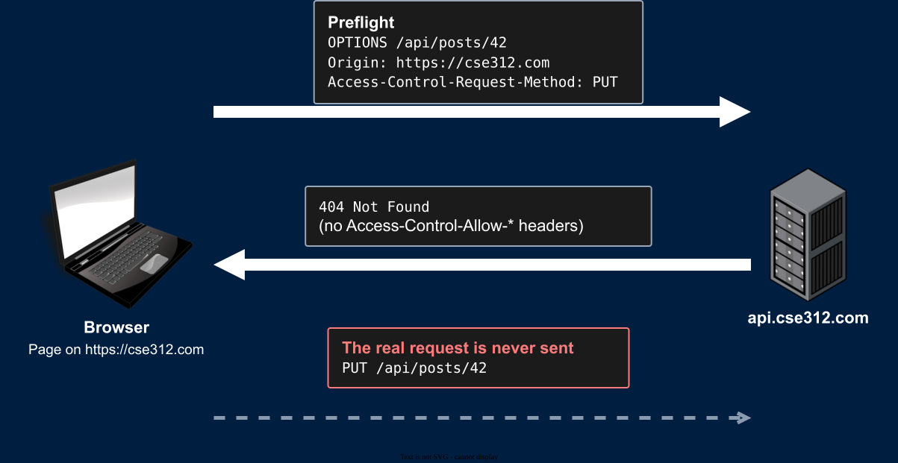{fig-alt="The server responds to the OPTIONS preflight with 404 Not Found and no Access-Control-Allow headers. The browser never sends the real PUT request."}

## Preflight {.unnumbered .unlisted}

- This is how your HW server behaves
  - It doesn't handle `OPTIONS`, so every preflight fails
  - No page on another origin can send your server a JSON `POST`, a `PUT`, or a `DELETE`
  - Any page on another origin can still send your server a **simple** request

## SameSite Cookies

- The SOP stops the attacker from reading. What stops the browser from attaching your cookies?
- Recall the `SameSite` cookie directive. It controls whether a cookie is sent on **cross-site** requests
  - `Strict` - Never sent on a cross-site request
  - `Lax` - Only sent on a cross-site request if it navigates to your site with a GET request
  - `None; Secure` - Always sent
- Browsers can have different default behavior (Usually set to lax)
  - To be sure, you can set the directive explicitly

## SameSite - Which Requests Include the Cookie?

Requests sent from a page on a **different site**:

| Cross-site request | `Strict` | `Lax` | `None` |
|--------------------|----------|-------|--------|
| Clicking a link (GET navigation) | Not sent | Sent | Sent |
| Form submission with GET | Not sent | Sent | Sent |
| Form submission with POST | Not sent | Not sent | Sent |
| ``, `<script>` | Not sent | Not sent | Sent |
| `fetch`, `<iframe>` | Not sent | Not sent | Sent |

- All requests from a page on the **same site** include the cookie


## GET Requests Must Not Change State

- `GET` requests must never change the state of your server
  - GETs only *get* data
- Any page can send them: links, image tags, redirects
- `Lax` cookies are sent when the user follows a link from another site
  - So `GET /transfer?to=attacker&amount=10000` is exploitable even with modern browser defaults
- Browsers also prefetch links, and search engines follow them
  - A crawler following your links should not delete anything

# XSRF Tokens

## When the Browser Isn't Enough

- The SOP and `SameSite` are enforced by the **user's browser**. We have limited control
  - An outdated or obscure browser might not implement them properly
  - A browser extension might disable them
  - Browsers disagree on the default `SameSite` value
- They don't cover every case either
  - Some apps need `SameSite=None` (Embedded widgets, cross-site sign-in)
  - `SameSite` checks the site, not the origin. Any subdomain of your site can attack you
- They protect most users, but not 100%
- We need protection on **our server** that works for every user, in every browser

## XSRF Tokens

- The attacker can send requests, but they can't read your pages (SOP)
- So: Put a secret in your pages that the request must send back
- On the server:
  - Generate a long random XSRF token when serving a page with a form
    - The attacker must not be able to guess the token
  - Store this XSRF token as issued to this user
  - Embed this XSRF token in the page
- In the browser:
  - The XSRF token is a hidden input on the form
  - The token is sent with the form submission

## XSRF Tokens - The Flow

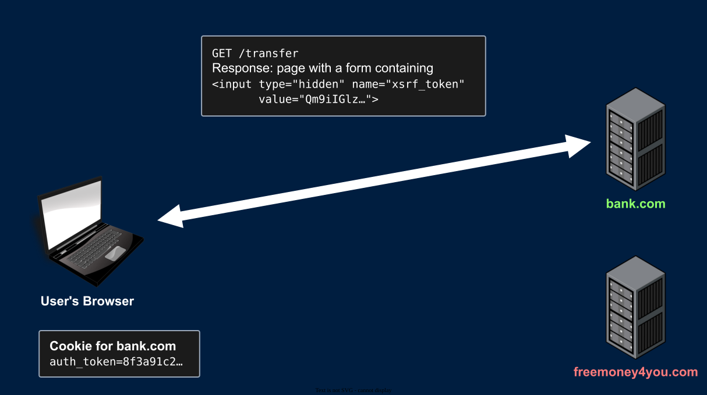{fig-alt="bank.com serves a page with a transfer form. A hidden input holds an XSRF token, Qm9iIGlz, that the server generated and stored for this user."}

## XSRF Tokens - The Flow {.unnumbered .unlisted}

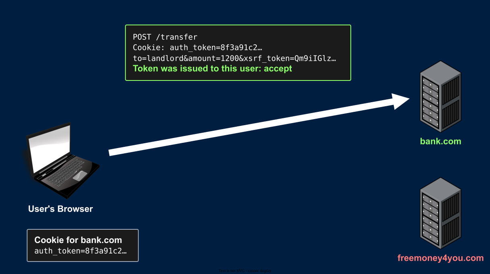{fig-alt="The user submits the form. The request contains the auth cookie and the XSRF token Qm9iIGlz in the body. The server confirms this token was issued to this user and accepts the request."}

## XSRF Tokens - In the Form

- Add a new hidden input to your form for the token
- Generate and inject the token as the value using HTML templates
- Read the token from the request and verify it

```{.html code-line-numbers="2"}
<form action="/image-upload" id="image-form" method="post" enctype="multipart/form-data">
    <input type="hidden" name="xsrf_token" value="AQAAAjppCA8mhugn2UvwOTaKnVY">
    <label for="form-file">Image: </label>
    <input id="form-file" type="file" name="upload">
    <br/>
    <label for="image-form-name">Caption: </label>
    <input id="image-form-name" type="text" name="name">
    <input type="submit" value="Submit">
</form>
```


## XSRF Tokens - Verifying

- On every request that changes state:
  - Authenticate the user with their auth token
  - Read the XSRF token from the request body
  - Verify that this XSRF token was issued to *this* user
- If the XSRF token was issued to this user
  - Accept the request as valid
- If the XSRF token is missing or was NOT issued to this user
  - This is an invalid request and might be an XSRF attack
  - Respond with `403 Forbidden`

## XSRF Tokens - The Attack Fails

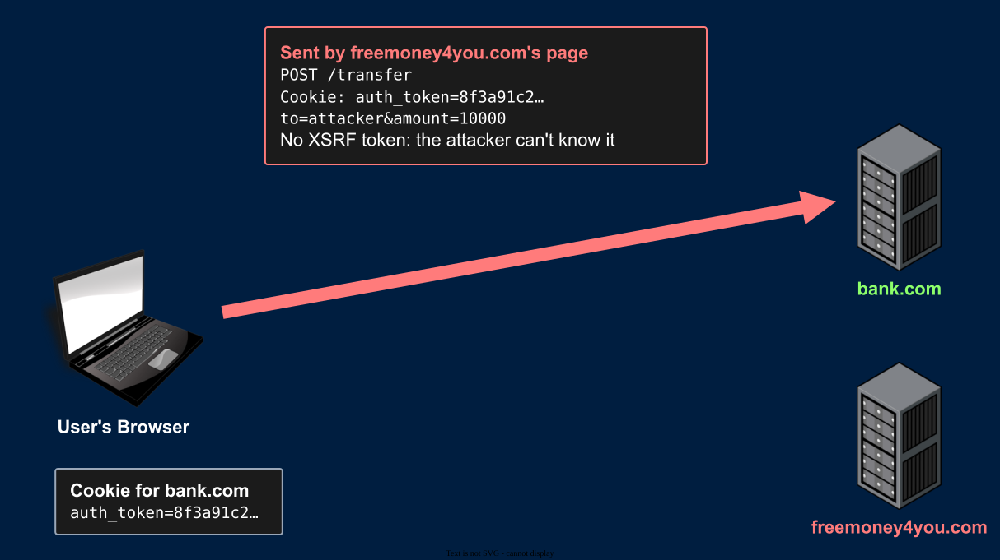{fig-alt="The attacker's page sends POST /transfer again. The browser attaches the auth cookie, but the body has no XSRF token because the attacker cannot read the user's pages to learn it."}

## XSRF Tokens - The Attack Fails {.unnumbered .unlisted}

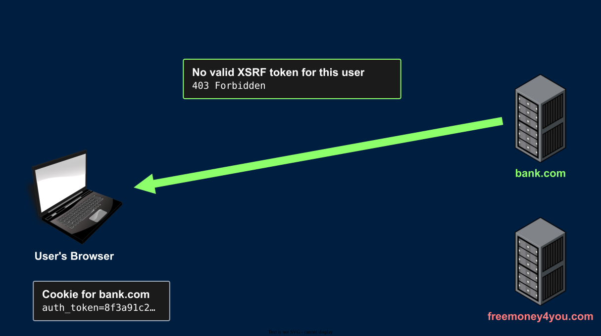{fig-alt="bank.com finds no valid XSRF token for this user and rejects the request with 403 Forbidden. The attack fails."}

## XSRF Tokens - The Attack Fails {.unnumbered .unlisted}

- Even if the browser attaches the cookie, the forged request can't contain your XSRF token
  - The SOP stops `freemoney4you.com` from reading your pages
- The server rejects the request
- The attacker can get a valid XSRF token for their own account
  - But that token was not issued to you, so it's rejected too
- Works in every browser, with any `SameSite` setting

## Why Not Put the XSRF Token in a Cookie?

- Cookies are attached to requests automatically, even forged requests
  - A token that only arrives in a cookie proves nothing. The forged request has it too
- The token must arrive in something the attacker's page can't produce:
  - A form field
  - A custom request header (Which also triggers a preflight)
- The user's page must be able to **read** the token to send it
- The attacker's page must **not** be able to read the token
  - This is exactly what the SOP gives us


# Summary

## Summary

- XSRF: Another site makes your browser send a request, with your cookies attached
- The SOP: Cross-origin reads are blocked. Writes and embeds are allowed
  - Simple requests are always sent. Non-simple requests are preflighted
- `SameSite` controls whether cookies are attached to cross-site requests
- `GET` requests never change state
- XSRF tokens: A secret in your pages that the attacker can't read
  - Required on every request that changes state
  - Protects every user, in every browser

## Next Time

- CORS: Letting other origins in, on purpose
- More attacks, and more layers of defense
