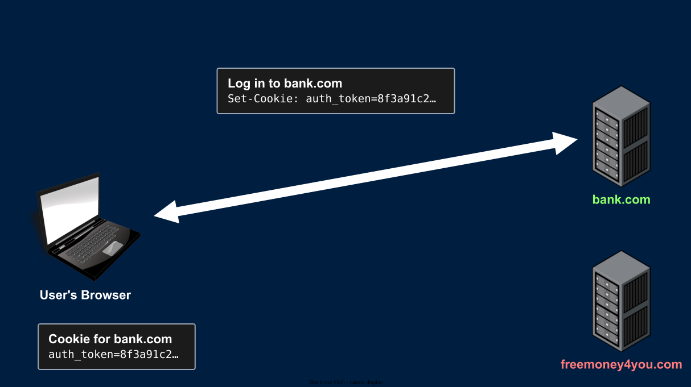
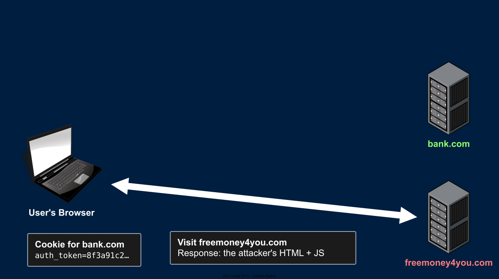
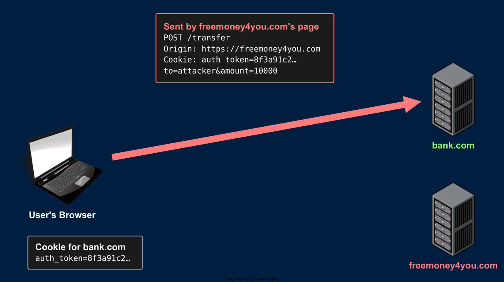
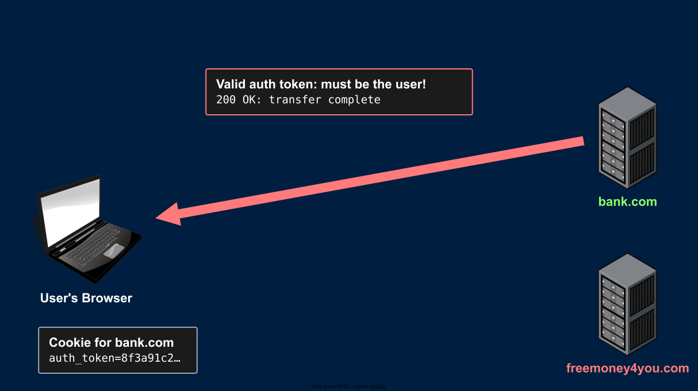

# The Attack

## Auth Tokens are Automatic

- Recall: After you log in, your auth token is stored in a cookie
- The browser attaches that cookie to **every** request sent to your server
  - No matter which page caused the request to be sent
  - The request is authenticated as you, even if you didn't choose to send it
- Your browser has many tabs open to many different sites at once
  - Some you trust (Your bank, Autolab)
  - Some you shouldn't (Clicking a link in a shady email)


## Cross-Site Request Forgery

- **Cross-Site Request Forgery (XSRF)** - A malicious site causes your browser to send a request to another site
  - The browser attaches your cookies
  - The server sees an authenticated request from you and processes it
  - You never intended to send it
- Used to transfer your money, make an Autolab submission, make a post/DM in your name, change your email address


## XSRF - The Attack

{fig-alt="The user logs in to bank.com. The server responds with Set-Cookie: auth_token=8f3a91c2, and the browser stores the cookie."}

- You log in to bank.com and get an auth token in a cookie

## XSRF - The Attack {.unnumbered .unlisted}

{fig-alt="The user visits freemoney4you.com, maybe from a link in an email. freemoney4you.com responds with the attacker's HTML and JavaScript."}

- You click a link in an email: ALL YOUR DREAMS WILL COME TRUE!! JUST CLICK HERE!!!
- Your browser loads the attacker's HTML/JavaScript

## XSRF - The Attack {.unnumbered .unlisted}

{fig-alt="The attacker's page makes the browser send POST /transfer to bank.com with the body to=attacker&amount=10000. The browser attaches the user's bank.com auth cookie automatically."}

- The attacker's page sends a transfer request to bank.com, and your browser attaches your auth cookie
  - The attacker knows the format of the request. Anyone can read bank.com's front end

## XSRF - The Attack {.unnumbered .unlisted}

{fig-alt="bank.com sees a valid auth token, treats the request as coming from the user, and completes the transfer. The attacker never saw the response but the damage is done."}

- bank.com sees a valid auth token and processes the request. Hacked!


## Sending the Forged Request

```html
<form id="attack" action="https://bank.com/transfer" method="post">
  <input type="hidden" name="to" value="attacker">
  <input type="hidden" name="amount" value="10000">
</form>
<script>document.getElementById("attack").submit();</script>
```

- **Navigation**: A hidden form that submits itself as soon as the page loads. No click needed
- **Embed**: Or an image tag, which sends a GET request
  - ``
  - This is why images are often blocked in emails
- **Fetch**: Or sends a `fetch` request
- Will any of these work? 
  - It depends on the browser and the Same-Origin Policy

# The Same-Origin Policy

## Same-Origin Policy

- The **Same-Origin Policy (SOP)** is a set of rules enforced by every modern browser
- **Content from one origin cannot read content from a different origin**
  - `freemoney4you.com`'s JavaScript cannot read any response from `bank.com`
- SOP *sometimes* blocks the entire request
- The SOP only affects cross-origin requests
- To understand the full rules, we first need to define "origin"

## Origin

- An origin is the combination of:
  - Protocol - `http`, `https`, `ws`, `ftp`
  - Host - `cse312.com`
  - Port - `443`
- Two URLs have the same origin if all three match exactly
- The path is not part of the Origin
- Origin is what the SOP checks

## Site

- A **site** is broader than an origin
- Site = protocol + domain (Not host)
- Ports and subdomains are ignored
  - `https://api.cse312.com` and `https://cse312.com` are the same site
  - `https://autograder.cse.buffalo.edu` and `https://buffalo.edu` are the same site
  - `http://localhost:8080` and `http://localhost:5000` are the same site
- For local testing, you can use `http://localhost:8080` and `http://127.0.0.1:8080` which
are different sites, but both reach your server
- This is the definition of site used by the `SameSite` cookie directive


## SOP Blocks All Reads

- **Navigation**: Attacker sends a request that navigates the browser to another origin
  - The response replaces the page that sent the request
  - The page that sent the request never sees the response
- **Embeds**: Embeds can be **used**, but not **read** [via JS. You can still read them in your console]
  - The page can display the image, run the script, and apply the styles
  - The page's JavaScript can't read the image's pixels or the script's source
- **Fetch**: SOP might allow the request to be sent, but the response is always blocked 
  - Attacker still sends the request, and the other origin will still send a response
  - The attackers JS is not allowed to read the response


## The Request Still Arrives

- Try it: From a page on one origin, `fetch` a URL on another origin
  - Console: `Access to fetch at '...' from origin '...' blocked by CORS`
  - Misleading error message: Devs often blame CORS for SOP behavior
- Now check the Network tab and your server's logs
  - The request was sent
  - Your server processed it and sent a 200 response
  - The browser received the response and refused to give it to the JavaScript
- [The SOP protects the response. It does not protect your server]{.yellow}

## SOP Blocks Some Requests

- If the request is still sent, can `freemoney4you.com` send `bank.com`:
  - A `DELETE` request?
  - A JSON body?
  - Any headers they want?
- No! The browser splits cross-origin requests into 2 kinds:
  - **Simple requests** - Always sent. The SOP only blocks reading the response
  - **Preflighted requests** - The browser asks the server for permission before sending the request

## Simple Requests

A cross-origin request is **simple** if all of these are true:

- The method is `GET`, `POST`, or `HEAD` (A request for only headers)
- Only sets "CORS-safelisted" headers
  - `Accept`, `Accept-Language`, `Content-Language`, `Content-Type`
- The `Content-Type`, if set, is one of:
  - `application/x-www-form-urlencoded`
  - `multipart/form-data`
  - `text/plain`

Every other request is "to be preflighted"

## Why These Rules?

- Compatibility. Many sites rely on cross-origin simple requests
- A simple request is a request that an HTML form could already send without any JavaScript
  - Forms could send these cross-origin long before `AJAX` and `fetch` existed
  - Blocking them in `fetch` wouldn't make anything safer so it's allowed. An attacker would simply use a form if it were not
- Anything else (`PUT`, `DELETE`, a JSON body, a custom header) could not be sent cross-origin when the SOP rules were written
  - Servers were written assuming they would never receive these cross-origin
  - Easy to block these without breaking existing apps
  - Browsers won't send them without the server's permission

## Preflight

- Before sending a non-simple cross-origin request, the browser sends a **preflight** request
  - Method `OPTIONS` for the intended path
  - Asks the server whether the real request is allowed
- If the server does not allow it, [the real request is never sent]{.yellow}
- The server can allow the request by responding with various `Access-Control-Allow` headers
  - `Access-Control-Allow-Method: PATCH`
  - `Access-Control-Allow-Origin: https://cse312.com`
  - Would allow PATCH requests for the path from cse312.com
- If any response is sent without these headers, the request is not allowed 
  - For example, if you respond to the OPTIONS request with a 404


## GET Requests Should Never Change State

- GETs only *get* data. They should never change that data
- Any page can send them: links, forms, redirects, image tags
  - If they are simple, the SOP allows the request
  - If they navigate to your page, SameSite cookies are sent
- So `GET /transfer?to=attacker&amount=10000` is exploitable even with all the protections built into modern browsers
  - Do not perform any sensitive actions with a GET request
- A web crawler could even accidentally change the state of your server


# XSRF Tokens

## When the Browser Isn't Enough

- The SOP and `SameSite` are enforced by the **user's browser**. We have limited control
  - An outdated or obscure browser might not implement them properly
  - A browser extension might disable them
  - Browsers disagree on the default `SameSite` value
- They protect most users, but not 100%
- We need protection on **our server** that works for every user, in every browser
  - Never trust your users, even with their own security

## XSRF Tokens

- The attacker can send requests, but they can't read your pages (SOP)
- So, put a secret in your pages that the request must send back
- On the server:
  - Generate a long random XSRF token when serving a page that can make state-changing requests
    - The attacker must not be able to guess the token (>=80 bits of entropy)
  - Store the XSRF token and associate it with the user who made the request
    - Identify the user by their auth token or session token
  - Embed this user's XSRF token in the page when you render it for them
- On the front end:
  - The XSRF token is a hidden input on the form
  - The token is sent with the form submission


## XSRF Tokens - In the Form

- Add a new hidden input to your form for the token
- Generate and inject the token as the value using HTML templates
- Read the token from the request and verify it

```{.html code-line-numbers="2"}
<form action="/image-upload" id="image-form" method="post" enctype="multipart/form-data">
    <input type="hidden" name="xsrf_token" value="AQAAAjppCA8mhugn2UvwOTaKnVY">
    <label for="form-file">Image: </label>
    <input id="form-file" type="file" name="upload">
    <br/>
    <label for="image-form-name">Caption: </label>
    <input id="image-form-name" type="text" name="name">
    <input type="submit" value="Submit">
</form>
```

## XSRF Tokens - In Fetch Requests

- If you want to send a `fetch` request with a XSRF token 
  - Use an HTML template to embed the token anywhere in the HTML  
    - Preferably in a `meta` tag
  - Use JS to read the token
  - Add it as a custom header in your request
    - Or as part of the body (In a JSON field)


## XSRF Tokens - Verifying

- On every request that changes state:
  - Authenticate the user with their auth token, or session token if they are not logged in
  - Read the XSRF token from the request body
  - Verify that this XSRF token was issued to *this* user
- If the XSRF token was issued to this user
  - Accept the request as valid
- If the XSRF token is missing or was NOT issued to this user
  - This is an invalid request and might be an XSRF attack
  - Respond with `403 Forbidden`


## XSRF Tokens - The Attack Fails

- Even if the browser attaches sends a request with auth tokens, the forged request can't contain the correct XSRF token
  - The SOP stops `freemoney4you.com` from reading your pages
  - This is why it's very important to embed the token in your page, not in a cookie
- The server rejects the request
- The attacker can get *a* valid XSRF token for their own account
  - But that token was not issued to you, so it's rejected too
- This is server-side security (The only real form of security)
  - Works in every browser, with any `SameSite` setting

## Why Not Put the XSRF Token in a Cookie?

- The auth tokens are what we're trying to protect
  - XSRF tokens in cookies would be like have 2 auth tokens (redundant)
- Cookies are attached to requests automatically, even forged requests
  - A token that only arrives in a cookie proves nothing. The forged request has it too
- The token must arrive in something the attacker's page can't produce:
  - A form field
  - A custom request header (Which also triggers a preflight)
- The user's page must be able to **read** the token to send it
- The attacker's page must **not** be able to read the token
  - This is exactly what the SOP gives us

