<!-- PDF page 1 -->
## OAuth 2.0 - Overview

<!-- PDF page 2 -->
## Web API

- Many apps have APIs that can be used to interact with user data programmatically
- Such apps will [typically] allow users to access their data in 2 ways:
  - Using the app itself - loading the page and interacting with the UI (User Interface)
  - Connecting to the API - Sending HTTP requests directly to the server without using the front end
- Using the API allows us to write custom programs that interact with the app
  - eg. A program that starts/stops Spotify playback when lecture ends/starts

<!-- PDF page 3 -->
## Web API

- Web APIs use endpoints
- API Endpoint: A combination of path and HTTP method that has specific behavior
- Examples:
  - POST /chat-message - Adds a message to chat
  - DELETE /chat-message/`<mesageId>` - delete the chat message with an id matching `<messageId>`
  - PUT api.spotify.com/v1/me/player/play - begin music playback
  - POST api.github.com/repos/`<owner>`/`<repo>`/issues - create an issue in the repo `<owner>`/`<repo>`
  - GET api.github.com/repos/`<owner>`/`<repo>`/issues - get all issues in the repo `<owner>`/`<repo>`

<!-- PDF page 4 -->
## Web API

- How do we securely consume an API?
- The API server can verify with an existing authentication token
  - These tokens were not designed for API access
  - Gives full access to the account without restriction
- More commonly, the API will issue an API key to the user
  - Send this key with each API access
  - Server verifies the user associated with the key for authorization
  - Keys can have restricted functionality and are only used for API access (Not as detrimental if compromised)

<!-- PDF page 5 -->
## Web API

<!-- REVIEW: diagram rendered whole; describe it in fig-alt -->

register/login

auth token

```
Request API key
-Auth token
```

API key

```
API endpoint
-API key
```

User

```
200 OK
-Private data
```

Server

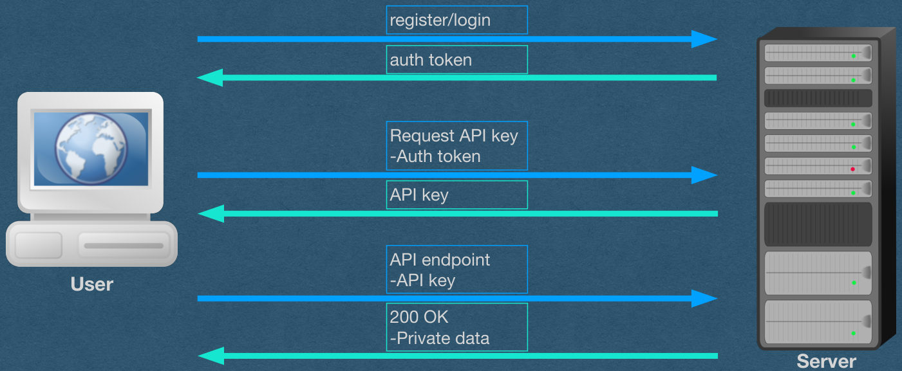{fig-alt="TODO: describe this image"}

<!-- PDF page 6 -->
## OAuth?

- This setup works well enough
- So where does OAuth come in?

<!-- PDF page 7 -->
## The Problem

- A user enjoys an app (eg. GitHub) that has a web API
- You want to write an app that consumes the GitHub API for your users
- Examples:
  - You're building a scrum board app that creates/updates GitHub issues for your users
  - You want users to access their private repos through your app
  - You want a "sign up with GitHub" button on your app

{fig-alt="TODO: describe this image"}

<!-- PDF page 8 -->
## The Problem

In general, you want to write an app that uses a 3rd

party API to create/access/modify your users’ private

data

How do we do this securely?

<!-- PDF page 9 -->
## A BAD Attempt

- Never do this!!
- ..Have your users give you their GitHub username and password
- Effective, but very insecure
- Never ask users for their password outside of registration/login on your own app.
  - We did a lot of work hashing/salting to make sure we can't know passwords
- This would require us to store plaintext passwords so we can reuse them each time a user wants to access the API through our app

<!-- PDF page 10 -->
## Another BAD Attempt

- Never do this!!
- ..Have the user give you their API key
- Not nearly as bad as storing their password
- But, there’s a lack of accountability
  - API accessing made by our app will look like they come from the user
  - Rouge apps can abuse your key without detection
- API key rate limiting will count against the user when we use the key
  - User gets denied access if your app overuses the key
  - Bigger problem if the API charges $ per access

<!-- PDF page 11 -->
## • Our app asks the user for their API key

<!-- REVIEW: diagram rendered whole; describe it in fig-alt -->

Simple Overview [BAD Attempt]:

1. Request API key

3rd Party API /

Auth Server /

Resource Server

Your App / Client

User / Resource Owner

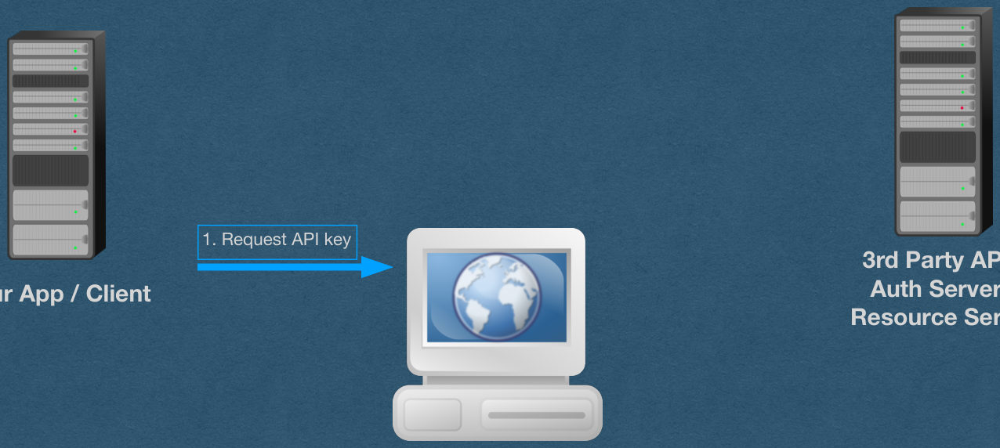{fig-alt="TODO: describe this image"}

<!-- PDF page 12 -->
## • Our app asks the user for their API key • User visits the API and obtains an API key for their account

<!-- REVIEW: diagram rendered whole; describe it in fig-alt -->

Simple Overview [BAD Attempt]:

1. Request API key

2. Request API key

3rd Party API /

Auth Server /

Resource Server

Your App / Client

3. API key

User / Resource Owner

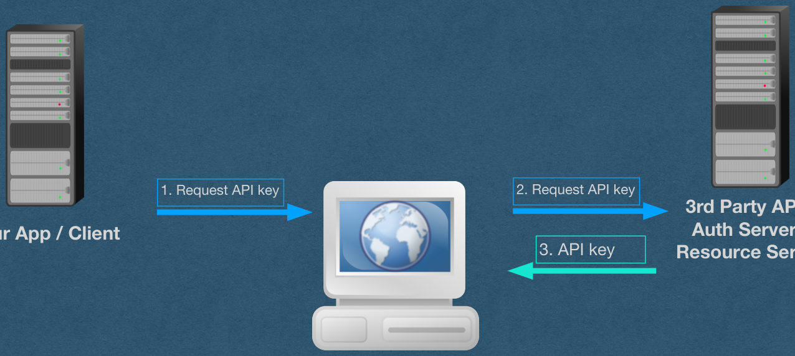{fig-alt="TODO: describe this image"}

<!-- PDF page 13 -->
## • Our app asks the user for their API key • User visits the API and obtains an API key for their account • User hands their key over to us

<!-- REVIEW: diagram rendered whole; describe it in fig-alt -->

Simple Overview [BAD Attempt]:

1. Request API key

2. Request API key

3rd Party API /

Auth Server /

Resource Server

Your App / Client

4. API key

3. API key

User / Resource Owner

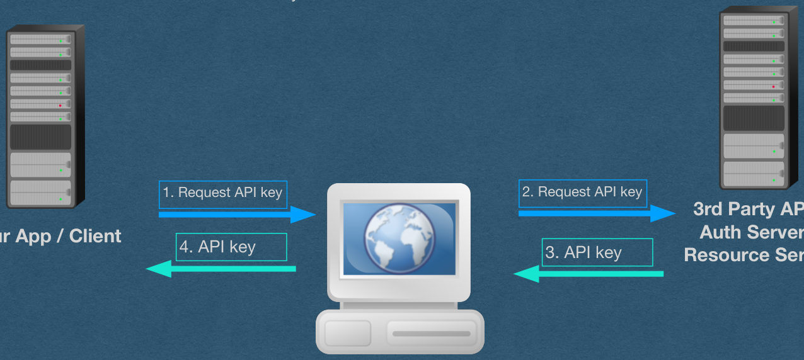{fig-alt="TODO: describe this image"}

<!-- PDF page 14 -->
## • Our app asks the user for their API key • User visits the API and obtains an API key for their account • User hands their key over to us • We use this key to access the API for them (Or login using this service)

<!-- REVIEW: diagram rendered whole; describe it in fig-alt -->

Simple Overview [BAD Attempt]:

5. API access

6. Private data

1. Request API key

2. Request API key

3rd Party API /

Auth Server /

Resource Server

Your App / Client

4. API key

3. API key

User / Resource Owner

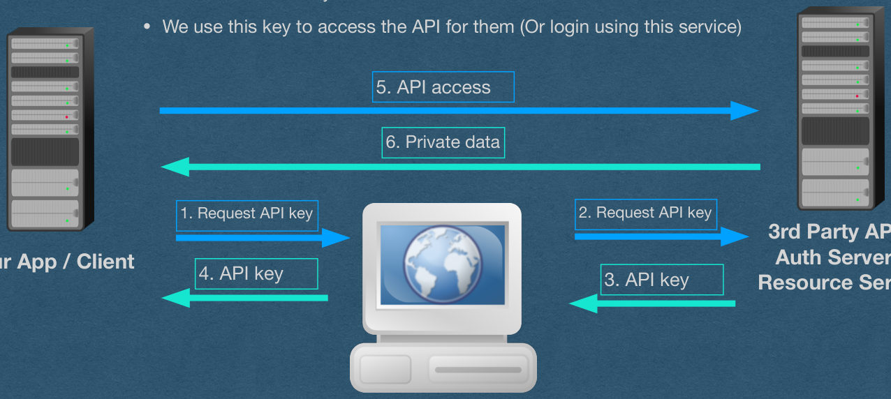{fig-alt="TODO: describe this image"}

<!-- PDF page 15 -->
## • The API has no idea that the user allowed your app to use this • The app using the key looks the same as the user using the

<!-- REVIEW: diagram rendered whole; describe it in fig-alt -->

Security issue - Lack of accountability of the client

key

key

5. API access

6. Private data

1. Request API key

2. Request API key

3rd Party API /

Auth Server /

Resource Server

Your App / Client

4. API key

3. API key

User / Resource Owner

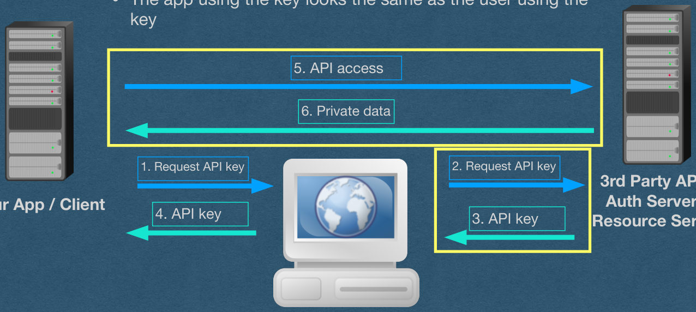{fig-alt="TODO: describe this image"}

<!-- PDF page 16 -->
## • Your server is responsible for handling the API key • If the key is compromised, attackers requests look

<!-- REVIEW: diagram rendered whole; describe it in fig-alt -->

Security issue - No compromise detection

like they come from the user

5. API access

6. Private data

1. Request API key

2. Request API key

3rd Party API /

Auth Server /

Resource Server

Your App / Client

4. API key

3. API key

User / Resource Owner

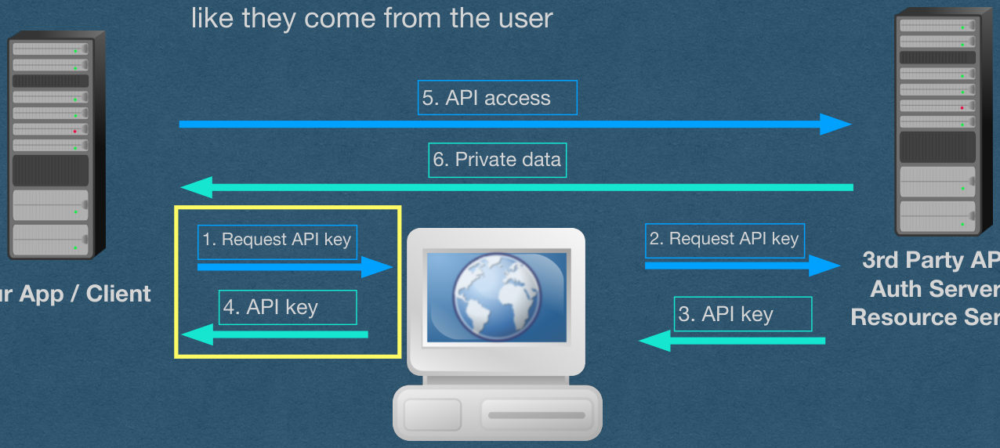{fig-alt="TODO: describe this image"}

<!-- PDF page 17 -->
## • The user has to handle their own API key • Key can be compromised at this point • Never trust your users. Not even with their own security

<!-- REVIEW: diagram rendered whole; describe it in fig-alt -->

Security issue - Never trust your users

5. API access

6. Private data

1. Request API key

2. Request API key

3rd Party API /

Auth Server /

Resource Server

Your App / Client

4. API key

3. API key

User / Resource Owner

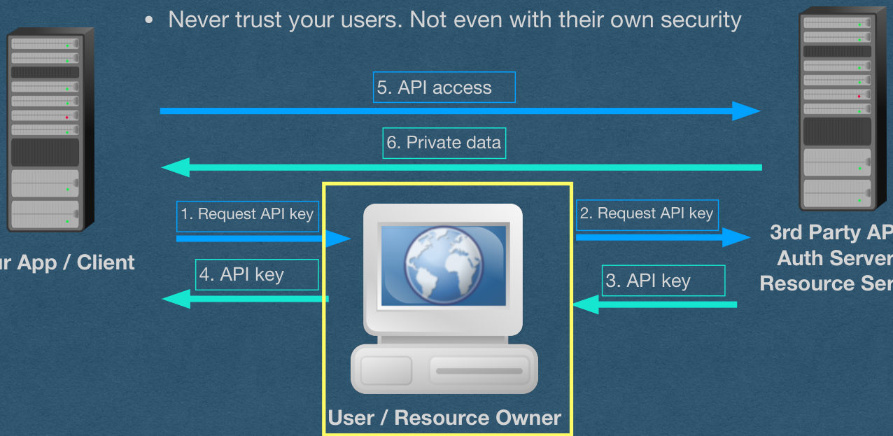{fig-alt="TODO: describe this image"}

<!-- PDF page 18 -->
## OAuth 2.0

- OAuth 2.0 (Open Authorization 2.0)
  - The current, most widely used, solution to this problem
- Designed specifically to allow apps to use 3rd party APIs for their users in a secure way
- User still has to trust the app with their data
  - They are explicitly giving the app permission to access their private data so this should be assumed
- The handling of this access is secure
  - Protected from outside attackers

<!-- PDF page 19 -->
## OAuth 2.0

- OAuth 2.0 will fix the security issues with one simple fix
- The API issues API keys (Called access tokens) to your app directly
  - Our app is accountable for the use, and secure handling, of the access token
  - User never handles their access token (No need to trust them)

<!-- PDF page 20 -->
## OAuth 2.0

- There are several ways to use OAuth 2.0 called flows
- We'll use the authorization code flow
  - The proper flow for our use case of a private server
  - We can store a secret on our server that the user can never access
- If, for example, we build a stand-alone app with no server:
  - The app must be self-contained (There is no back end)
  - User has access to every part of the app, including any secret information
  - Use the implicit grant flow (This is not allowed on the HW)

<!-- PDF page 21 -->
## OAuth 2.0 - Client Registration

- Before starting the authorization process with your users, you must register your app with the 3rd party API
- During the registration process, there are 3 key pieces of data:
  - Client ID: A unique id generated by the API and assigned to your app. This is public information
  - Client Secret: A high-entropy random value generated by the API. This is effectively a password that will be used to authenticate your app. [If this value cannot be kept secret, use a flow that doesn't involve a secret]
  - Redirect URI: Provided by you. This is where the API will send your users after they grant you access to the API

<!-- PDF page 22 -->
## • We'll update our picture with the full

<!-- REVIEW: diagram rendered whole; describe it in fig-alt -->

OAuth authentication code flow

5. Authorization Grant

6. Access Token

7. API Access

8. Private Data

1. Authorization Request

2. Authorization Request

4. Authorization Grant

3. Authorization Grant

Your App / Client

3rd Party API /

Auth Server /

Resource Server

User / Resource Owner

{fig-alt="TODO: describe this image"}

<!-- PDF page 23 -->
## • Let's break this down

<!-- REVIEW: diagram rendered whole; describe it in fig-alt -->

5. Authorization Grant

6. Access Token

7. API Access

8. Private Data

1. Authorization Request

2. Authorization Request

4. Authorization Grant

3. Authorization Grant

Your App / Client

3rd Party API /

Auth Server /

Resource Server

User / Resource Owner

{fig-alt="TODO: describe this image"}

<!-- PDF page 24 -->
## • 1: Your app asks the user to obtain an authorization

<!-- REVIEW: diagram rendered whole; describe it in fig-alt -->

grant allowing the app to use the API on their behalf

1. Authorization Request

Your App / Client

3rd Party API /

Auth Server /

Resource Server

User / Resource Owner

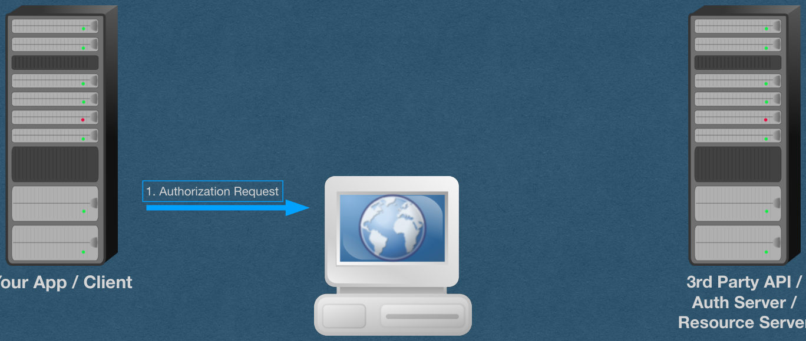{fig-alt="TODO: describe this image"}

<!-- PDF page 25 -->
## • 2. The user sends the request to • The user is authenticated by the • User is asked if they want to allow • Contains a list of scopes

<!-- REVIEW: diagram rendered whole; describe it in fig-alt -->

the authentication server

API (username/password or auth

token)

access

requested by our app

2. Authorization Request

3rd Party API /

Auth Server /

Resource Server

User / Resource Owner

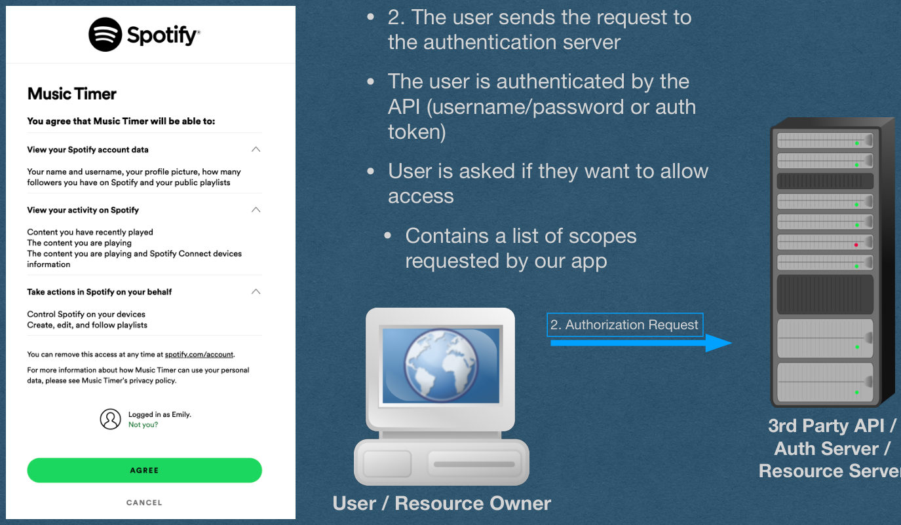{fig-alt="TODO: describe this image"}

<!-- PDF page 26 -->
## • 3: If the user is authenticated and accepts, an • The grant contains an authorization code

<!-- REVIEW: diagram rendered whole; describe it in fig-alt -->

authorization grant is sent to the user

1. Authorization Request

2. Authorization Request

3. Authorization Grant

Your App / Client

3rd Party API /

Auth Server /

Resource Server

User / Resource Owner

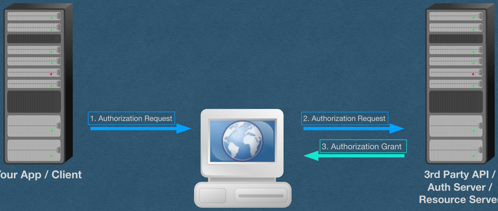{fig-alt="TODO: describe this image"}

<!-- PDF page 27 -->
## • 4: Your app receives a request from the user at the • Your app now has permission from the user to

<!-- REVIEW: diagram rendered whole; describe it in fig-alt -->

```
redirect URI containing the authorization grant
access the API
```

1. Authorization Request

2. Authorization Request

4. Authorization Grant

3. Authorization Grant

Your App / Client

3rd Party API /

Auth Server /

Resource Server

User / Resource Owner

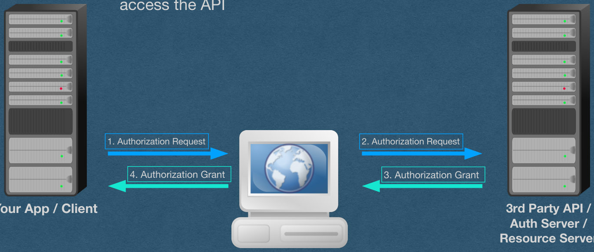{fig-alt="TODO: describe this image"}

<!-- PDF page 28 -->
## • 5: Your app will connect to the auth server and "cash in" the • This step prevents the user from ever handling their access token

<!-- REVIEW: diagram rendered whole; describe it in fig-alt -->

grant for an access token

5. Authorization Grant

1. Authorization Request

2. Authorization Request

4. Authorization Grant

3. Authorization Grant

Your App / Client

3rd Party API /

Auth Server /

Resource Server

User / Resource Owner

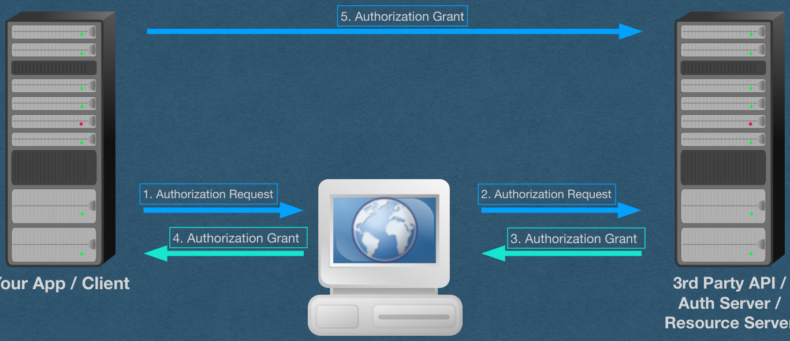{fig-alt="TODO: describe this image"}

<!-- PDF page 29 -->
## • 6: The auth server will verify the identity of the client

<!-- REVIEW: diagram rendered whole; describe it in fig-alt -->

```
using a client secret and will send the access token
directly to your app
```

5. Authorization Grant

6. Access Token

1. Authorization Request

2. Authorization Request

4. Authorization Grant

3. Authorization Grant

Your App / Client

3rd Party API /

Auth Server /

Resource Server

User / Resource Owner

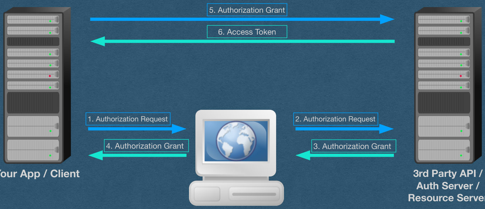{fig-alt="TODO: describe this image"}

<!-- PDF page 30 -->
## • 7/8: Your app can now use the access token to access the API for your user • If the user clicked "login with 3rd party", verify their identity through the API • Create an account for them based on this identity

<!-- REVIEW: diagram rendered whole; describe it in fig-alt -->

5. Authorization Grant

6. Access Token

7. API Access

8. Private Data

1. Authorization Request

2. Authorization Request

4. Authorization Grant

3. Authorization Grant

Your App / Client

3rd Party API /

Auth Server /

Resource Server

User / Resource Owner

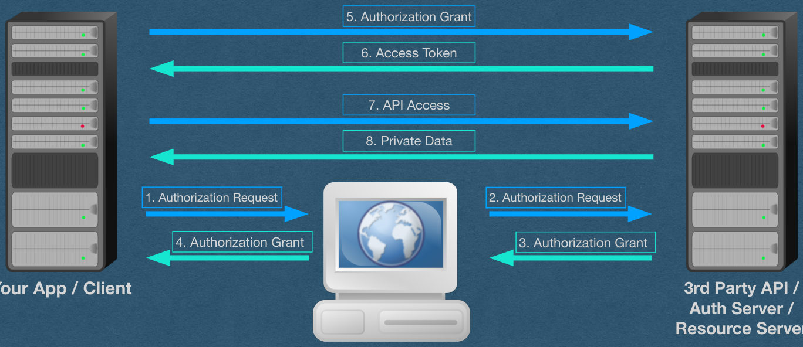{fig-alt="TODO: describe this image"}

<!-- PDF page 31 -->
## OAuth 2.0 - Authorization Code Flow

<!-- REVIEW: diagram rendered whole; describe it in fig-alt -->

5. Authorization Grant

6. Access Token

7. API Access

8. Private Data

1. Authorization Request

2. Authorization Request

4. Authorization Grant

3. Authorization Grant

Your App / Client

3rd Party API /

Auth Server /

Resource Server

User / Resource Owner

{fig-alt="TODO: describe this image"}
