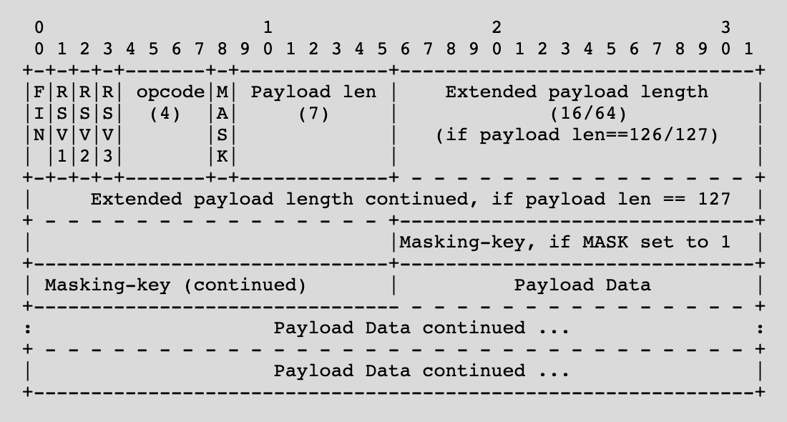

## WebSockets

## AJAX Summary

- Retrieve/Send data from the server after the page loads without a page reload
- To get new data from the server:
  - polling
  - long-polling
- If the server has new data to send to the client
  - Must wait for a poll request

## WebSockets

- Two-way communication between server and client
  - Server can "push" new data to each client without being prompted by an HTTP request
- Enables real-time [minus network delays] communication between users
  - Without long-polling
- Works by keeping a TCP socket open

## WebSocket Overview

- WebSocket protocol:
  - Establish a TCP connection
  - Client sends an HTTP request to upgrade to the WebSocket protocol
  - Server responds confirming the upgrade request
  - Client and server keep the TCP connection open
  - Client and server send WebSocket messages/frames over the TCP connection until one side closes the connection

## WebSocket Handshake

- When the server receives a WebSocket HTTP request
  - Take steps to keep this TCP socket open as a WebSocket connection
  - These steps ensure that both client and server are speaking the same protocol
- After the handshake, client/server can both send messages over the socket

## WebSocket Handshake

- Client sends an HTTP GET request to the WebSocket path
- Client sets headers
  - Connection: Upgrade
  - Upgrade: websocket
  - Sec-WebSocket-Key: `<random_key>`
- Server responds with 101 Switching Protocols with headers
  - Connection: Upgrade
  - Upgrade: websocket
  - Sec-WebSocket-Accept: `<accept_response>`

## WebSocket Handshake

- The client generates a random "Sec-WebSocket-Key" for each new WebSocket connection
- The server appends a specific GUID to this key
  - "258EAFA5-E914-47DA-95CA-C5AB0DC85B11"
- Computes the SHA-1 hash
- "Sec-WebSocket-Accept" is the base64 encoding of the hash
- Why?
  - Ensure client and server both implement the protocol
    - Highly unlikely this value would be returned by accident
  - Avoid caching

## WebSocket Frames

- Once the connection is established
  - Two-way communication via web socket frames
- A frame is a specifically formatted sequence of bits containing the message to be sent
  - Yes, bits! (And you thought bytes were fun!)
- Parse these bits to read the message

## WebSocket Frame


- https://tools.ietf.org/html/rfc6455#section-5.2
- We'll see how to parse through this on Wednesday

{fig-alt="TODO: describe this image"}

## Web Sockets - Browser

- To setup a connection from the browser
- Create a new WebSocket object with the host/path to connect to
  - Choose a path and setup your server to accept WS requests on that path

```
let socket = new WebSocket('ws://' + window.location.host + '/socket');
socket.onmessage = renderMessages;
```

```
function sendMessage() {
socket.send(JSON.stringify({'username': username, 'message': message}))
}
```

```
function renderMessages(message) {
console.log(message.data);
}
```

## Web Sockets - Browser

- Set onmessage to a function that will be called whenever a message is received
- The argument of the call will contain the message

```
let socket = new WebSocket('ws://' + window.location.host + '/socket');
socket.onmessage = renderMessages;
```

```
function sendMessage() {
socket.send(JSON.stringify({'username': username, 'message': message}))
}
```

```
function renderMessages(message) {
console.log(message.data);
}
```

## Web Sockets - Browser

- Call the send method to send a message to the server
- Can give it a String and the WebSocket object will convert it to a frame
  - We'll parse this frame on the server

```
let socket = new WebSocket('ws://' + window.location.host + '/socket');
socket.onmessage = renderMessages;
```

```
function sendMessage() {
socket.send(JSON.stringify({'username': username, 'message': message}))
}
```

```
function renderMessages(message) {
console.log(message.data);
}
```

## Examples

## Concurrency
