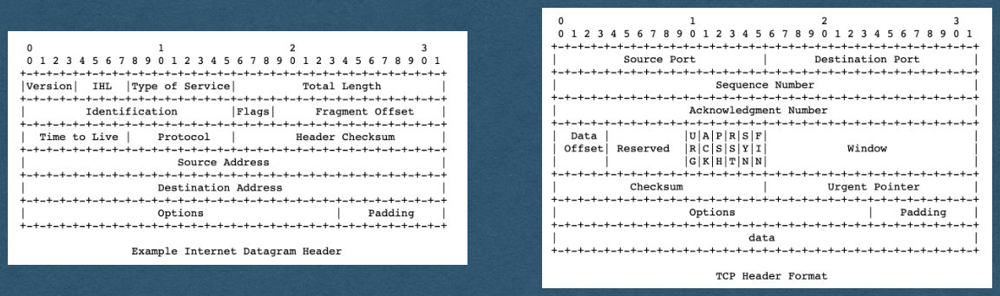
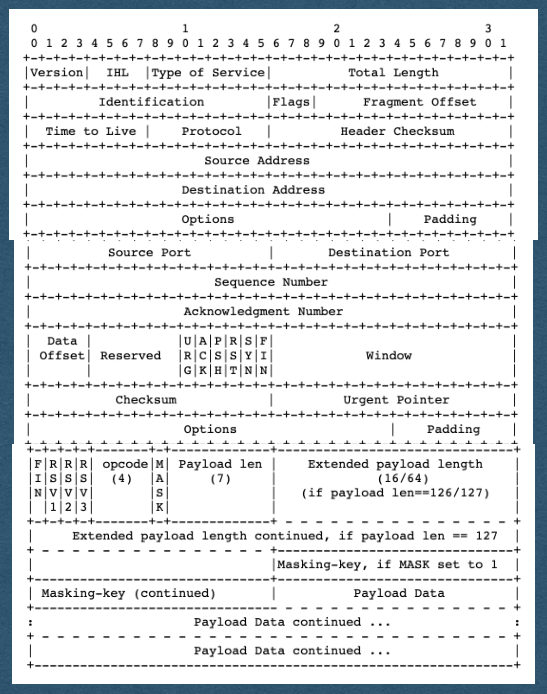

<!-- PDF page 1 -->
## WebSockets

<!-- PDF page 2 -->
## WebSockets

- Last time we saw how to establish a WebSocket connection
- Today, we'll parse and send messages over the socket

<!-- PDF page 3 -->
## WebSocket Frame

<!-- REVIEW: mostly an image; write a text description -->

https://tools.ietf.org/html/rfc6455#section-5.2

{fig-alt="TODO: describe this image"}

<!-- PDF page 4 -->
## Protocols Sidenote

- Many of the protocols used in the Internet define the order and meaning of bits that are sent
  - Sender assembles the bits of a message following the protocol
  - Send the bits through the Internet
  - Receiver interprets the bits following the same protocol to extract meaning from the bits
- Protocols enable communication using only 1's and 0's

<!-- PDF page 5 -->
## Protocols Sidenote

<!-- REVIEW: diagram rendered whole; describe it in fig-alt -->

- TCP/IP protocol headers shown here
- Routers read the IP header following this protocol to know how to route a packet
- Endpoints follow the TCP protocol to assemble a sequence of packets and send it to the process using the given port

{fig-alt="TODO: describe this image"}

<!-- PDF page 6 -->
## WebSocket Frame

- The WebSocket protocol functions the same way
- Client and server agree to follow this protocol
- Send bits in this specific order
  - We can rely on the client following this protocol

{fig-alt="TODO: describe this image"}

<!-- PDF page 7 -->
## Network Stack

<!-- REVIEW: diagram rendered whole; describe it in fig-alt -->

IP

- An IP packet containing a WebSocket frame looks like this

TCP

WebSocket

{fig-alt="TODO: describe this image"}

<!-- PDF page 8 -->
## Parsing Bits

- We will have to read frames at the bit level
  - It's already in a byte array when we receive it
  - We can access any byte and extract the bits we need
  - Helpful to recall that bytes are represented as 8-bit integer values (0-255)

{fig-alt="TODO: describe this image"}

<!-- PDF page 9 -->
## Parsing Bits

- Bit Example - To read the opcode:
  - get the byte at index 0
  - Bitwise AND (& in most languages) this byte with a "bit mask" of 15
  - Since 15 == 00001111 as a byte this will 0 out the 4 higher order bits
  - We now have an int from 0-15 representing the opcode

{fig-alt="TODO: describe this image"}

<!-- PDF page 10 -->
## WebSocket Frame

- FIN: The finish bit
  - 1 - This is the last frame for this message
  - 0 - There will be continuation frames containing more data for the same message

{fig-alt="TODO: describe this image"}

<!-- PDF page 11 -->
## WebSocket Frame

- RSV: Reserved bits
  - Used to specify any extensions being used
- [You can assume these are always 000 for the HW]

{fig-alt="TODO: describe this image"}

<!-- PDF page 12 -->
## WebSocket Frame

- opcode: Operation code
  - Specifies the type of information contained in the payload
  - Ex: 0001 for text, 0010 for binary, 1000 to close the connection, 0000 for continuation frame

{fig-alt="TODO: describe this image"}

<!-- PDF page 13 -->
## WebSocket Frame

- MASK: Mask bit
  - Set to 1 if a mask is being used
  - Set to 0 if no mask is being used
- This will be 1 when receiving messages from a client

{fig-alt="TODO: describe this image"}

<!-- PDF page 14 -->
## Frame Length

- The next bits will represent payload length in bytes
  - Similar to Content-Length
- The length can be represented in 7, 16, or 64 bits

{fig-alt="TODO: describe this image"}

<!-- PDF page 15 -->
## Frame Length

- If the length is <126 bytes
  - The length is represented in 7 bits, sharing a byte with the MASK bit
  - The next bit after the length is either the mask or payload

{fig-alt="TODO: describe this image"}

<!-- PDF page 16 -->
## Frame Length

- If the length is >=126 and <65536 bytes
  - The 7 bit length will be exactly 126 (1111110)
  - The next 16 bits represents the payload length

{fig-alt="TODO: describe this image"}

<!-- PDF page 17 -->
## Frame Length

- If the length is >=65536 bytes
  - The 7 bit length will be exactly 127 (1111111)
  - The next 64 bits represents the payload length
  - 18,446,744,073,709,551,615 max length!
    - 16 exabytes / 16,000,000 terabytes

{fig-alt="TODO: describe this image"}

<!-- PDF page 18 -->
## Frame Length

- To read the frame length, read the 7 bit length
  - If the value is 126, read the next 16 bits as the length
  - If the value is 127, read the next 64 bits as the length
  - Else, the value itself is the length

{fig-alt="TODO: describe this image"}

<!-- PDF page 19 -->
## Mask and Payload

- After all the length bits:
  - If the MASK bit == 1, the next 4 bytes (32 bits) is the mask
  - If the MASK bit == 0, the payload begins

{fig-alt="TODO: describe this image"}

<!-- PDF page 20 -->
## Mask and Payload

- If there is a mask, read these 4 bytes
- The mask will be randomly generated by the client for each message
  - You must parse this each time a message is received

{fig-alt="TODO: describe this image"}

<!-- PDF page 21 -->
## Mask and Payload

- Each 4 bytes of the payload has been XORed with the mask by the client
- Read the payload 4 bytes at a time and XOR the bytes with the mask
- If the length is not a multiple of 4, use only the bytes of the mask that are needed
  - Ie. Always reading 4 bytes will cause an index out of bounds error

{fig-alt="TODO: describe this image"}

<!-- PDF page 22 -->
## XOR Example

- If 4 bytes of the message are:
  - 01001001_01000011_01010101_00100001
- And the random mask is:
  - 01111011_00100010_01110101_01110011
- This part of the payload will be "message XOR mask":
  - 00110010_01100001_00100000_01010010
- When we receive these bits and XOR it with the mask again we get the original message bits:
  - 01001001_01000011_01010101_00100001

<!-- PDF page 23 -->
## Mask and Payload

<!-- REVIEW: mostly an image; write a text description -->

- Once the payload is XORed with the mask 4 bytes at time we get the entire message
- Then process the message

{fig-alt="TODO: describe this image"}

<!-- PDF page 24 -->
## Sending Frames

- To send a message to a client:
  - Use this same format
  - Assemble a byte array with the appropriate values
  - Append your payload as bytes

{fig-alt="TODO: describe this image"}

<!-- PDF page 25 -->
## Sending Frames

<!-- REVIEW: mostly an image; write a text description -->

- Do not use a mask when sending frames to a client
  - No caching concerns on server to client frames

{fig-alt="TODO: describe this image"}

<!-- PDF page 26 -->
## Sending Frames

- Example: For our purposes in the HW
  - RSVs are always 0
  - opcode is either 0001 (Sending text), 1000 (close connection), or 0000 (continuation frame)

{fig-alt="TODO: describe this image"}

<!-- PDF page 27 -->
## Sending Frames

<!-- REVIEW: mostly an image; write a text description -->

- Check the length of your payload to determine how many bits are needed for the length
- Follow the same format for payload length as the received messages

{fig-alt="TODO: describe this image"}

<!-- PDF page 28 -->
## Sending Frames

<!-- REVIEW: mostly an image; write a text description -->

- MASK bit is 0 and there are not mask bytes
  - After payload length, immediately add the bytes of the payload

{fig-alt="TODO: describe this image"}
