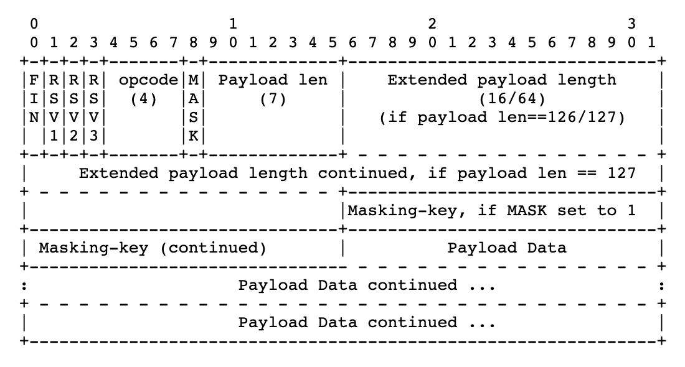
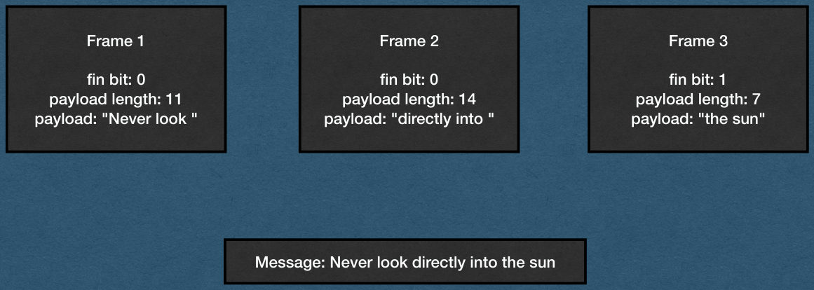
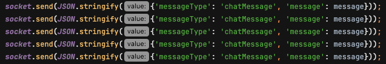
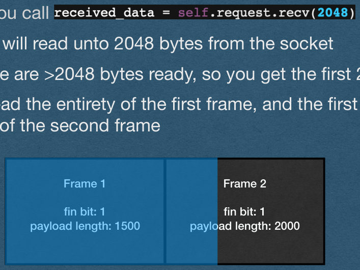
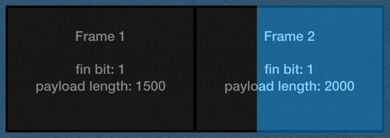
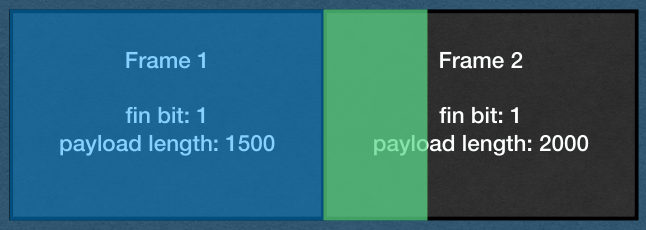
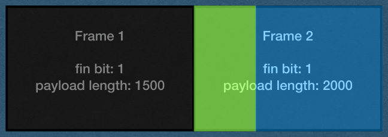

<!-- PDF page 1 -->
## WebSocket Buffers

<!-- PDF page 2 -->
## Slide 2

<!-- REVIEW: no clear title found; check the heading -->

{fig-alt="TODO: describe this image"}

<!-- PDF page 3 -->
## Special Cases

- Let's talk about 3 special cases that will come up when implementing WebSockets
  - Buffering large frames
  - Multiple frames per message using the fin bit and continuation frames
  - Multiple frames being sent back-to-back messages

<!-- PDF page 4 -->
## Buffering Large Frames

- You will sometimes receive WebSocket frames that are large enough that they need to be buffered
  - Buffering frames is very similar to buffering HTTP requests
- When receiving a WebSocket Frame:
  - Read bytes from the socket
  - Parse the headers
  - Read the payload length from the headers
  - Keep reading bytes from the socket until you've read the entire frame
    - Payload length does not include the header bytes
  - Process the request

<!-- PDF page 5 -->
## Continuation Frames

- You will sometimes receive very large messages from client that will be sent in multiple frames (>131,000 bytes in Chrome)
  - Fin bit will be 0 until the last frame
  - opcode will be 0000 for all but the first frame
  - Payload length is only the length of that frame

{fig-alt="TODO: describe this image"}

<!-- PDF page 6 -->
## Continuation Frames

- When you read a frame with a fin bit of 0:
  - Keep reading frames until you read a frame with a fin bit of 1
  - Combine the payload of all frames, then process the entire message

{fig-alt="TODO: describe this image"}

<!-- PDF page 7 -->
## Continuation Frames

<!-- REVIEW: diagram rendered whole; describe it in fig-alt -->

- Example of one message sent over 3 frames

Frame 1

Frame 2

Frame 3

fin bit: 0

payload length: 11

payload: "Never look "

fin bit: 0

payload length: 14

payload: "directly into "

fin bit: 1

payload length: 7

payload: "the sun"

Message: Never look directly into the sun

{fig-alt="TODO: describe this image"}

<!-- PDF page 8 -->
## Back-to-back Frames

- Multiple WebSocket frames can be sent back-to-back on the same connection
  - Especially when continuation frames are used
- If you read more bytes than you expect, you have read the headers of the next frame
- Use the payload length to know how many bytes to expect
  - If you read < payload length bytes, you should buffer
  - If you read > payload length bytes, store the extra bytes as the start of the next frame

<!-- PDF page 9 -->
## Back-to-back Frames

- To test for back-to-back frames:
  - Edit the front end JavaScript to send a message multiple times when the user sends a message
  - Make sure each message is duplicated the correct number of times
  - With this modification, every sent message should appear in chat 5 times

{fig-alt="TODO: describe this image"}

<!-- PDF page 10 -->
## Back-to-back Frames

- Example
- Two frames are sent by the client back-to-back
  - The first frame has a payload length of 1500
    - 1508 total bytes including headers
  - The first frame has a payload length of 2000
    - 2008 total bytes including headers
- Both frames have been processed by TCP and are ready to be read

Frame 1

Frame 2

fin bit: 1

payload length: 1500

fin bit: 1

payload length: 2000

<!-- PDF page 11 -->
## Back-to-back Frames

<!-- REVIEW: diagram rendered whole; describe it in fig-alt -->

- There are 3516 bytes ready to be read from the socket
- And you call
  - This will read unto 2048 bytes from the socket
  - There are >2048 bytes ready, so you get the first 2048
- You read the entirety of the first frame, and the first 540 bytes of the second frame

Frame 1

Frame 2

fin bit: 1

payload length: 1500

fin bit: 1

payload length: 2000

{fig-alt="TODO: describe this image"}

<!-- PDF page 12 -->
## Back-to-back Frames

<!-- REVIEW: diagram rendered whole; describe it in fig-alt -->

- If you're not careful, you loop will go back to the socket and read the remaining 1468 bytes of the second frame and attempt to parse it
- Since you start in the middle of the frame, you will run header parsing code on masked payload bytes
  - You will get errors!

Frame 1

Frame 2

fin bit: 1

payload length: 1500

fin bit: 1

payload length: 2000

{fig-alt="TODO: describe this image"}

<!-- PDF page 13 -->
## Back-to-back Frames

<!-- REVIEW: diagram rendered whole; describe it in fig-alt -->

- When parsing the first frame:
  - Use the payload length to detect that you've read too many bytes
  - Store the extra bytes in a separate variable
  - Parse the first frame

Frame 1

Frame 2

fin bit: 1

payload length: 1500

fin bit: 1

payload length: 2000

{fig-alt="TODO: describe this image"}

<!-- PDF page 14 -->
## Back-to-back Frames

<!-- REVIEW: diagram rendered whole; describe it in fig-alt -->

- When you finish processing the first frame, start parsing the second frame with the bytes stored in the operate variable
- Check the payload length and buffer if needed to read the rest of the frame
- Recommendation: Use your top-level loop to do this so you can handle any number of back-to-back frames

Frame 1

Frame 2

fin bit: 1

payload length: 1500

fin bit: 1

payload length: 2000

{fig-alt="TODO: describe this image"}

<!-- PDF page 15 -->
## Demos
