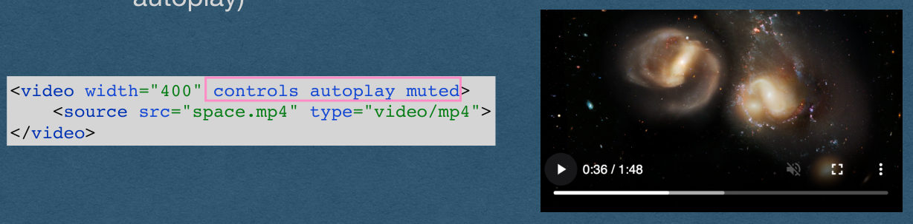
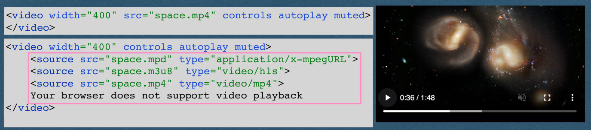

## Video

## Uploading Video

- We now support file uploads
  - We allow users to upload images
- How do we support video uploads?
  - The same exact way as images!
  - Files are just bytes
  - Images and videos are handled as bytes

## Displaying Video


- How do we display a video on our page?
  - Not the same as images (Can't use the `` element)
- Use the `<video>` element!

```
<video width="400" controls autoplay muted>
<source src="space.mp4" type="video/mp4">
</video>
```

{fig-alt="TODO: describe this image"}

## Displaying Video


- Can add a variety of attributes to the video
  - controls: displays the control buttons for the user
  - autoplay: plays on page load [if allowed by the browser]
  - muted: mute the audio (Required in Chromium for autoplay)

```
<video width="400" controls autoplay muted>
<source src="space.mp4" type="video/mp4">
</video>
```

{fig-alt="TODO: describe this image"}

## Displaying Video


- Specify the source file in a source element
- If the MIME type is omitted, the browser might be able to sniff the type (Don't rely on this)
- This element will request "space.mp4" just like the src of an img

```
<video width="400" controls autoplay muted>
<source src="space.mp4" type="video/mp4">
</video>
```

{fig-alt="TODO: describe this image"}

## Displaying Video


- Using the src attribute in the video element is allowed
  - This is discouraged
  - Cannot specify MIME type
  - Can only have one source

```
<video width="400" src="space.mp4" controls autoplay muted>
</video>
```

{fig-alt="TODO: describe this image"}

## Displaying Video


- Using the source element allows us to specify multiple formats
  - Browser will use the first source in the list that it supports
  - Most browsers do not support mpd or m3u8 and will play the mp4
- Add text that is displayed for very old browsers that don't support the HTML5 video element

```
<video width="400" src="space.mp4" controls autoplay muted>
</video>
```

```
<video width="400" controls autoplay muted>
<source src="space.mpd" type="application/x-mpegURL">
<source src="space.m3u8" type="video/hls">
<source src="space.mp4" type="video/mp4">
Your browser does not support video playback
</video>
```

{fig-alt="TODO: describe this image"}

## Displaying Video


- Expectation for HW3 when a video is uploaded:
  - Save the video to disk and store the filename in your DB
  - Host the video at a path matching the filename
  - The frontend will see the filename, request the video, then add the video bytes to a video element

```
<video width="400" controls autoplay muted>
<source src="space.mp4" type="video/mp4">
</video>
```

{fig-alt="TODO: describe this image"}

## File Formats

## File Formats

- How can we find the type of file that was uploaded?
- Check the file extension?
- File extension pros:
  - Helpful for us humans to identify the type
  - Let's our OS recommend which program to use to open the file
- File extensions cons:
  - They are part of the filename and can be set to anything by renaming the file (Or removed entirely)
  - They are not part of the file itself (No filename when working with only the content of the file)

## File Formats

- How can we find the type of file that was uploaded?
- Check the Content-Type of the part of the request?
- The browser might use the file extension to determine the Content-Type of an uploaded file
  - Cannot be fully trusted

## File Signatures

- The first bytes of each file contain a signature
  - Identifies the type of the file
  - Reliable(ish) since it's part of the content of the file itself instead of the filename
- When the file extension can't be trusted
  - Read the first bytes of the file
  - Lookup the signature of these bytes
- Common file types will always start with the same bytes
  - eg. JPEG images will start with
    - b'\xff\xd8\xff\xe0\x00\x10JFIF\x00\x01'
- Find the signatures for each file type you support and determine the MIME type matching the signature

## Video Processing

## Media Processing

- You do not always want to store user uploaded media as-is
  - Users can upload anything
  - What they upload might break your server
  - Never trust your users!
- Even your most trustworthy users will upload large media files
  - High storage cost
  - Slower load times

## Media Processing

- Process the media when it's uploaded
  - Convert/Compress the image/video
  - Only store and serve the converted files
  - Limits storage costs when compressing
  - All media stored in the same format
- *Typically also limit the file size on the front end
  - Can always be bypassed

## Aspect Ratios

- It's important to preserve the original aspect ratio of the media
- In our examples, we'll have a target maximum number of pixels for the height or width
- The Process:
  - Read the dimensions of the media to find the aspect ratio
  - Set the larger dimension equal to your maximum height/ width
  - Compute the other dimension based on the aspect ratio
  - Scale the media to this new height and width

## Video Processing

- Recommended (Pretty much required) to use ffmpeg
- ffmpeg is the answer for video manipulation
- Need to install ffmpeg
  - Include the installation in your Dockerfile if using docker
- You may use any library you'd like to process videos

## ffmpeg

- To run ffmpeg in your code
- Option 1: Make a system call
  - Same as typing a command into the command line
  - Build into every language
- Option 2: Use ffmpeg bindings (Library)
  - Simplifies the syntax by calling methods instead of working with command line arguments
  - Makes the system calls for you

## ffmpeg

ffmpeg -i inputVideo.avi -f mp4 outputVideo.mp4

- Example of command line ffmpeg usage
  - Converts inputVideo.avi into an mp4
- The -i flag indicates the input filename
- The -f flag indicates the output format
- The last argument is always the output filename
  - No flag for the output filename

## ffmpeg

ffmpeg -i inputVideo.avi -s 640x360 -f mp4 outputVideo.mp4

- We can add more arguments for more control
  - Output filename is still the last argument
- The -s flag is sets the resolution of the output file
  - We convert the file to 640x360
