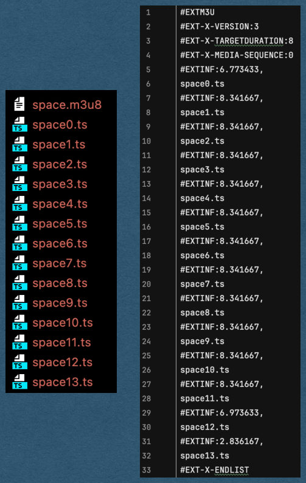
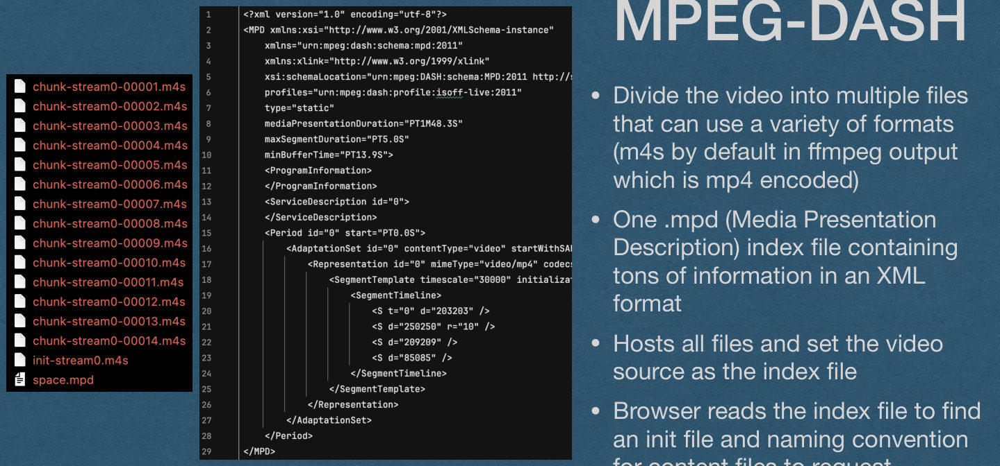
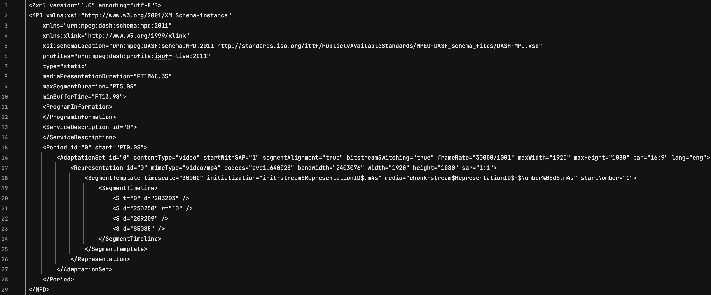
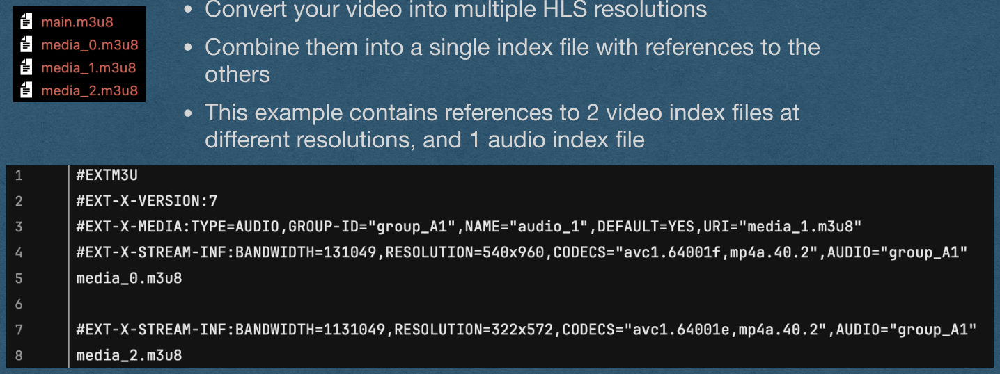
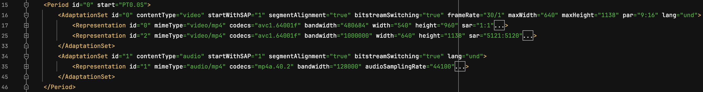
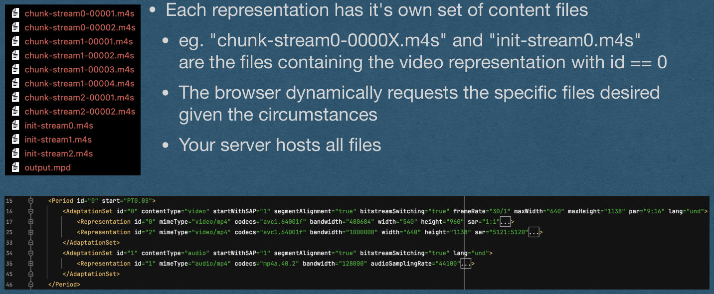
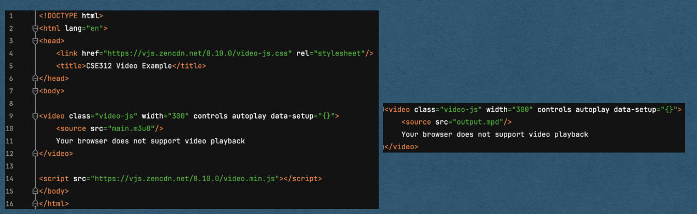
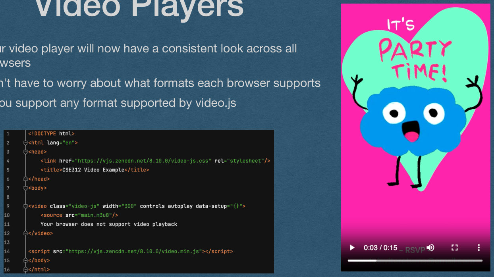

## Video - ABR

## The Problem

- You host a video on your web app
- You want high quality so you host a large 1080p mp4
  - The entire file is 100's of MB
- Every user visiting your page has to download the entire video before playback can begin
  - Very slow to load
  - Entire file must download even for users who will only watch for a few seconds

## Chunking

- Avoid the requirement of downloading the entire video before it plays
- Provided a way to request short segments of the video
- Download one "chunk" of the video at a time
  - Typically ~2-10 seconds of playback
- Advantages:
  - Only a few seconds need to be downloaded before playback starts
  - If the user skips around in the video, only request they chunk they skipped to
  - If the user leaves the page without finishing the video, the entire file doesn't have to be downloaded

## Chunking - Range

- Even mp4 videos can be chunked
- The browser may end a request for a large file that includes a Range header
  - The Range header specifies a range of bytes being requested
  - eg. A request for "/video.mp4" with a header "Range: 10000-20000" is request the 9999th through 19999th bytes of video.mp4
- The response code should be 206 Partial content
- The response should contain a Content-Range header
  - Contains the range of bytes being sent and the to total size of the file
  - eg. Content-Range: 10000-20000/500000
  - eg. Content-Range: 0-499999/500000 if the entire file is sent

## Chunking - Range

- Using the Range header can be effective in some cases, however:
  - It adds extra complexity to the server
  - It relies on the browser to request useful ranges
  - Some browsers might not implement Range and ask for the entire file
- We would like a more robust solution

## Chunking - Multiple Files

- Instead of relying on the browser asking for a specific range of bytes..
- We host a single video in multiple files
- Each file contains a few seconds of playback
- The browser requests each segment as needed
  - User only watches a few seconds -> Only need to request the first few segments
  - User skips to the middle of the video -> Request the middle segment

## HLS vs MPEG-DASH

- Two major protocols support the idea of breaking a video into smaller segments/chunks: HLS and MPEG-DASH
- HTTP Live Streaming (HLS)
  - Developed by Apple
  - Only supports the H.264 encoding for video
  - Wide-spread adaptation
  - Spec freely available in RFC8216
- Dynamic Adaptive Streaming over HTTP (MPEG-DASH)
  - Developed by Moving Picture Experts Group (MPEG)
  - Supports any video encodings
  - No support on Apple devices
  - Spec published as ISO/IEC 23009-1:2022 - Available for $245 (!)

## HLS

- Divide the video into multiple .ts files
  - MPEG Transport Stream files
- One .m3u8 index file containing information about each .ts file and how they combine into a single video
- Your server hosts all files
- Set the video source as the index file
- Browser reads the index file to know when to request each ts file

{fig-alt="TODO: describe this image"}

## HLS - Transcoding

ffmpeg -i space.mp4 -hls_list_size 0 -f hls space.m3u8

- Use ffmpeg to convert to HLS
- "-f hls" to specify the output format as HLS
- "-hls_list_size 0" to keep all ts files in the index
  - By deafult, ffmpeg will only keep the last 5 ts files in the index file
  - This is good if you are live-streaming (This is the HTTP Live Streaming protocol after all)
  - Since our use case is hosting Video on Demand (VOD), we want to keep every ts file in the index
  - Setting the list size to 0 means the size is not limited

## MPEG-DASH

- Divide the video into multiple files that can use a variety of formats (m4s by default in ffmpeg output which is mp4 encoded)
- One .mpd (Media Presentation Description) index file containing tons of information in an XML format
- Hosts all files and set the video source as the index file
- Browser reads the index file to find an init file and naming convention for content files to request

{fig-alt="TODO: describe this image"}

## MPEG-DASH

- Full mpd file from the example

{fig-alt="TODO: describe this image"}

## MPEG-DASH - Transcoding

ffmpeg -i space.mp4 -f dash space.mpd

- Use ffmpeg to convert to MPEG-DASH
- "-f dash" to specify the output format as MPEG-DASH
- Creates an mpd with the name you provide
  - All other files follow a default naming convention
  - May want to create a new directory for each video to avoid naming conflicts

## Adaptive Bit-Rate Streaming

## The Problem

- You host a video on your web app
  - You even use HLS or MPEG-DASH to segment the video into 2-10 seconds chunks
- You want high quality so you host chunks in 4K@60Hz
  - Can require ~25Mb/s bandwidth to stream
- And someone visits your site using eduroam on a bad day..
  - The video buffers, stutters, or doesn't play at all
- We need a solution that:
  - Allows users with slow connections to enjoy your content
  - Delivers high quality to users with high-speed Internet

## Adaptive Bit-Rate

- Instead of hosting the a single video at a single resolution
  - Host multiple versions of the same video at different resolutions
  - Each resolution requires a different bit rate to stream
- User visits your page
  - Their browser adapts to the current download bandwidth available
  - Stream the highest bit rate video that fits the bandwidth

## Adaptive Bit-Rate

- Using HLS or MPEG-DASH
  - Create chunks at several different resolutions/bit rates
  - Add information about all resolutions in the index file
- With the video segmented into ~2-10 second chucks
  - Easy for the browser to switch between resolutions

## Adaptive Bit-Rate

- The browser can adapt the requested bit-rate based on current conditions
- Limited interruption for the user, though quality can change over time

4k

1080p

480p

potato

wifi slows down

wifi speeds up

## Adaptive Bit-Rate - HLS

- Using HLS, m3u8 index files can be nested
- Convert your video into multiple HLS resolutions
- Combine them into a single index file with references to the others
- This example contains references to 2 video index files at different resolutions, and 1 audio index file

{fig-alt="TODO: describe this image"}

## Adaptive Bit-Rate - MPEG-DASH

- The mpd file can contain multiple resolutions
- The media is represented in multiple layers
  - Period
  - Adaptation Set
  - Representation

{fig-alt="TODO: describe this image"}

## Adaptive Bit-Rate - MPEG-DASH

- Period
- Allows the division of a media file into multiple parts
  - ie. Chapters
- For our purposes, we only need 1 period

{fig-alt="TODO: describe this image"}

## Adaptive Bit-Rate - MPEG-DASH

- Adaptation Set
- Represents different parts of the media that will all be combined into one experience
- Can contain multiple video/audio adaptation sets
  - eg. One for video, one for audio, and another for closed captions
- The example below has one for video and one for audio

{fig-alt="TODO: describe this image"}

## Adaptive Bit-Rate - MPEG-DASH

- Representation
- Each adaptation set can have multiple representations
- This is where we add multiple different bit-rates of the media
- The browser will choose one representation for each adaptation set at a given time based on bandwidth

{fig-alt="TODO: describe this image"}

## Adaptive Bit-Rate - MPEG-DASH

- Representation
- This example has 2 resolutions for  video that the browser can choose
  - 480kb of 1Mb bandwidth
- This example only has one representation of the audio track
  - Only 128kb bandwidth

{fig-alt="TODO: describe this image"}

## Adaptive Bit-Rate - MPEG-DASH

- Each representation has it's own set of content files
  - eg. "chunk-stream0-0000X.m4s" and "init-stream0.m4s" are the files containing the video representation with id == 0
  - The browser dynamically requests the specific files desired given the circumstances
  - Your server hosts all files

{fig-alt="TODO: describe this image"}

## Adaptive Bit-Rate

- Your task [For AO2]:
  - Choose between HLS and MPEG-DASH
  - Programmatically convert an uploaded mp4 into the format you choose with multiple resolutions
  - Serve those videos by setting the source of a video to the index file for that video
- Hint: Get ffmpeg to do all the work for you
  - You should not manually write any of these files
  - Do research to find the command(s)/flags you need to send to ffmpeg to do the job

## Video Players

- Most built-in video players do not support HLS or MPEG- DASH
  - You cannot rely on the browser having a player for either of these formats (eg. During grading we will not use a browser with built-in support for HLS or MPEG- DASH)
- We must use a 3rd party video player
  - Several players available (eg. dash.js)
  - Examples in the following slides will use video.js

## Video Players

- This example downloads the css and js for video.js from a CDN
- Uses "class" and "data-setup" attributes on a video element to tell the library to do its thing
- You now have a video player that supports both HLS and MPEG-DASH

{fig-alt="TODO: describe this image"}

## Video Players

- Your video player will now have a consistent look across all browsers
- Don't have to worry about what formats each browser supports
  - You support any format supported by video.js

{fig-alt="TODO: describe this image"}

## Live Streaming

## Live Streaming

- We've talked about uploading and host mp4 videos using a streaming protocol
  - A VOD service
- What about live streaming?
- Most live streaming isn't truly live
  - There will be several seconds of delay in the stream
  - Acceptable loss to gain accuracy

## Live Streaming

- Typical setup (eg. Twitch/YouTube Live/etc.)
- User streams their video into an ingest server using the Real-Time Messaging Protocol (RTMP)
  - RTMP is a container for any real-time communication
  - The content of RTMP happens to be a media stream in this case
- The server transcodes the video into a streaming format (eg. HLS/MPEG-DASH) and continually updates/ generates index files

## Live Streaming

- When a viewer visits a live stream
  - The browsers asks for the latest index file and starts requesting content
  - When it nears the end of that index file, request a new index file
  - Repeat until the stream ends
- When a viewer visits the VOD of a past live-stream
  - Serve an index file for then entire stream
  - No different than watching the stream live

## Live Streaming

- Since the transcoding process of the ingest server takes some time:
  - The stream is not truly live
- The streamed content is downloaded via TCP/HTTP
  - Reliable. You will not miss a second of video
- If the delay is unacceptable (eg. Zoom):
  - Use UDP instead of TCP
  - Do not transcode
  - Accept dropped packets as a part of life
