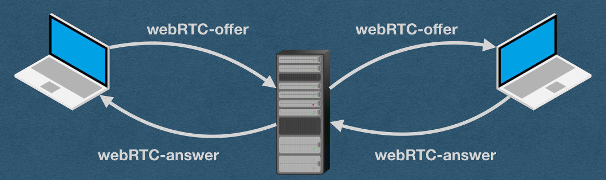
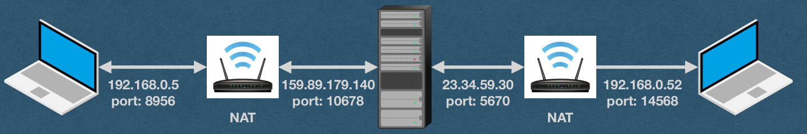
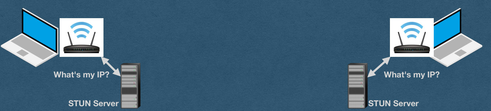
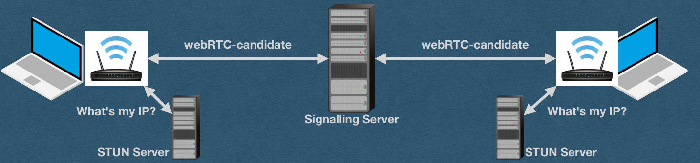
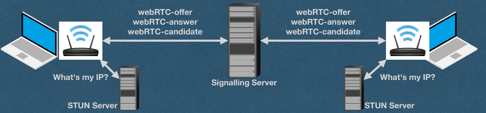
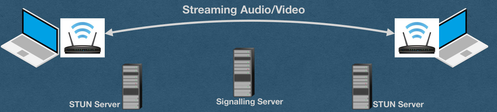
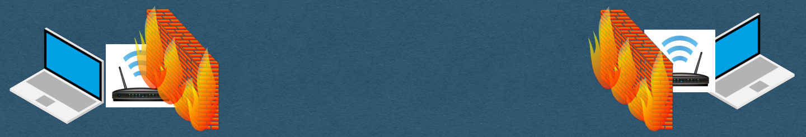
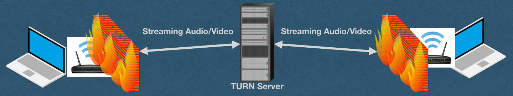
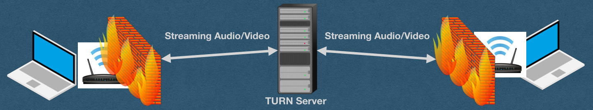

<!-- PDF page 1 -->
## WebRTC

<!-- PDF page 2 -->
## WebRTC

<!-- REVIEW: diagram rendered whole; describe it in fig-alt -->

- Need to establish a real-time streaming peer-to-peer connection
- But how?
  - Need the IP address of your peer
  - Need to agree on the details of the connection

{fig-alt="TODO: describe this image"}

<!-- PDF page 3 -->
## WebRTC - Connecting

<!-- REVIEW: diagram rendered whole; describe it in fig-alt -->

- One peer needs to get an offer to the other peer
- This is an offer to establish a connection that contains:
  - audio/visual codec, bitrate, etc details (How to interpret the bytes once the streaming starts)
  - A username fragment ("ice-ufrag") as a unique identifier

webRTC-offer

{fig-alt="TODO: describe this image"}

<!-- PDF page 4 -->
## WebRTC - Connecting

<!-- REVIEW: diagram rendered whole; describe it in fig-alt -->

- The peer responds with an answer
- The answer contains their audio/visual data
- Contains their own ufrag so the connection can be identified
- Once the answer is received, the peers agree to connect

webRTC-offer

webRTC-answer

{fig-alt="TODO: describe this image"}

<!-- PDF page 5 -->
## webRTC-answer?

<!-- REVIEW: diagram rendered whole; describe it in fig-alt -->

WebRTC - Connecting

- But there's a problem
- How do we send these messages between two peers?

webRTC-offer

{fig-alt="TODO: describe this image"}

<!-- PDF page 6 -->
## webRTC-answer?

<!-- REVIEW: diagram rendered whole; describe it in fig-alt -->

WebRTC - Connecting

- For usual web traffic with a server:
  - Type in a domain name or click a link containing a domain name
  - Use DNS to lookup the [static] IP address of the server
  - Send a request to the IP address on port 80 or 443

webRTC-offer

{fig-alt="TODO: describe this image"}

<!-- PDF page 7 -->
## webRTC-answer?

<!-- REVIEW: diagram rendered whole; describe it in fig-alt -->

WebRTC - Connecting

- For peer-to-peer traffic:
  - We need to discover the IP and port of the peer without DNS
  - Peer IP/port can change (dynamic IP)

webRTC-offer

{fig-alt="TODO: describe this image"}

<!-- PDF page 8 -->
## WebRTC - Signalling Server

<!-- REVIEW: diagram rendered whole; describe it in fig-alt -->

- Offer and answer are sent through a signaling server
  - On the HW - You are the signaling server!!
- Both peers connect to your server
- Send offer/answer to the server and the server forwards the messages to the other peer

webRTC-offer

webRTC-offer

webRTC-answer

webRTC-answer

Signalling Server

{fig-alt="TODO: describe this image"}

<!-- PDF page 9 -->
## WebRTC - Signalling Server

<!-- REVIEW: diagram rendered whole; describe it in fig-alt -->

- We need a method to send these messages
- We'll need a way for the server to be able to send messages to each client in real-time

webRTC-offer

webRTC-offer

webRTC-answer

webRTC-answer

Signalling Server

{fig-alt="TODO: describe this image"}

<!-- PDF page 10 -->
## WebRTC - Signalling Server

<!-- REVIEW: diagram rendered whole; describe it in fig-alt -->

- We need a method to send these messages
- We'll need a way for the server to be able to send messages to each client in real-time
- Wow! It's really convenient that we have WebSockets!

webRTC-offer

webRTC-offer

webRTC-answer

webRTC-answer

Signalling Server

{fig-alt="TODO: describe this image"}

<!-- PDF page 11 -->
## WebRTC - Signalling Server

<!-- REVIEW: diagram rendered whole; describe it in fig-alt -->

- When your server receives a WebSocket frame containing an offer or answer
  - Send the payload to the other peer over their WebSocket

webRTC-offer

webRTC-offer

webRTC-answer

webRTC-answer

Signalling Server

{fig-alt="TODO: describe this image"}

<!-- PDF page 12 -->
## WebRTC - NATs

<!-- REVIEW: diagram rendered whole; describe it in fig-alt -->

- We have another issue..
- How do we know the IP address and port for each peer?

192.168.0.5

port: 8956

159.89.179.140

23.34.59.30

192.168.0.52

port: 10678

port: 5670

port: 14568

NAT

NAT

Signalling Server

{fig-alt="TODO: describe this image"}

<!-- PDF page 13 -->
## WebRTC - NATs

<!-- REVIEW: diagram rendered whole; describe it in fig-alt -->

- Devices are commonly "hidden" behind NAT routers
  - Network Address Translation
- With a NAT:
  - You have a local IP address for communication on your local network
  - When communicating outside your network, the NAT router sends your message using a public IP address and port number

192.168.0.5

port: 8956

159.89.179.140

23.34.59.30

192.168.0.52

port: 10678

port: 5670

port: 14568

NAT

NAT

Signalling Server

{fig-alt="TODO: describe this image"}

<!-- PDF page 14 -->
## WebRTC - NATs

<!-- REVIEW: diagram rendered whole; describe it in fig-alt -->

- With a NAT:
  - Many devices on a local network can share a single public IP address
  - Each device does not know it's public IP/port used when it communicates to the outside world
  - [Also the problem that port-forwarding solves]

192.168.0.5

port: 8956

159.89.179.140

23.34.59.30

192.168.0.52

port: 10678

port: 5670

port: 14568

NAT

NAT

Signalling Server

{fig-alt="TODO: describe this image"}

<!-- PDF page 15 -->
## WebRTC - STUN Server

<!-- REVIEW: diagram rendered whole; describe it in fig-alt -->

- Solution: Use a STUN (Session Traversal Utilities for NAT) Server
- Each peer connects to a STUN server and asks for their public IP/port
- STUN server checks the origin IP/port and informs the client
- We'll use Google's free STUN server (stun2.1.google.com:19302)

What's my IP?

What's my IP?

STUN Server

STUN Server

{fig-alt="TODO: describe this image"}

<!-- PDF page 16 -->
## WebRTC - ICE Candidate

<!-- REVIEW: diagram rendered whole; describe it in fig-alt -->

- Each peer sends their public IP/port, and connection information, in an ICE (Interactive Connectivity Establishment) candidate message
- Whenever your signaling server receives an ICE candidate, forward it to the other peer

webRTC-candidate

webRTC-candidate

What's my IP?

What's my IP?

Signalling Server

STUN Server

STUN Server

{fig-alt="TODO: describe this image"}

<!-- PDF page 17 -->
## WebRTC - ICE Candidate

<!-- REVIEW: diagram rendered whole; describe it in fig-alt -->

- Candidate contains:
  - Connection type - UDP, not TCP
  - IP/port - Local in this example
  - Username fragment - Uniquely identifies the connection

{"candidate":"candidate:2382557538 1 udp 2122260223 192.168.1.19 54090 typ host generation 0 ufrag FGP/ network-id 1

network-cost 10","sdpMid":"0","sdpMLineIndex":0}

webRTC-candidate

webRTC-candidate

What's my IP?

What's my IP?

Signalling Server

STUN Server

STUN Server

{fig-alt="TODO: describe this image"}

<!-- PDF page 18 -->
## WebRTC - Connection

<!-- REVIEW: diagram rendered whole; describe it in fig-alt -->

- And now we can establish a peer-to-peer connection!

webRTC-offer

webRTC-answer

webRTC-candidate

webRTC-offer

webRTC-answer

webRTC-candidate

What's my IP?

What's my IP?

Signalling Server

STUN Server

STUN Server

{fig-alt="TODO: describe this image"}

<!-- PDF page 19 -->
## WebRTC - Summary

<!-- REVIEW: diagram rendered whole; describe it in fig-alt -->

- One peer sends an offer to the other
- Other peer responds with an answer
- Both peers get their public IP/port from their STUN Servers
- Both peers send their ICE candidates to the other

webRTC-offer

webRTC-answer

webRTC-candidate

webRTC-offer

webRTC-answer

webRTC-candidate

What's my IP?

What's my IP?

Signalling Server

STUN Server

STUN Server

{fig-alt="TODO: describe this image"}

<!-- PDF page 20 -->
## WebRTC - Summary

<!-- REVIEW: diagram rendered whole; describe it in fig-alt -->

- Once the connection is established
- The servers step aside and the clients stream directly to each other
  - True peer-to-peer!

Streaming Audio/Video

Signalling Server

STUN Server

STUN Server

{fig-alt="TODO: describe this image"}

<!-- PDF page 21 -->
## WebRTC - Summary

<!-- REVIEW: diagram rendered whole; describe it in fig-alt -->

- Your role in all of this?
  - Route the offer/answer/candidate messages between peers
- No need to read/parse/interpret the RTC portion of these messages
  - Extract the payload from the WS frame, send it to the appropriate peer as a new WS frame

webRTC-offer

webRTC-answer

webRTC-candidate

webRTC-offer

webRTC-answer

webRTC-candidate

What's my IP?

What's my IP?

Signalling Server

STUN Server

STUN Server

{fig-alt="TODO: describe this image"}

<!-- PDF page 22 -->
## WebRTC - Restrictions

<!-- REVIEW: diagram rendered whole; describe it in fig-alt -->

- The browser will not allow WebRTC connections when connected to a site using HTTP (as opposed to HTTPS)
- Must have an encrypted connection to use WebRTC
  - *Unless connecting over localhost (Let's us test locally)

webRTC-offer

webRTC-answer

webRTC-candidate

webRTC-offer

webRTC-answer

webRTC-candidate

What's my IP?

What's my IP?

Signalling Server

STUN Server

STUN Server

{fig-alt="TODO: describe this image"}

<!-- PDF page 23 -->
## WebRTC - Restrictions

<!-- REVIEW: diagram rendered whole; describe it in fig-alt -->

- Sometimes a peer-to-peer connection cannot even be established
  - Can have restrictive firewalls
  - Dynamic NATs might change your port unexpectedly
  - Organizations might block certain traffic on their network

{fig-alt="TODO: describe this image"}

<!-- PDF page 24 -->
## WebRTC - TURN Server

<!-- REVIEW: diagram rendered whole; describe it in fig-alt -->

- In cases where peer-to-peer is blocked:
  - Use a TURN (Traversals Using Relays around NAT) Server
  - After the connection is established using a signaling server, each peer routes their streaming data through a TURN server

Streaming Audio/Video

Streaming Audio/Video

TURN Server

{fig-alt="TODO: describe this image"}

<!-- PDF page 25 -->
## WebRTC - TURN Server

<!-- REVIEW: diagram rendered whole; describe it in fig-alt -->

- If you ask me... using a TURN server defeats the purpose of using a peer-to-peer technology
- ... Unless you run your own TURN server!

Streaming Audio/Video

Streaming Audio/Video

TURN Server

{fig-alt="TODO: describe this image"}
