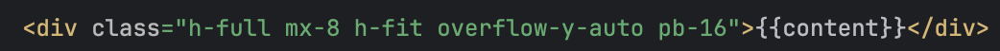

## Architecture

## Rendering HTML

## HTML Templates

- Problems:
  - We want to reuse HTML across multiple pages
  - We want to serve content that is constantly changing
  - We want to serve different content to different users
- Solution: HTML templates
  - Create partial HTML files with placeholders
  - To load a page, replace the placeholders with specific content

{fig-alt="TODO: describe this image"}

## Rendering HTML

- Templates allow us to separate the HTML (Structure of the page) from the content that will be displayed on the page
- Injecting content into an HTML template to form the final HTML is called rendering
- HTML Template + data = HTML

{fig-alt="TODO: describe this image"}

## Rendering HTML

- Architecture Decision: When/where do we render HTML?
- Server-side
  - Your server renders the HTML and serves completed HTML to the users
- Client-Side
  - Your server hosts HTML templates and data endpoints and has the client render the final HTML

## SPA - Single Page Application

- Take client-side rendering to the extreme
  - HTML/CSS/JS is only sent one time
  - All content is requested later and rendered client-side
- Give us features like "infinite scroll"
- The page never reloads

## Modularization

## Modularization

- The code for a large web app can become difficult to maintain
  - Eg. If you have most of your code in server.py, it's difficult to add new features and debug existing features
- If helps to modularize your code
  - Split it up into smaller, easier to maintain, chunks

## Modularization

- First step to modularize a web app:
  - Isolate the web
- A web is just an app that is accessed using web protocols
- DEMO
