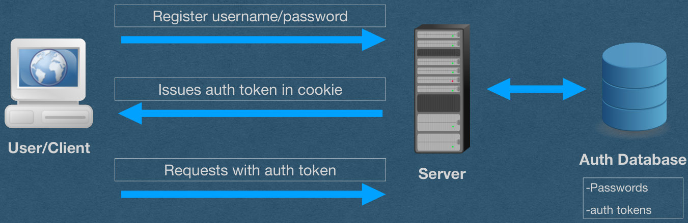
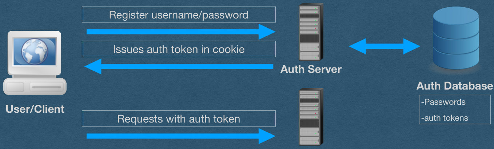
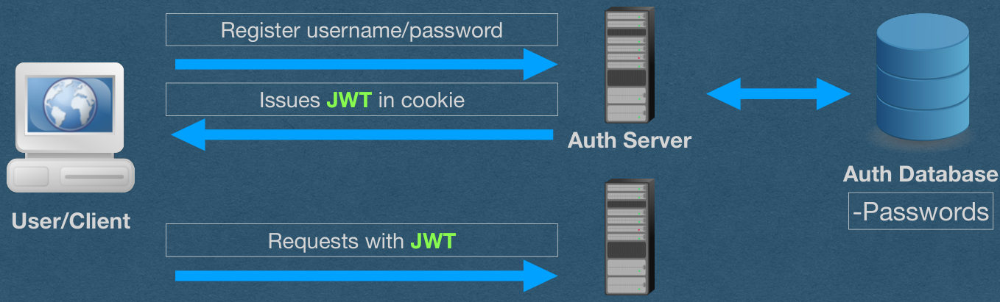

## JSON Web Tokens (JWTs)

## Why JWT?

- We'll use JWTs for persistent authentication
- We currently use authentication tokens to solve the same problem
- Why do we need a new mechanism?
- What's wrong with auth tokens?

## Recall Auth Tokens

- Server issues an auth token on login
- Store token in database on login
- Lookup token in database for authentication

Register username/password

Issues auth token in cookie

User/Client

Auth Database

Requests with auth token

Server

-Passwords

-auth tokens

{fig-alt="TODO: describe this image"}

## Recall Auth Tokens

- The token is opaque
  - Random meaningless bytes
- Database lookup is required

Register username/password

Issues auth token in cookie

User/Client

Auth Database

Requests with auth token

Server

-Passwords

-auth tokens

{fig-alt="TODO: describe this image"}

## Recall Auth Tokens

- When your app gets HUGE
  - Make it distributed
  - Separate parts of your app onto different servers

Register username/password

Issues auth token in cookie

Auth Server

Auth Database

-Passwords

User/Client

Requests with auth token

-auth tokens

App Server

{fig-alt="TODO: describe this image"}

## Recall Auth Tokens

- App server needs to verify the auth token

Register username/password

Issues auth token in cookie

Auth Server

Auth Database

-Passwords

User/Client

Requests with auth token

-auth tokens

App Server

{fig-alt="TODO: describe this image"}

## Auth Tokens - Distributed

- App server needs to verify the auth token
- Option 1: Shared DB
  - App server connects to the same DB as the auth server to lookup the auth token
  - Advantage: Code is simple. Same thing we've been doing
  - Disadvantage: Slow and complex architecture
    - DB must support multiple servers
    - App must connect to the shared DB on every authenticated request

## Auth Tokens - Distributed

- App server needs to verify the auth token
- Option 2: Server-Server Communication
  - App server sends a request to the auth server to verify the token
  - Advantage: Avoids a shared DB
  - Disadvantage: Slow
    - Every authenticated requests requires the app server, auth server, and the auth DB
    - Might as well have a monolith app (It's effectively not distributed)

## Introducing JWTs

- Instead of auth token
  - Issue a self-contained JWT

Register username/password

Issues JWT in cookie

Auth Server

Auth Database

-Passwords

User/Client

Requests with JWT

App Server

{fig-alt="TODO: describe this image"}

## JWT

- JWTs are tokens that are designed to be self- contained
  - Contain all information needed for authentication/ authorization
  - No need to talk to the DB or the auth server
  - Auth server doesn't even need to store JWTs
- App server receives a request containing a JWT
  - Verify the token locally

## JWT

- JSON Web Tokens
  - Often pronounced "jot"
- JSON
  - Contains a payload that must be a JSON object
- Web
  - Encoded using url-safe characters
  - Can be used in HTTP headers
- Tokens
  - Typically used for authentication/authorization
  - Can be used to solve any problem that wants tokens

## JWT - Structure

- A JWT is composed of three parts
- Headers
  - Specifies the type of token, and algorithm used for signing
- Claims
  - The payload of the token
  - Can contain the identity of the user (Authentication) and any scopes they can access (Authorization)
- Signature
  - The signature of the token using the algorithm specified in the headers

## JWT - Structure

- Each of the three parts are Base64URL encoded
- Base64
  - Maps 3 bytes of arbitrary data into 4 ASCII characters
  - 64 characters: a-z, A-Z, 0-1, '+', '/'
  - If length%3 != 0, pad with '='
  - Not suitable for the web
- Base64URL
  - Replace '+' and '/' with '-' and '_'
  - Omit the padding
  - This avoids all url reserved characters

## JWT - Structure

- Three Base64URL-encoded parts are separated by '.'
- eyJhbGciOiJSUzI1NiIsInR5cCI6IkpXVCJ9.eyJ1c2VybmFtZSI6IkFsaWNlIn0.Bh0...
- This token looks opaque
  - It is not!!
- Base64URL is not a hashing algorithm!
- Base64URL is not encryption!
- Your JWTs are effectively plain-text
- This token has the claim: {"username": "Alice"}

## JWT - Usage

- JWTs are effectively plain text
- Everyone with access to the token can see the claims
- Anyone can generate their own tokens with any claims they choose
  - Trivial to impersonate other users
- Need to verify that the auth server issued the token
  - Sign it!

## JWT - Verification

- The issuer (Auth server) will cryptographically sign the JWTs it issues
- Apps will verify this signature
- Attackers cannot forge the signatures
- eyJhbGciOiJSUzI1NiIsInR5cCI6IkpXVCJ9.eyJ1c2VybmFtZSI6IkFsaWNlIn0.Bh0qjhE- gYMC3uQOORQ7yrsjUeESQ6fBqrt5dpGXRQ5i4z9FCsN1USZVw10MFZf9XPq5mt9 MLyMNSrMsvVnCFYcWONbmupgWxMi4MMkziy9LePgFosFX- SSb64mWZsE6t8MG657ZmvkmRpq7AINtOi4UZpFmpTcvNFrVRXIi8os9i6PcPbplBA yPq4a8sIxQXcLqyObr84CZQv3q67NFI- ZP0RQHu9qm65CxdchHVW7kuwTWyTvvZWNMS3Ga_9VY2QdYr8oyMAYDySCwta L5eTk8Zm8TNiBHLCD15H8A7IQ7_r2V7cXxeXBgDXfs1DqufcEv6lSsBN1i3rat096bxl PM183zTRKD-WYHLzIJV1FTRCms4lmwYlPfDski- nX41sWIvUk2FNtuWl1QcQmR8WVxFhXtmicka4caU83iL_zlTGVTswuW5Bd6UBsJ1c 9c_OBE28RnMtR23duJZsL7lTqCIn9H_7GvLrwWy1JgAp4CRqeiFR8j8vJne1XcIJJ9h JVWL-2bdbe6Iu_SAWUpmiAeXy3NfJaTibSSCANs2ple_eCY7mg1ebrGHIdNq9W3izj HwyNFAg8p5K3aNnv8rLe6yJhXg0CS94s3oLkhiEa83y4pvnjO2Adgm9o4Z3uE0Hb1n ZN_LJuOWMZbdPZavmPKlTFsSzUZ_hE0AdWtabc

## JWT - Verification

- Public/Private key
  - In CSE312, we'll prefer to sign tokens with a private RSA key using the RS256 algorithm
  - This algorithm computes a SHA256 hash of the headers and claims of the token
  - Sign this hash using the auth server's private key
  - The Base64URL encoding of this signature is the 3rd part of the token
- App server has the auth servers public key
  - Use the public key to verify the signature

## JWT - Verification

- Public/Private key
  - Attackers can generate JWTs to with valid headers and claims
  - Attacks cannot forge the signature
- If the signature is not valid, do not accept the token

## JWT - Verification

- Shared Secret
  - Alternatively, all servers can control a shared secret used to both sign and verify signatures
  - If the secret is not compromised, this is just as good a private key signatures
  - Downside:
    - Expands your attack surface
      - Attacker who compromises any server has your shared secret
    - Not wise if you're issuing tokens that are verified by 3rd party servers
  - Not allowed on HW5..

## JWT - Encryption

- JWTs can optionally be encrypted to obfuscate the headers and claims
- I don't have anything else to say about that

😅

{fig-alt="TODO: describe this image"}

## • When the auth and resource servers are separate • Common for access tokens to be JWTs • Make them short-lived and issue refresh tokens

Recall OAuth

Authorization Grant

Access Token and Refresh Token

Authentication

Refresh Token

Server

Access Token [and Refresh Token]

API Access - Access Token Only

Resource

Private Data

Your App / Client

Server

{fig-alt="TODO: describe this image"}
